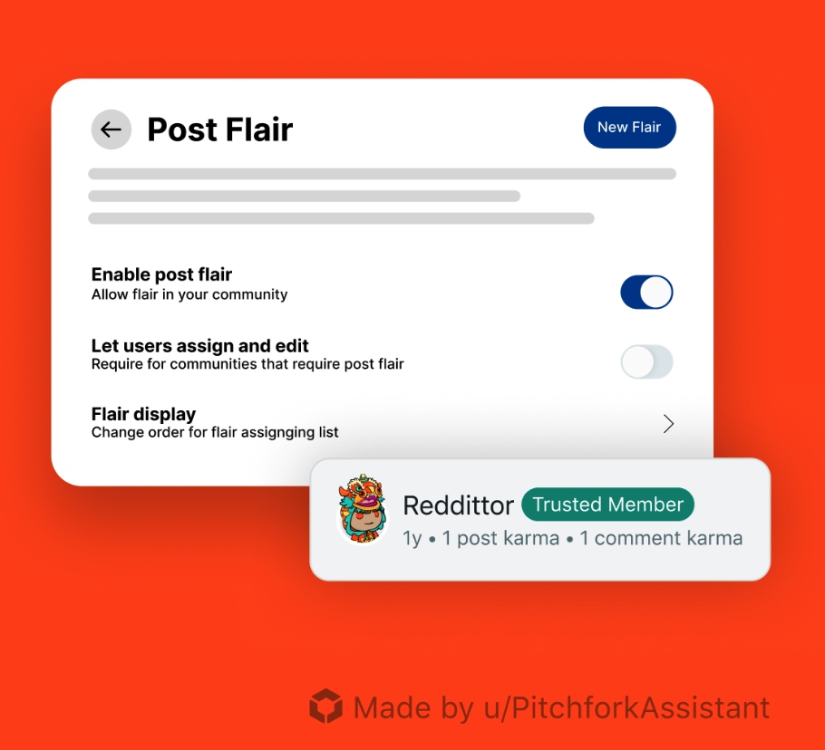

# Reddit’s Developer Platform: Build with the Community, for the Community

We’ve been hard at work building and expanding Reddit’s Developer Platform, and it’s growing fast. <!--truncate --> [Since our beta opened](https://www.reddit.com/r/Devvit/comments/1ddmgah/welcome_to_rdevvit/), over 2,000 developers have created apps in 31,000+ communities.

We’re also compensating successful developers through temporary programs, such as hackathons and [Reddit Developer Funds](https://developers.reddit.com/docs/reddit_developer_funds). In particular, our Developer Funds currently allow developers to get paid as apps achieve certain metrics, with payments up to \$116,500+ per app - up to <strong>\$349,500 per developer</strong>.

From powerful mod tools like [Trending Tattler](https://developers.reddit.com/apps/trendingtattler) and [Moderator Mentions](https://developers.reddit.com/apps/mod-mentions) to interactive apps like [Live Scores](https://www.reddit.com/r/realmadrid/comments/1k8kflj/match_thread_fc_barcelona_vs_real_madrid_live/) and to games like [Riddonkulous](https://www.reddit.com/r/riddonkulous/), developers and their apps make Reddit more useful, fun, and community-driven.

Reddit is becoming a home for developers, not just to build but to grow real communities around their creations. Our platform gives developers the tools to ship apps directly into subreddits, reach highly engaged users, and monetize their work.

Here’s what developers get:

- <strong>Distribution</strong> hands-on support from our team and out-of-the-box discovery via feeds and our app directory
- <strong>Monetization options</strong> including payments and our [Developer Funds program](https://developers.reddit.com/docs/earn-money/reddit_developer_funds)
- <strong>Community</strong> of their own for games and experiences

### The Future of Developer Platform

It's not just about tools — it's about unlocking what's next for Reddit.

The future is already taking shape with new experiences and games. The new [r/GamesOnReddit](https://www.reddit.com/r/GamesOnReddit) community is growing fast with dev-built games. And with AI making creation easier than ever, Reddit is here to help developers solve the complex parts of app-building: distribution, community, and sustainability.

Whether you're building the next must-have mod tool, a useful community app, or the next viral game, Reddit is the platform that lets you build, grow, and thrive.

As our CEO, Steve Huffman (aka u/spez), [recently shared](https://www.reddit.com/user/spez/comments/1kfciml/reddits_next_chapter_smarter_easier_still_human/) about our Developer Platform: _whatever our users come up with will be far more interesting than anything we build ourselves_. And we can't wait to see what you do next.
