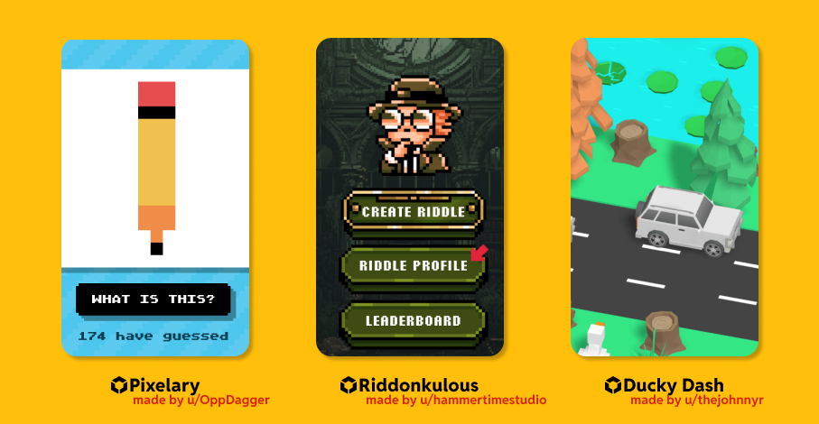

# Reddit’s Developer Platform: Build with the Community, for the Community

We’ve been hard at work building and expanding Reddit’s developer platform, and it’s growing fast. <!--truncate --> [Since our beta opened](https://www.reddit.com/r/Devvit/comments/1ddmgah/welcome_to_rdevvit/), over 2,000 developers have created apps in 31,000+ communities.

We’re also investing directly in developers through hackathons and [Reddit Developer Funds](https://developers.reddit.com/docs/reddit_developer_funds) which allows developers to earn up to \$116,500+ per app - up to <strong>\$349,500 per developer</strong>.

From powerful mod tools like Trending Tattler and Moderator Mentions to interactive apps like [Live Scores](https://www.reddit.com/r/realmadrid/comments/1k8kflj/match_thread_fc_barcelona_vs_real_madrid_live/) and to games like [Riddonkulous](https://www.reddit.com/r/riddonkulous/), developers and their apps make Reddit more useful, fun, and community-driven.

Reddit is becoming a home for developers, not just to build but to grow real communities around their creations. Our platform gives developers the tools to ship apps directly into subreddits, reach highly engaged users, and monetize their work.

Here’s what developers get:

- <strong>Monetization</strong> options including payments and our Developer Funds program
- <strong>Subreddit publishing tools</strong> for launching and managing apps
- <strong> Distribution </strong> hands-on support from our team and out-of-the-box discovery via feeds
- <strong>Community</strong> of their own as they build their game or experience

The future is already taking shape. [r/GamesOnReddit](https://www.reddit.com/r/GamesOnReddit) is growing fast with dev-built games. And with AI making creation easier than ever, Reddit helps solve the complex parts: distribution, community, and sustainability.

Whether developers are building the next must-have mod tool, a useful community app, or the next viral game, Reddit is the platform to build, grow, and thrive.

As our CEO [recently shared](https://www.reddit.com/user/spez/comments/1kfciml/reddits_next_chapter_smarter_easier_still_human/) about our Developer Platform: whatever our users come up with will be far more interesting than anything we build ourselves.
