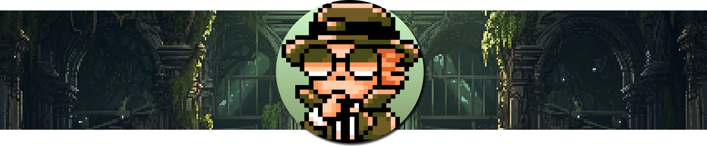

Reddit’s Developer Platform provides first-class API and development tools and access to a massive, engaged user base. The vibrant developer community is a mix of independent devs and pro gaming shops creating innovative, successful games that work in Reddit’s unique ecosystem. One of those games is [r/Riddonkulous](https://www.reddit.com/r/Riddonkulous)<!-- truncate -->, an interactive riddle game developed by [Hammertime e.U](https://hammertime.studio/en). ([u/hammertimestudio](https://www.reddit.com/u/hammertimestudio)) that already has more than 33K subscribers.  
We asked Hammertime e.U. to share their experience building with the [Devvit CLI](https://developers.reddit.com/docs/devvit_cli), [blocks](https://developers.reddit.com/docs/blocks/overview), [Redis](https://developers.reddit.com/docs/capabilities/redis), [realtime](https://developers.reddit.com/docs/capabilities/realtime), and our new [payments API](https://developers.reddit.com/docs/payments/payments_overview), and this is what they had to say.

### Tell us about your background and motivation

_With 10+ years in web app development and a lifelong love for games sparked by **Warcraft 3** and **Age of Empires II**, I’ve always been drawn to browser-based experiences. The web offers a low-barrier, high-access medium to build lightweight, playful applications without relying on heavy installs or hardware requirements._

_I’ve built games across Twitch, Discord, Telegram—and more recently—Reddit, under my studio, **Hammertime e.U**. Reddit became a playground for experimentation after hearing about the 2024 Reddit Games & Puzzles Hackathon. That curiosity led to my first app: [Birb](https://www.reddit.com/r/BirbGame/), a Flappy Birb remix using Devvit._

### Why choose Reddit?

_Coming from Twitch, I wasn’t expecting Reddit to become a major platform for my work. But the developer experience Devvit promised—real-time capabilities, Redis, caching helpers—got me hooked. Reddit’s ecosystem is a rare blend of niche and mainstream communities, making it a unique environment for social and creative experimentation. What started as a curiosity quickly became a full-blown obsession._

### What was the idea behind Riddonkulous?

_What makes a game fun? That was my north star. Not all fun is flashy. Sometimes it’s thoughtful, collaborative, even weird. I’m a huge fan of Jackbox Party Games and took inspiration from how they turn creativity into gameplay. I also studied successful Reddit games like Pixelary, to learn what works in this ecosystem._

_Riddonkulous was built with community at its core. It's a user-generated riddle game—if players don’t care, the game fails. Its success depends on people showing up with creative energy. Reddit, with its deeply engaged communities, was the perfect fit._

### How was your developer experience?

_What went well:_

- _**Rapid prototyping**: The Devvit CLI made scaffolding and deploying apps fast._

- _**Community support**: Devvit’s Discord was key for debugging and inspiration (shoutout to Pixelary’s SVG font hack!)._

_What took effort:_

- _**Blocks customization**: While Blocks is clean and beginner-friendly, advanced styling (custom fonts, animations) comes with a learning curve._

- _**Responsiveness**: Tailoring UI to behave well across platforms requires understanding how Devvit maps CSS-like behavior under the hood._

_Experience with frameworks like React, Vue, or Tailwind is a definite plus here._

### How was working with the Devvit Community?

_Devvit’s developer community is incredibly active and helpful. Office Hours sessions and Discord chats have been invaluable. Whether you’re new or experienced, the support from Reddit staff and fellow developers made a huge difference. This is not a passive group—it's collaborative, iterative, and generous with knowledge._

### Talk about performance and scalability.

_Optimizing for mobile-first users was essential—especially for Reddit’s home feed._

- _**Cache helper** and **Redis** made data delivery fast and scalable._

- _**Blocks** enabled cross-platform compatibility without worrying about device-specific quirks._

- _For heavier features (like the upcoming WebView support), standard web dev tools (Vue, Vite) made integration easier.
  There was no need for hybrid mobile frameworks—the web was more than enough._

### Building a community

_From day one, I built an app-centric subreddit. Consistent updates, Devnotes, and community events (like XP boosts or credit unlocks) kept things fresh. I encouraged feedback and ran megathreads to gather ideas._

_💡 **Key growth tip**: Respond seriously to all feedback—even harsh or blunt comments often hide actionable insights. The most passionate users often offer the best ideas._

_When the community vibe dipped, we addressed it fast—adjusting rules, listening openly, and involving players in the fixes. That collaborative spirit shaped Riddonkulous' best features._

### How did you monetize the game?

_At first, I explored Devvit’s Payments API out of curiosity. But it soon became a way to sustain the project long-term._

_The in-game economy I built benefits the entire community. For instance, players can spend credits to unlock a hint for everyone. This fosters a collaborative dynamic instead of pay-to-win mechanics. Upcoming cosmetic upgrades (like Riddle Appearance customizations) will follow the same philosophy—shared fun over individual perks._

### Viral growth and Reddit’s impact

_In just 30 days:_

- _30K+ subscribers_
- _Tens of thousands of active players_
- _10M+ views_
- _8,000+ community riddles_

_I made sure Riddonkulous was:_

- _Lightweight_
- _Fast_
- _Playable in one tap_

_We also used moderation tools (like AutoMod) to maintain content quality during peak waves._

### Community feedback & stories

_The community continues to amaze me:_

- _Parents solve riddles with kids._

- _Colleagues use it for breaks._

- _Competitive users chase the leaderboard._

- _Others treat it like daily meditation._

_One redditor even made it their mission to post warm-up riddles before raid events. That kind of energy is deeply motivating._

### What’s a “Raid” event?

_I introduced Raid events as a way to reward players and test real-time game coordination. When Medusa appeared with her sisters Stheno and Euryale, the community had to solve riddles across posts._

_Technically, it was powered by Redis and Devvit’s real-time capabilities using an authoritative server model. It was an exciting experiment in both gameplay and engineering._

### What advice would you give to other developers considering Reddit’s Developer Platform?

- **Be brave and think of massive multiplayer.** Devvit gives you the building blocks to scale—even as a solo developer.

- **Invest early in AutoMod and mod tools.** YAGNI is fine… until it isn’t. These tools are easy to pick up and essential once things grow.

- **Lean into Reddit-native features.** Flair changes, snoovatar lookups, automated comments, PMs—all these make your app feel like a part of Reddit.

- **Talk to people.** Share ideas in r/devvit or the Devvit Discord. The staff and community are super helpful and bring strong experience.

- **Give Redditors something to care about.** Highlight user actions, show snoovatars, recognize contributions—this keeps players coming back.

- **Create a shared space.** Even across diverse cultures, a common goal like solving riddles builds connection.

- **Understand your community.** Do they prefer lurking or competing? Cozy vibes or high-stakes? Learn by reading between the lines.

- **Read. The. Docs.** Seriously. The Devvit docs are concise and come with a handy AI assistant. Use it.

- **Optimize for the home feed.** Make it fast, engaging, and playable in one tap. Use caching wisely (but be cautious).

- **Design for UGC.** Community-driven content keeps things fresh. Let users shape part of the game.

- **Don't take criticism personally.** Haters gonna hate—but if you and your core community are having fun, you’re winning.

### Would you recommend Reddit’s Developer Platform to other devs?

_Yes, absolutely._

_On platforms like Discord, Twitch, or Telegram, building an app usually means juggling backend setup, auth flows, deployments, monitoring, and more. Devvit condenses that whole stack into one streamlined toolset. You get:_

- _Built-in storage_

- _Real-time updates_

- _Hosting_

- _Minimal auth headaches_

_All of that, without managing infrastructure. That means more time to focus on your actual game or app._

### And that’s a wrap

Special thanks to Hammertime e.U for taking the time to share their experience with us. Riddonkulous demonstrates how Reddit’s Developer Platform can be used to create successful, immersive, community-centric apps. Go join the fun at [r/riddonkulous](https://www.reddit.com/r/riddonkulous)!
