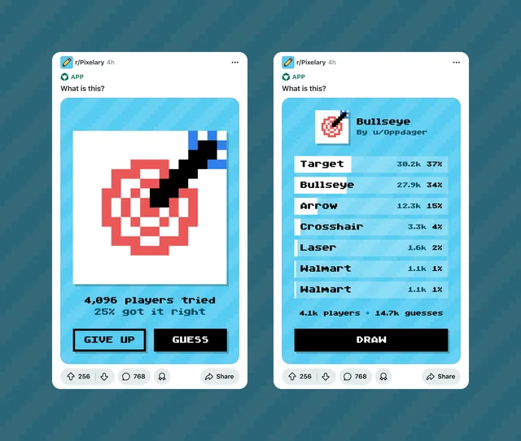

# Inside Pixelary: A Designer’s Take on Building Games at Reddit

In November 2023, I launched the first version of [Pixelary](https://www.reddit.com/r/Pixelary/), a simple drawing and guessing game built using [Reddit’s developer platform](https://developers.reddit.com/).

As a designer, I’m particularly interested in how the developer platform can foster new experiences for Reddit’s users. The platform enables the creation of everything from interactive games in post units to sophisticated moderation tools, allowing communities to personalize their spaces through code—and turning code itself into content.

What began as a hackathon project has evolved into a thriving game, attracting more than 65,000 subscribers. The insights gained from building Pixelary extend beyond game design, offering valuable lessons for creating engaging, scalable experiences in any context.

Guess what the drawing is on r/[pixelary](https://www.reddit.com/r/Pixelary/).

# Create a content flywheel

Posts on Reddit fade away from the feed after a few days. If a game’s lifespan is longer, it needs to continuously produce content to maintain engagement.

In Pixelary, every interaction creates new content: drawing produces new posts and guessing generates comments, which boosts visibility across Reddit. This “content flywheel” ensures that Pixelary remains visible and engaging—more content means more interaction, and more interaction leads to more content.

# Create a distinctive first screen

In a feed, user attention is fleeting. If your post looks the same every time, it risks being ignored as a repost.

For Pixelary, I focused on showcasing the drawings. The first screen changes with every post, which offers users a new visual to engage with and prevents the sense of repetition. The more unique and intriguing the first screen, the more likely it is that users will stop scrolling and start playing.

# Make calls to action clear and focused

A game is only as good as its ability to get users to take an action. In Pixelary, I narrowed the focus to just a few key actions: submitting drawings and commenting. This simplicity helps reduce decision fatigue and encourages players to engage with the game on a deeper level.
The game was designed to direct attention toward the most valuable interactions—those that contributed to the game’s ongoing content creation and distribution.

# Build for N players

Pixelary is an asynchronous game. Players don’t need to be online at the same time to enjoy it.

This flexibility allows for a scalable experience. As the user base grows, we don’t want the game to be limited by the number of people playing at any given moment.

Asynchronous mechanics reduce the commitment threshold—players can hop in, contribute a guess, and leave. The increased volume of guesses and drawings only improves the overall game experience, as it increases the variety and quality of posts.

This approach also means that players don’t need to dedicate large chunks of time to enjoy the game, making it easier for the user base to expand.

# Moderation through accountability

In any community, moderation is key to maintaining a healthy, engaging experience. By pairing usernames with their actions—whether drawing or commenting—Pixelary encourages accountability and helps reduce trolling, creating a safer space for users to interact.

# Scaling with Devvit

As Pixelary grew, I quickly realized that the way data was stored couldn’t keep up with the increased traffic. Initially, I stored all post data in a single object, but this approach became too slow. To fix it, I broke the data into smaller, more efficient pieces, optimizing how we queried the system. This change allowed Pixelary to scale and handle the growing user base more effectively.

Another challenge was the performance of Reddit’s legacy APIs. Some calls were slow, especially for international users, which led to slow load times and increased unsubscribe rates. Caching responses helped speed up the system, but it was a constant balancing act between performance and user experience.

# Working within constraints

Reddit's design system (RPL) presented challenges and opportunities. For example, RPL didn’t support a custom typeface, so I built a tool to convert text strings into a [pixel font](https://developers.reddit.com/play#pen/N4IgdghgtgpiBcIAKBLAHjANgAgGIHswAXEAGhAGcAnAYwRBSgAd8qjtgARGANx5SIBfbADMq+KNgDkAAQAmvfkQD0TAK4AjTChoBaCExRSAOmFPLl2AOKYAnkwAWFbBCoxsCkSjAw52DVj4AO6mRPbuAMpqTCxsvjb2TtgAvNgA1jC2+CLYYUww2dZ2jhQA3Kah4UWJKRym2NhMEEQO8NgURFTeAOblYA1BKHItbWBqUAFUfQ0OMCjdDkSj45N9gn2m3kQwVCIQNO6oGJgAKjBoREjiTM7A9dg0DiiYcm5gbR1dYL33FCgAXjAAPzLCY7aYPfCYVgg9qdHprCo+NCxdgiNRgGhEFCEbBHLBnC4ACiY1wobXxp3OlzJAEo2gApCIADQAdABRTAwWDEOr9SFgDocB5PF5vUjtAHuVIAJglNChrFqUi0+zSUmwwlSpPwNwhCsF7G0Plqj2erxgYAA2gAGAC6rIoTG0RCJUiktP1hCF3QMtQAjF7DdhZvNFrUEiUrVIAIJSB2hhZECFc9iDYYOWo2lMwdhoADyIhEFFzWY2-INQsern22yo5LhX26VrttRb5YaxpgrJErHZ+wcRKJ1aotZ2tJSAD4+Q0GigcsOHDWsTsUslUhqPTPZw0C0WS+wANSpABs2EP2F9TAhO7cRDUVDAN81SJ3lfY3WKrWqjgjX4oVojmOVAuM4UQxKw2xyJGTh2s+87YESACEn6JBOdz8reuYPk+9wNIIeEisudYUKy6gUIOAAGAA8TQtIRDRyMkxggAAJMAqGOGRzQOARIAMbko6Cr2VBQMxICdBAgqYM0MBEuxe7Frmwg2rSLECV4mCYLoVBqFy4m8Ja+ByHI6mYbONDaEwOl6TABk8EZJlmTuyiTpRnqvrOikHueqScQ4rLpi056XgYz5BZmqTebmEKCB5Zj8hY2AAErcvgDm5LMgkQM8PShUw9wRdguh+WFnnvu0NAQFycgABJzEmbTcHwAisgAQtCNBpKRERShE8LfLUlHsYm4YAFSSoCghMGglFBkKFBVTVADqQwjNgzVKO1nXdayvWAv1TZDexRUTX8U0zXNnl3jhiGEdRjAQN0MACY9z31WGRDJMAo1CK9UBPTAq0Zt9EUEeZMwNYs32LdVvgfUm4M7gMa0ODDS2+MDLRI8jCiLV0TDYoQ31mmKlq2naONYedMAALLGXZLGaZgznIw+mDfZRcjNBA8BvTAygUDw3SHmgUCYKUI4HskACqJy4LoAAcpACQ01FC90qvIxF4knajfFazuv26z9UN-fxEPIw0-AwEEbX4Gg4k2tgzt6xmwgjWbBuW1bzMmwq0JUN7VtW2LmCCuJixEEw8AWEE8eBQAzKyrDdMoMo2pngvC6zVuTlr7FASu9asgAVvg3huh6VPI9R2fdPnluUTXrn3PF4OmJtrUQCZADCagdBISD4B0JzhESGENJAsBtFIABy0AwFIKv8m8ChUG0AD6BrbBcU7bg0N2PndlvUTwHRqiGZvif6mcAKQsdgOssbfNoPyALjaN0YA8l9LEaPgIgRAJCPyaCZHo4kZJUGeo-DQapujiAxHIXuioqDiQAMQygACzYOwY-K84kKAAy0ixRuIdsDUScEQS+BCWJEOqizEAZDyEUMpISdgNNvoAFZhAB1YOJIITxtikPqlpfAdc2HUmYVbOuVC1TSNrnIrq+VCHEMYQomRki96cOADwyEgcBFCJekw5arAXgSPQASKRhtWGWKpNoqU3DeGoIwUWLBXDM6kM3hY447CNGzlkRfLq-i67n2ocEwial+TgzikiCqMFnCpEntgFiNoWJtGSQ0FidEHDpJSSAWmXCXa1X9AANX9LVG0pSuElNKSeWqXDqm1RPOUhppSbQAC1aZYOwBUmUpTE61UTqUrBtV+k1KwQMoZpSZS1Umf6DpLEV47hYhFPJJ5lmzhYr9PJAB2e4ghNkvzyZk-JOS8ksW6cU-pFSymzPGZUupzSmmTM6UswiqzUbrM2VkkAOyEDYH2dEo5IAZQnI+SAc5ALLn+mKY0ipLTZmNMGZM0ZwyaktPqVUmpZTRn9MGcM2Z8yxkzMebc9piyyAQrWQCjZEL-ltCBfhEFidwXmWyTxC5BTnY2meRUxpRKpmNNGS0mpjT6llJqVUvFLyRnTMGf02ZwyKlVLeVS9lIAaVtDpRqhlgKDkgqwWylZkLOXQoKUU3lyqSWzLKYM7F0z6mNIxXKxpnTaYymwMMtFUyZSUp+fkrV2AdUmr1UyzUIKuHGq2aa+i5raZnl5VUlFTT+mjIdWUp1TSWmDIFSShFFL3kaqDSGmNYaDX3BYieaNvyoVtBhXC1piq2mDNFW0iVTSqnkvdZ6iZvrqn+upV82lAbtlmz2RW-kLF9kAtORyuN9buXFMRS2uZcrhkdplQS0lxLVWDuLcO7Vo6-njoBeGw5laQCKxrWcs1i7CnFLKSq0ldrHk4qec655ubSUtP5RSq5yKSUTK6T0+5rTJl+qLSaktx7y3AsvQAThvfO3J8bYW8vhc80Zn7Jkdpqd6tdgy7lktqT27Agq+kzP3dBw9wbYOnsZZO35MZkOxtQ-ez1vLiV5sxWump-SsUvqbf+z1aa133OozGmD9KGP6vg1OkAbVWN1vyQ+pNH7s1Cp-a0t1IGvVAcI100T4HSWQfVTRjM3yZOfQnfJ35vdlN3tU+htpBaKMGdRc8sVTzJUkbKWq490ndWyfPSCzgjmF2qZ6ep+pkzvMitJZh15emlXCfw3KiDknflBdDSFpj+T2QRfY6pxNjz6ltvxW0sDBaAtDssyO6zSZbPMsvbgIrXLaY8r5Ta1dAnHm1YPfVo9jXFjNYjZeqw7W0PLrS2un1rafOdtaf5rLgbaOlt+XBlrCnapTfvV15trznmxf7YJgbFnIsbfyVt8bCmACSe3VNdd-Xx47b7839dW58obdGRtEDGxehTDJHuXNK3Fkl6ammZraS687Un1v0Zs2e-LLEADSIOCmcbKxD6ZfbytNOFeJ1zzyuOtMJSSuH2WEd-YByCgAMhjj1xSqn4-44W8z8OftXbHUjxjdnVOM4O2TndOn2m1V2RplN82SVna+5q2juzEdNeR-zlic9BfXOF4K3lvHwcEb63uqDnPLtK9Gyr7bvz8yM8tbU5976s0ur-e6nplG+0LKN1Trnpv-vm9u78pAGuWc48Ay9t1lSjO9KmcSszgXqfBd53Ji3+SACK1vH2tIzU89Fa7WdtIS07vTrvpmjPmXLnLZa8uq5AMlQPTyxPZ9w151doexfO96SSlN7uOee5NzT33gPfkREZy5zDzaQ8E8W32ojpKu2kbL3H3LCfQuXpOIz0rs++vEpaZTtbXu+986TyxGWgePNi944b7vu-e-x+Vwfv3+TSmM6x9K2pbOTvxZJ3Nin8+9837N3fgffJZaE-SrcnSZb9XlCXB3L-bPA3dnWPH7RXffRPe-FiZkEAkXHXRLOVXXOVOA0ZYjC-BA6-RfW-FAwAliAATSf2ZyEwVSeXAKq0-wg2-w9yv2K25xPSXxRxAEpQyQhRU1B1oIqXJ0q1xWxwq3XSj2wJqx-xIIr24KrwgGH3bx40n0eQIOkNtXKQj3B08xjzq3kM20r0PxAA0BoJixhy-SYP6Tb3oKnzkI4O91p0vRoBUL-TA28zw0eW0K72IOKy4WcP7xBVMlnQEKcyENJ20PtShyeW3wjynyA0cKsz-x9wAJBWMX4I1UEIKVhQ8KwwM3FVfx8NtwjxTTA0TmSIa1SJcIUxEDT15RuVqVmWTVqXqWGW-VSwLzYO+0i0COQOXwU01jCOyIiNyPb140aV2Wx3B3EKqV8N0KJzTSqOGxqOCMvWKznTYw6yFyRSmVwPoNlx6Pl1-1IP-3IJBRQEZ0TnIzFyfWmRaKmV8yDz1yo2OKDSwSCPSMvVLmuNuIwy13bTXWmKD0JRWOwH6LWO+IUzSAwO3T2KlysNwPSxlSOMv16KcIGJ4MYSyJNRyM62KQbyeUz2fR3wxLyU+KxKrygA10o3cxXSgLz1e312JJ0PeIVy+IuMvTMBGLxLGIJPyNwLA0Ez8MMMxKhK5IU3wHcKYLbSKOeKEwWSZz7U8PBM4JuwoMhVpNKWmIeUJxXUwzIzExYIMMGyMOuxMNQJAAAEc1929CC5VfNJlpjf0I9jTTM1TOTBjfkqBaTZStCZcyVPSqTTCKAZSV1Kt9SJ9BM+1NCYiFj2TTiFCyDvT8k0iD5b1ItLlosPt5iDMN0m8WCXtktEzzSecUyeC1A-SHkt91Cu1gyJTUyWIeAaDn1NC39XsoyKl9C2T0STiyyuCKyq8QheSY18TnZKN4TCNicJcEt39HValIdRSzTiskDGyeC0BqyRc3NV1PNP1kTAzM8t1migzSzxSzj0ymyQBbAtyS9Wk5SGCdTsds85jez-CUiLzajfl-g-SDTpCfUXUYzFyO8HjTy+zy9jDFDTDN4Ncii20yT+zzzkzzirzdANcCMc1w8zyPzkLLyeDWQNdG8xMEKg05QQyrSVZRza1+SbjNDBNdSs8RlwTE4vSeCiQGiPsHT2zAycM8Dty2kSLaNITPz1iFM1IqLMzitLkbj1NyVUtuLQTZVsN+LhlBKfthLcKvz8kkILCNC68lsZU1LIsyL1yq9DxWzpyWk7z6liL+1lyLskLIKhzTCxoZTydMMJdZlMLFYcCmlGTP0CzfNbL6CEzwLaNlZyLNSgQOL7i8ymiWCOiIdHy2c7zOjutdNsLqiRLoSO5kRUQPAYA9g9J2Au4SByAHJ6wcQwAEB-RBAgA). It wasn’t a major change, but it helped reinforce Pixelary’s identity and gave it a unique feel.

Constraints—whether technical, design, or platform-based—force us to think more creatively and push the boundaries of what’s possible.

# What’s next?

Pixelary is far from finished. There’s still much to explore, including:

- A smarter dictionary for more dynamic guessing.
- Enhanced drawing tools, like drag-to-draw and a broader color palette.
- A deeper progression system.
- More community-driven events and experimental game modes.

These ideas are just the beginning, and I’m excited to keep improving the game. You can dive into the open-source code for Pixelary [here](https://github.com/reddit/devvit/tree/main/packages/apps/pixelary).

# Join us!

If you’re interested in building community games, I encourage you to explore Reddit’s [developer platform documentation](https://developers.reddit.com/docs/quickstart).
