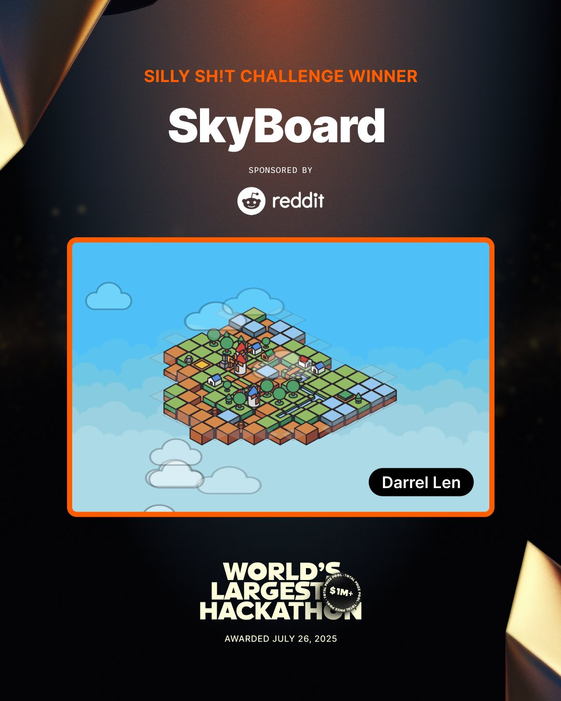

# Skyboard Wins Reddit's "Silly Sh!t Challenge" at the World's Largest Hackathon

What happens when you combine [Reddit's developer platform](https://developers.reddit.com/), a massive online hackathon, and a challenge to build the weirdest thing possible? You get [Skyboard](https://www.reddit.com/r/Skyboard/) — a pixel-based MMO city-builder that lives entirely _on Reddit_. And it just took home the win in the _Silly Sh!t Challenge_ at the [World's Largest Hackathon](https://hackathon.bolt.fun/) presented by [Bolt](https://bolt.new/).

Runner up winners to the Silly Sh!t Challenge include:

- r/[FroggyFlight](https://www.reddit.com/r/froggyflight/) – this is what happens when you combine planes and launching frogs
- r/[GrumpyGranny](https://www.reddit.com/r/GrumpyGranny/) – crack the passcode to grumpy granny's computer before she screams
- r/[WibbitGame](https://www.reddit.com/r/WibbitGame/comments/1lo9h2a/wibbit_game/) - make pixel art using tetrominoes
- r/[RunningWithSnoo](https://www.reddit.com/r/RunningWithSnoo/) - journey around the world in your Reddit avatar with help from the community
- r/[bolt_gigapet](https://www.reddit.com/r/bolt_gigapet/) - turns out tamagotchi and Reddit is a great combination

# More On Skyboard

Skyboard is a collaborative, city-builder game powered by Reddit’s developer platform and built using Bolt. This app transforms the r/Skyboard subreddit into a living, breathing digital landscape — where Redditors drop tiles, construct buildings, and shape the world together.

The result? A minimalist, endlessly scrolling MMO where your subreddit is the game world. There’s no download, no launcher — just your browser and your imagination.

Play it today: [r/Skyboard](https://www.reddit.com/r/Skyboard/)

# The Silly Sh!t Challenge

The _Silly Sh!t Challenge_ within the hackathon asked developers to embrace the weird and wonderful:

- _Build the silliest, strangest, most delightfully useless thing possible using Reddit x Bolt._

Skyboard nailed it by taking something familiar — the city-builder genre — and reimagining it in a Reddit way. It's a game built entirely out of community, creativity, and a bit of chaos.

# More on the Hackathon

The [_World's Largest Hackathon_](https://worldslargesthackathon.devpost.com/), presented by Bolt, brought together thousands of developers to _build with AI and Bolt_ for a shot at $1M+ in prizes. From tools to games to complete absurdities, the event celebrated boundary-pushing builds. Additionally, Reddit runs a ton of hackathons throughout the year with cash prizes and if you're interested in keeping up with the latest you should join our developer community on r/[devvit](https://www.reddit.com/r/Devvit/).

# Build Today

Reddit's Developer Platform + Bolt makes it easy to bring games, tools, and weird experiments to life — all within Reddit where online communities thrive. So whether you want to build the next big tower defense game or just something fun for your community, now's the time.

Check out [developers.reddit.com](https://developers.reddit.com/) to get started.
