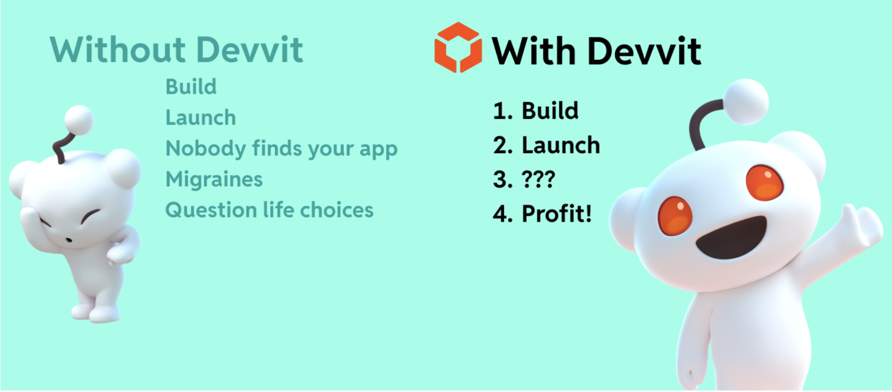

# Code, Publish, Community, Profit: Reddit's Developer Funds are Paying Big!

**Want to build unique experiences directly within Reddit communities and get paid for it? Meet the [Reddit Developer Funds](https://developers.reddit.com/docs/earn-money/reddit_developer_funds) Program that rewards community and creativity.**

If you're dreaming of monetizing your games and apps without the usual hurdles, Devvit is your answer! The [Reddit Developer Funds](https://developers.reddit.com/docs/earn-money/reddit_developer_funds) Program has already **paid hundreds of thousands of dollars** (not including hackathons) to innovative developers. In October alone, developers **made more than $80,000 in payouts**.

From the goose survival game [Honk](https://developers.reddit.com/docs/blog/honk), to the side-scrolling frog battler [Sword And Supper](https://developers.reddit.com/docs/blog/sword-and-supper), to the community quiz trivia game, [Quiz Planet](https://www.reddit.com/r/QuizPlanetGame/), to the [Touch Grass](https://www.reddit.com/r/touchgrass_app/) game, to a community favorite riddle challenge [Riddonkulous](https://developers.reddit.com/docs/blog/riddonkulous) — plenty of games have not only captured the imagination of Redditors but also earned their developers impressive payouts through the [Reddit Developer Funds](https://developers.reddit.com/docs/earn-money/reddit_developer_funds) Program. These projects are proof that when creativity meets community, real rewards follow.

**So, how can you get in on this?**

[Reddit's Developer Funds](https://developers.reddit.com/docs/earn-money/reddit_developer_funds), powered by [Devvit](https://developers.reddit.com/docs/) (Reddit's Developer Platform), champions a low barrier to entry. The current program lets eligible developers earn up to **$167,500 per app** by focusing on user engagement. Monetization can start once your creation hits just 500 qualified daily players maintained for seven days. No launch budget needed – just engaging content!

And did we mention that hosting a scalable backend is also free? Here's what [u/hammertimestudio](https://www.reddit.com/user/hammertimestudio/) maker of [r/Riddonkulous](https://www.reddit.com/r/riddonkulous/) had to [say](https://developers.reddit.com/docs/blog/riddonkulous) about building on Reddit:

“When building games or apps for other platforms you typically end up managing a backend, authorization flows, CI/CD (build pipeline and deployment), logging, quality assurance, load balances, and other infrastructure overhead. Devvit simplifies that entire stack into a single suite, making it easy to start and scale it. <strong>This allows you to focus on the most important part, your app in the making</strong>.”  

 

Additionally, here’s what [u/thejohnnyr](https://www.reddit.com/user/thejohnnyr/) maker of the hit game [r/Honk](https://www.reddit.com/r/honk/) had to say:

“The Reddit team has been fantastic. They’ve helped with promotion, infrastructure, bug fixes, even hotfix approvals at odd hours. <strong>Honestly, all I’ve had to do is focus on building the game</strong>.”  

 

What this all means for you: on Reddit, your app's earning potential is tied directly to user engagement, and **distribution within relevant communities is inherently free**.

We’re doing this because a) we want developers to succeed on Reddit, and b) we believe it’s how we can best enable apps to serve the Reddit community. More specifically:

- Distribution support is an active investment for us - we want to help you find your audience. Allowing you to focus on building the best experience, means it’s even easier to find the right audience.
- This program is set up to reward developers for incremental success as they build these new types of experiences.
- Games and Reddit have been a match since the dawn of...well, Reddit. We want to open up the doors for developers to better connect and build for an audience that is hungry for more.

This means your focus can remain on building a great, engaging app, knowing that discovery and a path to revenue are built into the platform. It’s a stark contrast to the traditional grind of launch, advertise, and hope.

This is a golden opportunity, especially for game and indie developers. Publish directly to passionate communities and earn as users play. Web developers can also build sought-after tools and apps, joining the ranks of top earners. If your creation gets engagement, you're on the path to profit.

Not interested in making games? How about giving communities customization or turning Reddit into a better place? Devvit also allows any developer to build tools for moderators that help keep conversations engaging, delightful, and safe. If you build moderation tools, and they get adopted by many subreddits, you're also eligible for payouts.

If you want to monetize your games or publish apps easily, Reddit’s Developer Funds offers a clear path. Real developers, real money, right now.

We’re also thrilled to share that the **Reddit Developer Funds Program will continue into 2026**, giving even more developers the chance to innovate, earn, and grow on Reddit. Expect more opportunities, bigger rewards, and continued support as we expand the program to empower the next wave of builders and creators.

**Need Inspiration? Check out [r/GamesOnReddit](https://www.reddit.com/r/GamesOnReddit)!**

**Ready to turn your passion into profit? Explore [Devvit](https://developers.reddit.com/docs/) today and join our Discord!**
