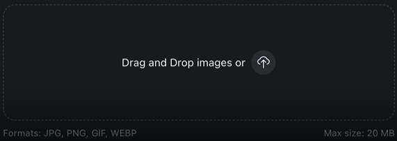

import Tabs from '@theme/Tabs';
import TabItem from '@theme/TabItem';

# Forms

A form lets your app ask users to input and submit data. Forms can be defined with a simple [form object](#form-object) that takes a [list of fields](#supported-fields-types), and return user responses directly as promises.


## Using forms

<Tabs>
  <TabItem value="web" label="Devvit Web">
  
  **Promise-based forms:**
  ```ts title="client/index.ts"
  import { showForm } from '@devvit/web/client';

  // Show form and get user response directly
  const result = await showForm({
    form: {
      fields: [
        {
          type: 'string',
          name: 'name',
          label: 'Name',
        },
      ],
    },
    data: { name: 'Default value' } // Optional initial data
  });

  // Handle form submission result immediately
  if (result) {
    const { name } = result;
    
    // Process the data directly
    console.log(`User entered: ${name}`);
    
    // Chain additional actions
    await fetch('/api/save-name', {
      method: 'POST',
      body: JSON.stringify({ name })
    });
    
    // Or show another form in sequence
    const step2 = await showForm({
      form: {
        fields: [
          {
            type: 'string',
            name: 'food',
            label: 'Favorite food?',
          },
        ],
      }
    });
    
    if (step2) {
      console.log(`Multi-step complete: ${name}, ${step2.food}`);
    }
  } else {
    console.log('User cancelled the form');
  }
  ```

  ### Parameters

  **`showForm(options)` → Returns Promise**
  - `form` (Form): The form specification object
  - `data` (FormValues, optional): Initial form field values
  - **Returns**: `Promise<FormValues | null>` - Resolves with form data or null if cancelled

  </TabItem>
  <TabItem value="blocks" label="Devvit Blocks / Mod Tools">
  ```tsx
  import { Devvit, useState, useForm } from '@devvit/public-api';

  // Interactive post with form
  Devvit.addCustomPostType({
    name: 'FormExample',
    render: (context) => {
      const [name, setName] = useState('unknown');

      const myForm = useForm(
        {
          fields: [
            {
              type: 'string',
              name: 'name',
              label: 'Name',
            },
          ],
        },
        (values) => {
          // onSubmit handler
          setName(values.name);
        }
      );

      return (
        <vstack gap="medium" height="100%" alignment="middle center">
          <text>Hello {name}!</text>
          <button
            onPress={() => {
              context.ui.showForm(myForm);
            }}
          >
            Set name
          </button>
        </vstack>
      );
    },
  });

  // Menu action with form
  const myForm = Devvit.createForm(
    {
      fields: [
        {
          type: 'string',
          name: 'food',
          label: 'What is your favorite food?',
        },
      ],
    },
    (event, context) => {
      // onSubmit handler
      context.ui.showToast({ text: event.values.food });
    }
  );

  Devvit.addMenuItem({
    label: 'Show a form',
    location: 'subreddit',
    onPress: async (_event, context) => {
      context.ui.showForm(myForm);
    },
  });
  ```

  ### Methods

  **`context.ui.showForm(formConfig, onSubmit)`** - For interactive posts
  - `formConfig` (Form): The form specification object
  - `onSubmit` (function): Callback function when form is submitted

  **`Devvit.createForm(formConfig, onSubmit)`** - For menu actions
  - `formConfig` (Form): The form specification object  
  - `onSubmit` (function): Callback function when form is submitted

  </TabItem>
</Tabs>

## Menu Response Forms

For forms that open from a menu item, you can use menu responses. This is useful since you do not have access to the `@devvit/web/client` library from a menu item endpoint.

<Tabs>
  <TabItem value="web" label="Devvit Web">
  
  **Configure forms in devvit.json:**
  ```json title="devvit.json"
  {
    "forms": {
      "nameForm": "/internal/form/name-submit",
      "reviewForm": "/internal/form/review-submit"
    }
  }
  ```

  **Server endpoint that shows form via menu response:**
  ```ts title="server/index.ts"
  import { UIResponse } from '@devvit/web/shared';

  // Menu action that triggers menu response form
  router.post("/internal/menu/start-workflow", async (_req, res: Response<UIResponse>) => {
    // Server processing before showing form
    const userData = await fetchUserData();
    
    res.json({
      showForm: {
        name: 'nameForm',
        form: {
          fields: [
            {
              type: 'string',
              name: 'name',
              label: 'Name',
            },
          ],
        },
        data: { name: userData.name } // Pre-populate from server
      }
    });
  });

  // Form submission handler that can chain to another form
  router.post("/internal/form/name-submit", async (req, res: Response<UIResponse>) => {
    const { name } = req.body;
    
    // Server processing
    await saveUserName(name);
    
    // Show next form in workflow
    res.json({
      showForm: {
        name: 'reviewForm',
        form: {
          fields: [
            {
              type: 'paragraph',
              name: 'review',
              label: 'How was your experience?',
            },
          ],
        }
      }
    });
  });

  router.post("/internal/form/review-submit", async (req, res: Response<UIResponse>) => {
    const { review } = req.body;
    
    await saveReview(review);
    
    res.json({
      showToast: 'Thank you for your feedback!'
    });
  });
  ```

  </TabItem>
  <TabItem value="blocks" label="Devvit Blocks / Mod Tools">
  
  For Devvit Blocks, use the standard promise-based approach even in menu actions:

  ```tsx
  Devvit.addMenuItem({
    label: 'Multi-step workflow',
    location: 'subreddit',
    onPress: async (_event, context) => {
      // Step 1: Get user data from server
      const userData = await fetchUserData();
      
      // Step 2: Show form with server data
      const step1 = await context.ui.showForm({
        fields: [
          {
            type: 'string',
            name: 'name',
            label: 'Name',
          },
        ],
        data: { name: userData.name }
      });
      
      if (!step1) return;
      
      // Step 3: Save and continue to next form
      await saveUserName(step1.name);
      
      const step2 = await context.ui.showForm({
        fields: [
          {
            type: 'paragraph',
            name: 'review',
            label: 'How was your experience?',
          },
        ],
      });
      
      if (step2) {
        await saveReview(step2.review);  
        context.ui.showToast('Thank you for your feedback!');
      }
    },
  });
  ```

  </TabItem>
</Tabs>


## Form object

The form object enables you to customize the form container and the [list of form fields](#supported-fields-types) included. The form object structure is the same for both Devvit Web and Devvit Blocks.

#### Usage

```tsx
const myForm = {
  title: 'My form',
  description: 'This is my form. There are many like it, but this one is mine.',
  fields: [
    {
      type: 'string',
      name: 'food',
      label: 'What is your favorite food?',
    },
    {
      type: 'string',
      name: 'drink',
      label: 'What is your favorite drink?',
    },
  ],
  acceptLabel: 'Submit',
  cancelLabel: 'Cancel',
};
```

#### Supported properties

| Property      | Supported types      | Description                                   |
| :------------ | :------------------- | :-------------------------------------------- |
| `title`       | `string` `undefined` | An optional title for the form                |
| `description` | `string` `undefined` | An optional description for the form          |
| `fields`      | `FormField[]`        | The fields that will be displayed in the form |
| `acceptLabel` | `string` `undefined` | An optional label for the submit button       |
| `cancelLabel` | `string` `undefined` | An optional label for the cancel button       |

## Supported fields types

The following field types are supported: [String](#string), [Select](#select), [Paragraph](#paragraph), [Number](#number), [Boolean](#boolean), [Image](#image), and [Group](#group).

### String

A single-line text input.


#### Usage

```ts
const stringField = {
  type: 'string',
  name: 'title',
  label: 'Tournament title',
};
```

#### Properties

| Property       | Supported types                                                                   | Description                                                                                                                                                      |
| :------------- | :-------------------------------------------------------------------------------- | :--------------------------------------------------------------------------------------------------------------------------------------------------------------- |
| `type`         | `string`                                                                          | The desired field type.                                                                                                                                          |
| `name`         | `string`                                                                          | The name of the field. This will be used as the key in the `values` object when the form is submitted.                                                           |
| `label`        | `string`                                                                          | The label of the field. This will be displayed to the user.                                                                                                      |
| `helpText`     | `string` `undefined`                                                              | An optional help text that will be displayed below the field.                                                                                                    |
| `required`     | `boolean` `undefined`                                                             | If true the field will be required and the user will not be able to submit the form without filling it in. Defaults to `false`.                                  |
| `disabled`     | `boolean` `undefined`                                                             | If true the field will be disabled. Defaults to `false`.                                                                                                         |
| `defaultValue` | ` ValueType` `undefined`                                                          | The default value of the field.                                                                                                                                  |
| `scope`        | [`SettingScopeType`](/api/public-api/type-aliases/SettingScopeType) `undefined` | This indicates whether the field (setting) is an app level or install level setting. App setting values can be used by any installation. `undefined` by default. |
| `placeholder`  | `string` `undefined`                                                              | Placeholder text for display before a value is present.                                                                                                          |
| `isSecret`     | `boolean` `undefined`                                                             | Makes the form field secret.                                                                                                                                     |

### Select

A dropdown menu with predefined options.


#### Usage

```ts
const selectField = {
  type: 'select',
  name: 'interval',
  label: 'Update the leaderboard',
  options: [
    { label: 'Hourly', value: 'hourly' },
    { label: 'Daily', value: 'daily' },
    { label: 'Weekly', value: 'weekly' },
    { label: 'Monthly', value: 'monthly' },
    { label: 'Yearly', value: 'yearly' },
  ],
};
```

#### Properties

| Property       | Supported types                                                                   | Description                                                                                                                                                      |
| :------------- | :-------------------------------------------------------------------------------- | :--------------------------------------------------------------------------------------------------------------------------------------------------------------- |
| `type`         | `string`                                                                          | The desired field type.                                                                                                                                          |
| `name`         | `string`                                                                          | The name of the field. This will be used as the key in the `values` object when the form is submitted.                                                           |
| `label`        | `string`                                                                          | The label of the field. This will be displayed to the user.                                                                                                      |
| `options`      | `FieldConfig_Selection_Item[]`                                                    | The list of options available.                                                                                                                                   |
| `helpText`     | `string` `undefined`                                                              | An optional help text that will be displayed below the field.                                                                                                    |
| `required`     | `boolean` `undefined`                                                             | If true the field will be required and the user will not be able to submit the form without filling it in. Defaults to `false`.                                  |
| `disabled`     | `boolean` `undefined`                                                             | If true the field will be disabled. Defaults to `false`.                                                                                                         |
| `defaultValue` | ` string[]` `undefined`                                                           | The default value of the field. Note that the default value is wrapped in an array to support multiple selected values.                                          |
| `scope`        | [`SettingScopeType`](/api/public-api/type-aliases/SettingScopeType) `undefined` | This indicates whether the field (setting) is an app level or install level setting. App setting values can be used by any installation. `undefined` by default. |
| `multiSelect`  | `boolean` `undefined`                                                             | Enables users to select more than 1 item from the set.                                                                                                           |

### Paragraph

A multi-line text input for longer responses.


#### Usage

```ts
const paragraphField = {
  type: 'paragraph',
  name: 'description',
  label: 'Description',
};
```

#### Properties

| Property       | Supported types                                                                   | Description                                                                                                                                                      |
| :------------- | :-------------------------------------------------------------------------------- | :--------------------------------------------------------------------------------------------------------------------------------------------------------------- |
| `type`         | `string`                                                                          | The desired field type.                                                                                                                                          |
| `name`         | `string`                                                                          | The name of the field. This will be used as the key in the `values` object when the form is submitted.                                                           |
| `label`        | `string`                                                                          | The label of the field. This will be displayed to the user.                                                                                                      |
| `helpText`     | `string` `undefined`                                                              | An optional help text that will be displayed below the field.                                                                                                    |
| `required`     | `boolean` `undefined`                                                             | If true the field will be required and the user will not be able to submit the form without filling it in. Defaults to `false`.                                  |
| `disabled`     | `boolean` `undefined`                                                             | If true the field will be disabled. Defaults to `false`.                                                                                                         |
| `defaultValue` | ` ValueType` `undefined`                                                          | The default value of the field.                                                                                                                                  |
| `scope`        | [`SettingScopeType`](/api/public-api/type-aliases/SettingScopeType) `undefined` | This indicates whether the field (setting) is an app level or install level setting. App setting values can be used by any installation. `undefined` by default. |
| `placeholder`  | `string` `undefined`                                                              | Placeholder text for display before a value is present.                                                                                                          |
| `lineHeight`   | `number` `undefined`                                                              | Sets the field height by number of lines.                                                                                                                        |

### Number

An input for numerical values.


#### Usage

```ts
const numberField = {
  type: 'number',
  name: 'tokens',
  label: 'Token balance',
};
```

#### Properties

| Property       | Supported types                                                                   | Description                                                                                                                                                      |
| :------------- | :-------------------------------------------------------------------------------- | :--------------------------------------------------------------------------------------------------------------------------------------------------------------- |
| `type`         | `string`                                                                          | The desired field type.                                                                                                                                          |
| `name`         | `string`                                                                          | The name of the field. This will be used as the key in the `values` object when the form is submitted.                                                           |
| `label`        | `string`                                                                          | The label of the field. This will be displayed to the user.                                                                                                      |
| `helpText`     | `string` `undefined`                                                              | An optional help text that will be displayed below the field.                                                                                                    |
| `required`     | `boolean` `undefined`                                                             | If true the field will be required and the user will not be able to submit the form without filling it in. Defaults to `false`.                                  |
| `disabled`     | `boolean` `undefined`                                                             | If true the field will be disabled. Defaults to `false`.                                                                                                         |
| `defaultValue` | ` ValueType` `undefined`                                                          | The default value of the field.                                                                                                                                  |
| `scope`        | [`SettingScopeType`](/api/public-api/type-aliases/SettingScopeType) `undefined` | This indicates whether the field (setting) is an app level or install level setting. App setting values can be used by any installation. `undefined` by default. |

### Boolean

A yes/no or true/false type input.


#### Usage

```ts
const booleanField = {
  type: 'boolean',
  name: 'enable',
  label: 'Enable the event',
};
```

#### Properties

| Property       | Supported types                                                                   | Description                                                                                                                                                      |
| :------------- | :-------------------------------------------------------------------------------- | :--------------------------------------------------------------------------------------------------------------------------------------------------------------- |
| `type`         | `string`                                                                          | The desired field type.                                                                                                                                          |
| `name`         | `string`                                                                          | The name of the field. This will be used as the key in the `values` object when the form is submitted.                                                           |
| `label`        | `string`                                                                          | The label of the field. This will be displayed to the user.                                                                                                      |
| `helpText`     | `string` `undefined`                                                              | An optional help text that will be displayed below the field.                                                                                                    |
| `disabled`     | `boolean` `undefined`                                                             | If true the field will be disabled. Defaults to `false`.                                                                                                         |
| `defaultValue` | ` ValueType` `undefined`                                                          | The default value of the field.                                                                                                                                  |
| `scope`        | [`SettingScopeType`](/api/public-api/type-aliases/SettingScopeType) `undefined` | This indicates whether the field (setting) is an app level or install level setting. App setting values can be used by any installation. `undefined` by default. |

### Image

An image upload field.



#### Usage

```ts
const imageField = {
  type: 'image', // This tells the form to expect an image
  name: 'myImage',
  label: 'Image goes here',
  required: true,
};
```

#### Properties

| Property      | Supported types                                                                | Description                                                                                                                                                      |
| :------------ | :----------------------------------------------------------------------------- | :--------------------------------------------------------------------------------------------------------------------------------------------------------------- |
| `type`        | `string`                                                                       | The desired field type.                                                                                                                                          |
| `name`        | `string`                                                                       | The name of the field. This will be used as the key in the `values` object when the form is submitted.                                                           |
| `label`       | `string`                                                                       | The label of the field. This will be displayed to the user.                                                                                                      |
| `helpText`    | `string` `undefined`                                                           | An optional help text that will be displayed below the field.                                                                                                    |
| `required`    | `boolean` `undefined`                                                          | If true the field will be required and the user will not be able to submit the form without filling it in. Defaults to `false`.                                  |
| `disabled`    | `boolean` `undefined`                                                          | If true the field will be disabled. Defaults to `false`.                                                                                                         |
| `scope`       | [`SettingScopeType`](/api/public-api/type-aliases/SettingScopeType) `undefined` | This indicates whether the field (setting) is an app level or install level setting. App setting values can be used by any installation. `undefined` by default. |
| `placeholder` | `string` `undefined`                                                           | Placeholder text for display before a value is present.                                                                                                          |
| `isSecret`    | `boolean` `undefined`                                                          | Makes the form field secret.                                                                                                                                     |

### Group

A collection of related fields that allows for better readability.

#### Usage

```ts
const groupField = {
  type: 'group',
  label: 'This is a group of input fields',
  fields: [
    {
      type: 'paragraph',
      name: 'description',
      label: 'How would you describe what happened?',
    },
    {
      type: 'number',
      name: 'score',
      label: 'How would you rate your meal on a scale from 1 to 10?',
    },
  ],
};
```

#### Properties

| Property   | Supported types      | Description                                                   |
| :--------- | :------------------- | :------------------------------------------------------------ |
| `type`     | `string`             | The desired field type.                                       |
| `label`    | `string`             | The label of the group that will be displayed to the user.    |
| `fields`   | `FormField[]`        | The fields that will be displayed in the group.               |
| `helpText` | `string` `undefined` | An optional help text that will be displayed below the group. |

## Examples

Below is a collection of common use cases and patterns.

### Dynamic forms

<Tabs>
  <TabItem value="web" label="Devvit Web">
  
  **Client-side approach:**
  ```ts title="client/index.ts"
  import { showForm } from '@devvit/web/client';

  // Get user data and show form with dynamic default values
  const user = await reddit.getCurrentUser();
  
  const result = await showForm({
    form: {
      fields: [
        {
          type: 'string',
          name: 'username',
          label: 'Username',
        },
      ],
    },
    data: {
      username: user?.username || ''
    }
  });

  if (result) {
    // Handle the form result
    console.log(`Hello ${result.username}`);
  }
  ```

  **Server-side approach:**
  ```json title="devvit.json"
  {
    "forms": {
      "dynamicForm": "/internal/form/dynamic-submit"
    }
  }
  ```

  ```ts title="server/index.ts"
  // Endpoint that shows form with dynamic data
  router.post("/internal/menu/show-dynamic-form", async (_req, res: Response<UiResponse>) => {
    const user = await reddit.getCurrentUser();
    
    res.json({
      showForm: {
        name: 'dynamicForm',
        form: {
          fields: [
            {
              type: 'string',
              name: 'username',
              label: 'Username',
            },
          ],
        },
        data: {
          username: user?.username || ''
        }
      }
    });
  });

  // Form submission handler
  router.post("/internal/form/dynamic-submit", async (req, res: Response<UiResponse>) => {
    const { username } = req.body;
    
    res.json({
      showToast: `Hello ${username}`
    });
  });
  ```
  </TabItem>
  <TabItem value="blocks" label="Devvit Blocks / Mod Tools">
  ```tsx
  import { Devvit } from '@devvit/public-api';

  Devvit.configure({
    redditAPI: true,
  });

  const myForm = Devvit.createForm(
    (data) => {
      return {
        fields: [
          {
            type: 'string',
            name: 'username',
            label: 'Username',
            defaultValue: data.username,
          },
        ],
        // Adding `as const` helps you get accurate types in the onSubmit function below
        // This will only work if the function does not have any branching logic
      } as const;
    },
    (event, context) => {
      context.ui.showToast({
        text: `Hello ${event.values.username}`,
      });
    }
  );

  Devvit.addMenuItem({
    label: 'Show a dynamic form',
    location: 'subreddit',
    onPress: async (_event, context) => {
      const user = await context.reddit.getCurrentUser();
      const username = user?.username;
      context.ui.showForm(myForm, { username });
    },
  });
  ```
  </TabItem>
</Tabs>

### Multi-step forms

<Tabs>
  <TabItem value="web" label="Devvit Web">
  
  **Client-side approach (Promise chaining):**
  ```ts title="client/index.ts"
  import { showForm } from '@devvit/web/client';

  async function multiStepForm() {
    // Step 1: Get name
    const step1Result = await showForm({
      form: {
        fields: [
          {
            type: 'string',
            name: 'name',
            label: "What's your name?",
            required: true,
          },
        ],
      }
    });

    if (!step1Result) return; // User cancelled

    // Step 2: Get food preference  
    const step2Result = await showForm({
      form: {
        fields: [
          {
            type: 'string',
            name: 'food',
            label: "What's your favorite food?",
            required: true,
          },
        ],
      },
      data: { name: step1Result.name } // Pass data from previous step
    });

    if (!step2Result) return; // User cancelled

    // Step 3: Get drink preference
    const step3Result = await showForm({
      form: {
        fields: [
          {
            type: 'string',
            name: 'drink',
            label: "What's your favorite drink?",
            required: true,
          },
        ],
      },
      data: { 
        name: step1Result.name,
        food: step2Result.food
      }
    });

    if (step3Result) {
      // All steps completed - save or process data
      const finalData = {
        ...step1Result,
        ...step2Result, 
        ...step3Result
      };
      
      console.log(`Thanks ${finalData.name}! You like ${finalData.food} and ${finalData.drink}.`);
    }
  }
  ```

  **Server-side approach (Separate endpoints):**
  ```json title="devvit.json"
  {
    "forms": {
      "step1Form": "/internal/form/step1-submit",
      "step2Form": "/internal/form/step2-submit",
      "step3Form": "/internal/form/step3-submit"
    }
  }
  ```

  ```ts title="server/index.ts"
  // Step 1: Name form
  router.post("/internal/form/step1-submit", async (req, res: Response<UiResponse>) => {
    const { name } = req.body;
    
    res.json({
      showForm: {
        name: 'step2Form',
        form: {
          fields: [
            {
              type: 'string',
              name: 'food',
              label: "What's your favorite food?",
              required: true,
            },
          ],
        },
        data: { name } // Pass data to next step
      }
    });
  });

  // Step 2: Food form
  router.post("/internal/form/step2-submit", async (req, res: Response<UiResponse>) => {
    const { name, food } = req.body;
    
    res.json({
      showForm: {
        name: 'step3Form',
        form: {
          fields: [
            {
              type: 'string',
              name: 'drink',
              label: "What's your favorite drink?",
              required: true,
            },
          ],
        },
        data: { name, food } // Pass accumulated data
      }
    });
  });

  // Step 3: Final form
  router.post("/internal/form/step3-submit", async (req, res: Response<UiResponse>) => {
    const { name, food, drink } = req.body;
    
    res.json({
      showToast: `Thanks ${name}! You like ${food} and ${drink}.`
    });
  });
  ```
  </TabItem>
  <TabItem value="blocks" label="Devvit Blocks / Mod Tools">
  ```tsx
  import { Devvit, useState, useForm } from '@devvit/public-api';

  Devvit.configure({
    redditAPI: true,
  });

  Devvit.addCustomPostType({
    name: 'Multi-step Form',
    render: (context) => {
      const [name, setName] = useState('');
      const [food, setFood] = useState('');
      const [drink, setDrink] = useState('');

      const form3 = useForm(
        {
          fields: [
            {
              type: 'string',
              name: 'drink',
              label: "What's your favorite drink?",
              required: true,
            },
          ],
        },
        (values) => {
          setDrink(values.drink);
        }
      );

      const form2 = useForm(
        {
          fields: [
            {
              type: 'string',
              name: 'food',
              label: "What's your favorite food?",
              required: true,
            },
          ],
        },
        (values) => {
          setFood(values.food);
          context.ui.showForm(form3);
        }
      );

      const form1 = useForm(
        {
          fields: [
            {
              type: 'string',
              name: 'name',
              label: "What's your name?",
              required: true,
            },
          ],
        },
        (values) => {
          setName(values.name);
          context.ui.showForm(form2);
        }
      );

      function restart() {
        setName('');
        setFood('');
        setDrink('');
        context.ui.showForm(form1);
      }

      const isAnswered = name && food && drink;

      return (
        <vstack height="100%" alignment="center middle" gap="none">
          {isAnswered && (
            <>
              <text>Name: {name}</text>
              <text>Favorite food: {food}</text>
              <text>Favorite drink: {drink}</text>
              <spacer size="large" />
              <button onPress={restart}>Restart</button>
            </>
          )}
          {!isAnswered && <button onPress={restart}>Take questionnaire</button>}
        </vstack>
      );
    },
  });
  ```
  </TabItem>
</Tabs>

### One of everything

This example includes one of each of the [supported field types](#supported-fields-types).

<Tabs>
  <TabItem value="web" label="Devvit Web">
  
  **Client-side approach:**
  ```ts title="client/index.ts"
  import { showForm } from '@devvit/web/client';

  const result = await showForm({
    form: {
      title: 'My favorites',
      description: 'Tell us about your favorite food!',
      fields: [
        {
          type: 'string',
          name: 'food',
          label: 'What is your favorite food?',
          helpText: 'Must be edible',
          required: true,
        },
        {
          label: 'About that food',
          type: 'group',
          fields: [
            {
              type: 'number',
              name: 'times',
              label: 'How many times a week do you eat it?',
              defaultValue: 1,
            },
            {
              type: 'paragraph',
              name: 'what',
              label: 'What makes it your favorite?',
            },
            {
              type: 'select',
              name: 'healthy',
              label: 'Is it healthy?',
              options: [
                { label: 'Yes', value: 'yes' },
                { label: 'No', value: 'no' },
                { label: 'Maybe', value: 'maybe' },
              ],
              defaultValue: ['maybe'],
            },
          ],
        },
        {
          type: 'boolean',
          name: 'again',
          label: 'Can we ask again?',
        },
      ],
      acceptLabel: 'Submit',
      cancelLabel: 'Cancel',
    }
  });

  if (result) {
    console.log('Form values:', result);
    // Handle form submission
  }
  ```

  **Server-side approach:**
  ```json title="devvit.json"
  {
    "forms": {
      "everythingForm": "/internal/form/everything-submit"
    }
  }
  ```

  ```ts title="server/index.ts"
  router.post("/internal/form/everything-submit", async (req, res: Response<UiResponse>) => {
    console.log('Form values:', req.body);
    
    res.json({
      showToast: 'Thanks!'
    });
  });

  // Example showing the form
  router.post("/internal/menu/show-everything-form", async (_req, res: Response<UiResponse>) => {
    res.json({
      showForm: {
        name: 'everythingForm',
        form: {
          title: 'My favorites',
          description: 'Tell us about your favorite food!',
          fields: [
            {
              type: 'string',
              name: 'food',
              label: 'What is your favorite food?',
              helpText: 'Must be edible',
              required: true,
            },
            {
              label: 'About that food',
              type: 'group',
              fields: [
                {
                  type: 'number',
                  name: 'times',
                  label: 'How many times a week do you eat it?',
                  defaultValue: 1,
                },
                {
                  type: 'paragraph',
                  name: 'what',
                  label: 'What makes it your favorite?',
                },
                {
                  type: 'select',
                  name: 'healthy',
                  label: 'Is it healthy?',
                  options: [
                    { label: 'Yes', value: 'yes' },
                    { label: 'No', value: 'no' },
                    { label: 'Maybe', value: 'maybe' },
                  ],
                  defaultValue: ['maybe'],
                },
              ],
            },
            {
              type: 'boolean',
              name: 'again',
              label: 'Can we ask again?',
            },
          ],
          acceptLabel: 'Submit',
          cancelLabel: 'Cancel',
        }
      }
    });
  });
  ```
  </TabItem>
  <TabItem value="blocks" label="Devvit Blocks / Mod Tools">
  ```tsx
  import { Devvit } from '@devvit/public-api';

  const exampleForm = Devvit.createForm(
    {
      title: 'My favorites',
      description: 'Tell us about your favorite food!',
      fields: [
        {
          type: 'string',
          name: 'food',
          label: 'What is your favorite food?',
          helpText: 'Must be edible',
          required: true,
        },
        {
          label: 'About that food',
          type: 'group',
          fields: [
            {
              type: 'number',
              name: 'times',
              label: 'How many times a week do you eat it?',
              defaultValue: 1,
            },
            {
              type: 'paragraph',
              name: 'what',
              label: 'What makes it your favorite?',
            },
            {
              type: 'select',
              name: 'healthy',
              label: 'Is it healthy?',
              options: [
                { label: 'Yes', value: 'yes' },
                { label: 'No', value: 'no' },
                { label: 'Maybe', value: 'maybe' },
              ],
              defaultValue: ['maybe'],
            },
          ],
        },
        {
          type: 'boolean',
          name: 'again',
          label: 'Can we ask again?',
        },
      ],
      acceptLabel: 'Submit',
      cancelLabel: 'Cancel',
    },
    (event, context) => {
      console.log(event.values);
      context.ui.showToast('Thanks!');
    }
  );

  Devvit.addMenuItem({
    location: 'subreddit',
    label: 'One of everything form',
    onPress: (_event, context) => {
      context.ui.showForm(exampleForm);
    },
  });
  ```
  </TabItem>
</Tabs>

### Image uploads

<Tabs>
  <TabItem value="web" label="Devvit Web">
  
  **Client-side approach:**
  ```ts title="client/index.ts"
  import { showForm } from '@devvit/web/client';

  const result = await showForm({
    form: {
      title: 'Upload an image!',
      fields: [
        {
          name: 'myImage',
          type: 'image', // This tells the form to expect an image
          label: 'Image goes here',
          required: true,
        },
      ],
    }
  });

  if (result) {
    const { myImage } = result;
    // returns an i.redd.it URL
    console.log('Image uploaded:', myImage);
    
    // Process the image further
    await fetch('/api/process-image', {
      method: 'POST',
      body: JSON.stringify({ imageUrl: myImage })
    });
  }
  ```

  **Server-side approach:**
  ```json title="devvit.json"
  {
    "forms": {
      "imageForm": "/internal/form/image-submit"
    }
  }
  ```

  ```ts title="server/index.ts"
  router.post("/internal/form/image-submit", async (req, res: Response<UiResponse>) => {
    const { myImage } = req.body;
    // Use the mediaUrl to store in redis and display it in an <image> block, or send to external service to modify
    console.log('Image uploaded:', myImage);
    
    res.json({
      showToast: 'Image uploaded successfully!'
    });
  });
  ```
  </TabItem>
  <TabItem value="blocks" label="Devvit Blocks / Mod Tools">
  ```tsx
  import { Devvit } from '@devvit/public-api';

  const form = Devvit.createForm(
    {
      title: 'Upload an image!',
      fields: [
        {
          name: 'myImage',
          type: 'image', // This tells the form to expect an image
          label: 'Image goes here',
          required: true,
        },
      ],
    },
    (event, context) => {
      // returns an i.redd.it URL
      const imageUrl = event.values.myImage;
    }
  );
  ```
  </TabItem>
</Tabs>
