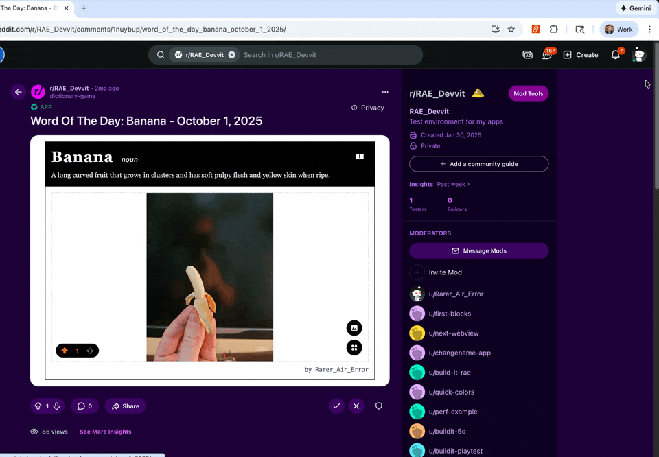

# Setting up View Modes and Entry Points

## View Modes

Devvit apps support two view modes:

**Inline Mode**

- **What it is**: Your app loads directly within the post unit
- **User experience**: Users see your app content immediately without clicking
- **Use case**: Preview screens, game menus, leaderboards, or any content that works well in a post-sized container
- **Requirements**: Only respond to taps and clicks, load quickly, and respect post boundaries

**Expanded Mode**

- **What it is**: Your app displays in a larger modal (web) or full screen (mobile)
- **User experience**: Users click to enter a dedicated experience
- **Use case**: Full games, longer load times, detailed interfaces, or any content that needs more space or full gesture support
- **Trigger**: User-initiated only (button click, gesture, etc.)

## Multiple Entry Points

Multiple entry points let the user start the game from different contexts or states. For example, you can have a button that launches into a leaderboard view and another for a specific game mode, each of these would be configured as an entry point for your app. You can define multiple entry points in your `devvit.json` and `src/client/vite.config.ts` to create different experiences:

```js title="devvit.json"
{
  "post": {
    "dir": "dist/client",
    "entrypoints": {
      "default": {
        "entry": "preview.html",
        "height": "regular",
	 "inline": true
      },
      "game": {
        "entry": "game.html"
      },
      "leaderboard": {
        "entry": "leaderboard.html"
      }
    }
  }
}
```

```ts title="vite.config.ts"
import { defineConfig } from 'vite';
import tailwind from '@tailwindcss/vite';
import react from '@vitejs/plugin-react';
import { fileURLToPath } from 'url';
import { dirname, resolve } from 'path';

// https://vitejs.dev/config/
export default defineConfig({
  plugins: [react(), tailwind()],
  build: {
    outDir: '../../dist/client',
    sourcemap: true,
    rollupOptions: {
      input: {
        default: resolve(dirname(fileURLToPath(import.meta.url)), 'preview.html'),
        game: resolve(dirname(fileURLToPath(import.meta.url)), 'game.html'),
        leaderboard: resolve(dirname(fileURLToPath(import.meta.url)), 'leaderboard.html'),
      },
      output: {
        entryFileNames: '[name].js',
        chunkFileNames: '[name].js',
        assetFileNames: '[name][extname]',
        sourcemapFileNames: '[name].js.map',
      },
    },
  },
});
```

**File Structure Example**

```tsx
your-app/
├── devvit.json
├── src/
│   ├── server/
│   │   └── index.ts
│   └── client/
│       ├── preview.html
│       ├── game.html
│       ├── leaderboard.html
│       └── styles.css
└── dist/                  // Built files after compilation
    └── client/            // This is what "dir" points to
        ├── preview.html
        ├── game.html
        ├── leaderboard.html
        └── styles.css
```

The `dir` property specifies where your built client files are located. During development, your build process (e.g., Vite, webpack) typically compiles files from `src/client/` to `dist/client/`. The entry paths are relative to this `dir` location.

### Creating Posts with Specific Entry Points

Use the `entry` parameter when creating posts to specify which entry point from your `devvit.json` configuration to use. The entry value must match one of the keys defined in `post.entrypoints`.

```tsx title="server/index.ts"
import { reddit } from '@devvit/web/server';

// Create a post using the default entrypoint
async function createDefaultPost(context: any) {
  return await reddit.submitCustomPost({
    subredditName: context.subredditName!,
    title: 'Adventure Game',
    entry: 'default',
    postData: {
      gameState: 'menu',
    },
  });
}

// Create a post using a specific entrypoint
async function createGamePost(context: any) {
  return await reddit.submitCustomPost({
    subredditName: context.subredditName!,
    title: 'Adventure Game',
    entry: 'game', // Must match a key in devvit.json entrypoints
    postData: {
      gameState: 'active',
      initialized: true,
    },
  });
}
```

**How it works**

- If `entry` is not specified, the `default` entry point is used automatically.
- The `entry` value must match a key defined in your `devvit.json post.entrypoints` object.
- Each entry point can have its own HTML file and height setting.
- Invalid entry point names will cause an error.

### Switching Between View Modes

You can transition from inline mode to expanded mode with a different entry point, like this:

```tsx
import { requestExpandedMode } from '@devvit/web/client';

// Switch to the 'game' entrypoint in expanded mode
const handleStartGame = async (event: React.MouseEvent) => {
  try {
    await requestExpandedMode(event.nativeEvent, 'game');
  } catch (error) {
    console.error('Failed to enter expanded mode:', error);
  }
};
```

## Inline Mode Requirements

All Devvit web view apps load in inline mode by default. Your app loads directly in the post unit without requiring users to click to expand.

Apps must meet these requirements for approval and featuring:

1. **Performance**

- Optimize for mobile devices and slower connections
- Load initial content in under 1 second
- Achieve a [Lighthouse](https://developer.chrome.com/docs/lighthouse/overview) score >80.
  - To find your Lighthouse score you can follow these steps:
    1. Open your inline post
    2. Open Developer Tools in Chrome and navigate to the elements tab
    3. Find the `devvit-blocks-web-view` element and open it in a new tab
    4. Open Developer Tools in the new tab and navigate to Lighthouse
    5. Ensure you have mobile selected and select Analyze Page Load



2. **Gesture compliance**

- **Only tap or click input is allowed**
- No scroll traps or scroll hijacking
- No zoom or pan interference
- Users must be able to scroll past your post naturally

3. **Responsive design**

- Content must work across all viewport sizes (use chrome devtools to test your app's responsiveness)
- Keep in mind that the majority of users are on mobile devices

4. **User-initiated expanded mode**

- Apps cannot auto-launch into expanded mode or auto-close without a user action
- Must have explicit user interaction (clearly labeled button or action)
- Default view should respect standard post boundaries

5. **Safe use of sound**

- Audio should not play unless there is a user interaction
- Include a button to mute in your game
- Use the visibilityChange handler to mute any sounds if a user scrolls away
