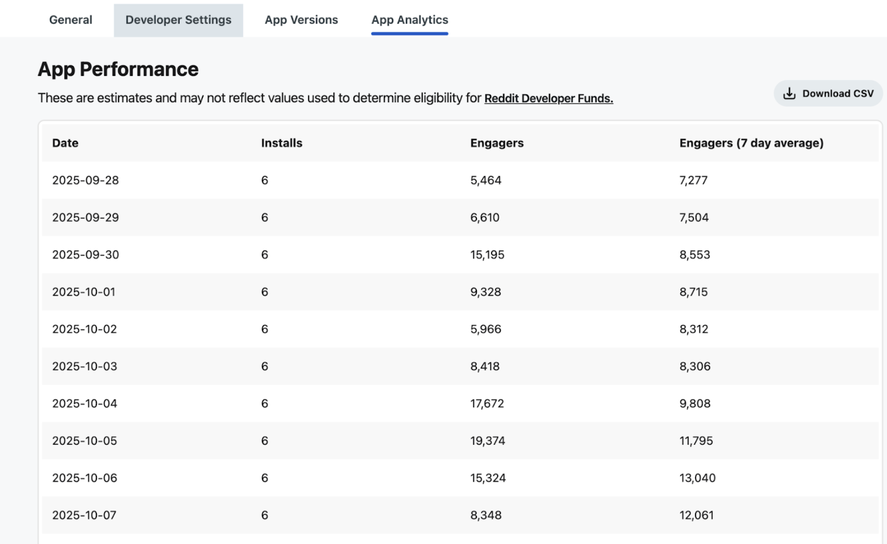

# Changelog

While we're always shipping fixes and improvements, our team bundles new features, breaking changes, and other user-facing updates into regular releases. This page logs the changes to each version of Devvit.

To use the latest version of Devvit:

1. Run `npm install devvit@latest` to update your CLI.
2. Run `npx devvit update app` to update your @devvit dependencies.

## Devvit 0.12.1: Cache Helper, Analytics dashboard for developers, and smaller fixes

**Release Date: October 10, 2025**

In this release, we’ve added back the cache helper for Devvit Web and also included an App Analytics tab for you to track your app’s engagement metrics.

**Cache Helper**
The cache helper helps your app reduce the number of server side calls by caching the response for all users. This is great for any data that you plan to share across users, like a global leaderboard or consistent data from an external source like the score of a sports game. We now have this feature available in Devvit Web, and you can look up how to use it in the [cache helper docs](./capabilities/server/cache-helper.mdx).

**App Analytics**
There’s a new App Analytics tab in your app settings that lets you track your progress against Reddit Developer Funds.

**Other fixes**
This release also includes a handful of other fixes including:

- Added a method mergePostData() to append to postData.
- Fixed reddit.setPostFlair() method.
- Added a new triggers field that fixed the issue where triggers within the blocks entrypoint weren’t working. The migration guide has been updated.
- Added error handling when trying to `devvit new`on an already existing app name.
- Added disconnectRealtime() and isRealtimeConnected() as helper methods for the realtime plugin.

## Devvit 0.12.0: Devvit Web

**Release Date: August 13, 2025**

We're excited to introduce [Devvit Web](./capabilities/devvit-web/devvit_web_overview.mdx), a new way to build [games](./quickstart/quickstart.md) and [apps](./quickstart/quickstart-mod-tool.md) on Reddit using standard web technologies you already know and love. This release brings the power of modern web development to the Reddit platform, letting you build with React, Three.js, Phaser, and other industry-standard frameworks while maintaining access to all the Devvit capabilities you rely on. Moving forward, this will be the preferred way of building interactive post apps.

**What's New**

Devvit Web transforms how you build Reddit apps:

- **Standard web development**: Build apps just like you would for the web, using familiar frameworks and tools
- **Server endpoints**: Define /api/ endpoints using Node.js frameworks like Express.js or Koa
- **New configuration system**: devvit.json provides a clean, declarative way to configure your app
- **Unified SDK**: @devvit/web package with clear client/server separation
  Better AI compatibility: Standard web technologies work seamlessly with AI coding tools

There's also a new [web-based creation flow](https://developers.reddit.com/new/) that makes creating new apps faster:

- A step-by-step UI guides you through the initial steps to create an app
- Automatically builds a playtest subreddit for testing
- Gives you the code you need to access your new app via the terminal

**Key Features**

- **Client/server architecture**: Clear separation between frontend (@devvit/web/client) and backend (@devvit/web/server)
- **Full platform access**: Continued access to Redis, Reddit API, and Devvit's hosting services
- **Flexible development**: Use Devvit Web alongside existing Blocks - choose the right tool for each feature

**Current Limitations**

- Serverless endpoints only (no long-running connections or streaming)
- Package restrictions (no fs or external native packages)
- Single request/response model (no websockets)
- Client-side fetch is limited to app domain (enforced via CSP)

**Getting Started**

- **New apps**: Go to developers.reddit.com/new to start building new apps
- **Existing apps**: Migration is optional - your current apps continue to work on 0.11, but we recommend using these migration guides to move your app over to Devvit Web.
  - [Devvit Web Experimental to Devvit Web](./guides/migrate/devvit-web-experimental.md)
  - [useWebView to Devvit Web](./guides/migrate/inline-web-view.md)
  - [Blocks app to Devvit Web](./guides/migrate/devvit-singleton.md)

**Support & Feedback**

We'd love to hear about your experience with Devvit Web! Join the conversation in #devvit-web on Discord to share feedback, report issues, and connect with other developers building with Devvit Web.

**Even More Features**

In addition to Devvit Web, release 0.12 also adds:

- **Post data** - [Post data](./capabilities/server/post-data.mdx) allows you to add data to your post when you submit it so that you can retrieve and use in your app without an additional Redis call.
- **Splash screen** - Having a compelling first screen of your app is one of the most important indicators of good post engagement. Every submitPost will come with a default per-post [splash screen](./capabilities/server/splash-screen.mdx) you can customize.
