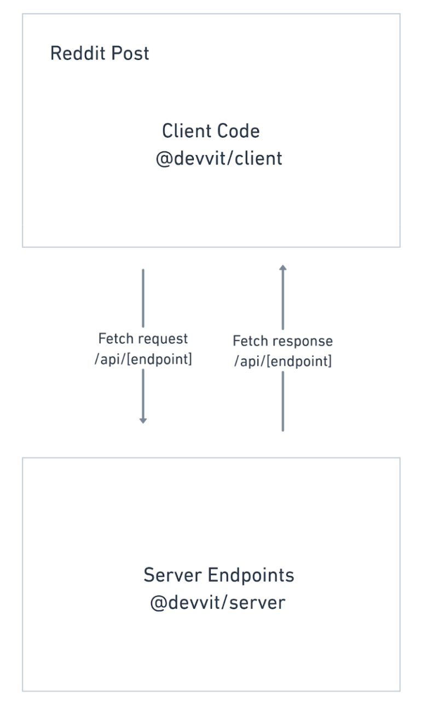

# How Devvit Web works

Devvit Web uses endpoints between the client and server to make communication similar to standard web apps. A Devvit Web app has three components:

- Client
- Server
- Configuration

Devvit Web [templates](../devvit_web/devvit_web_templates) all have the same file structure:

```tsx
-src -
  client / // contains the webview code
    -server / // endpoints for the client
    -devvit.json; // the devvit config file
```

Now, instead of passing messages with postMessage (old way), you’ll define /api/endpoints (new way).

## Client folder

This folder is for client-side code. This includes any html/css/javascript and relevant web libraries, and it will appear in a webview inside of a post for Reddit users.

When you want to make server-side calls, or use server-side capabilities, you’ll use fetch and define what happens in your server folder.

## Server folder

This folder is for server-side code. We provide a node server, and you can use typical node server frameworks like Koa or Express. This is where you can access key capabilities like [Redis](../capabilities/Redis), Reddit API client, and [fetch](..capabilities/http-fetch), and you no longer need to add these to a devvit.configure object in order for them to work.

We also provide an authentication middleware so you don’t have to worry about authentication.

::note
All server endpoints must start with /api/ (e.g. /api/get-something or /api/widgets/42).
:::



## Configuration

The configuration file defines key entry points, permissions, and capabilities for your app. The following options are currently supported:

| Parameter | Description                                                                                                                 |
| --------- | --------------------------------------------------------------------------------------------------------------------------- |
| name      | Name of the custom post type.                                                                                               |
| entry     | File in client directory that your app should point to once you click “Launch App”.                                         |
| height    | Height of the initial post, either ‘tall’ or ‘regular’.                                                                     |
| menu      | An object that allows you to create a menu action that creates the initial post. Options are: enable, label, and postTitle. |

```tsx// Side effect import to bundle the server. The /index is required for server splitting.
…
import { defineConfig } from '@devvit/server';
import '../server/index';

defineConfig({
  name: 'Word Guesser',
  entry: 'index.html',
  height: 'tall',
  menu: {
    enable: true,
    label: 'New Word Guesser Post',
    postTitle: 'Initial Word Guesser Post',
  }
});
```

:::note
We expect this to change substantially. Check out the [Future Roadmap](../devvit_web/future_roadmap) for how this may evolve.
:::
