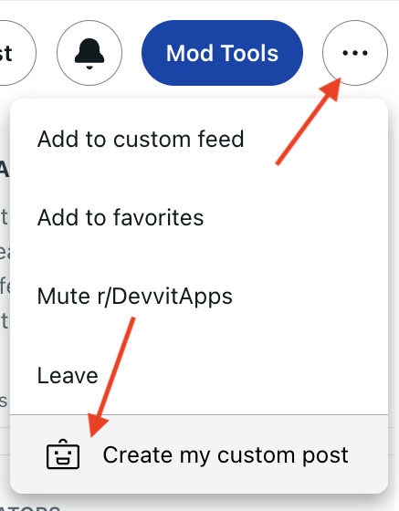

import Tabs from '@theme/Tabs';
import TabItem from '@theme/TabItem';

# Intro to Devvit

This tutorial will help you get to know Devvit and help r/Devvit get to know you!

When you're done, you'll have a custom introduction post that you can share with the community. It should take about five minutes.

## Step 1: Set up your environment

Before you get started, ensure that [Node.js](https://nodejs.org/) (v18.18.2 or higher) is installed. Additionally, you'll need to make a small [subreddit](https://mods.reddithelp.com/hc/en-us/articles/360001766991-How-to-create-a-subreddit) for testing, if you don't already have one.

Run the following commands in your terminal to install the [`@devvit`](https://www.npmjs.com/package/devvit) CLI:

<Tabs>
  <TabItem value="npm" label="npm" default>
    ```bash npm install -g devvit devvit login devvit new ```
  </TabItem>
  <TabItem value="yarn" label="Yarn">
    ```bash yarn global add devvit devvit login devvit new ```
  </TabItem>
  <TabItem value="pnpm" label="pnpm" default>
    ```bash pnpm install -g devvit devvit login devvit new ```
  </TabItem>
</Tabs>

## Step 2: Create a project

After you're logged in, you're ready to create a new project. Run:

```
devvit new
```

## Step 3: Name your project

We suggest using `Hello-[username]` for this tutorial.

## Step 4: Choose the template

When prompted to chose a template, scroll and select `intro-to-devvit`

## Step 5: Upload and build

Run the following commands to get your app uploaded and running:

```
cd <app-name>
devvit upload
devvit playtest <my-subreddit-name>
```

## Step 6: Open your project

Open your project from your IDE (we recommend [VS Code](https://code.visualstudio.com/)). It should look like this:

```text
my-project
├── assets
├── src
│   └── main.tsx
│   └── weird.tsx
│   └── guts // don't worry about this section
├── devvit.yaml
├── package.json
├── tsconfig.json
├── README.md
```

You'll be making updates to `main.tsx` and the `assets` folder in this tutorial.

## Step 7: Create a post

Visit your test subreddit. From the subreddit menu, select "Create my custom post" and wait for your post to load.



## Step 8: Playtesting

As you make and save code modifications, playtest will automatically build and deploy the app to your subreddit. Simply refresh the page to view the latest changes.

To stop the playtest, press `Ctrl + c`.

From here, the post will tell you what to do!

## Step 9: Share your post

When you're happy with your post, considering sharing it with the community. You can see [creations made by other devs here](https://www.reddit.com/r/Devvit/?f=flair_name%3A%22Devvitor%22).

Select "Share to Devvit" from the mod menu on the post:


## More resources

Now you know how to create and deploy apps! Next up, try the following:

- Check out the [examples](examples/overview.mdx) to see what others have created.
- Learn how to [publish](dev_guide/#9-publish) your app and make it public in the Apps directory.
- Follow the [Remind Me](examples/tutorials/remind_me.md) tutorial.
