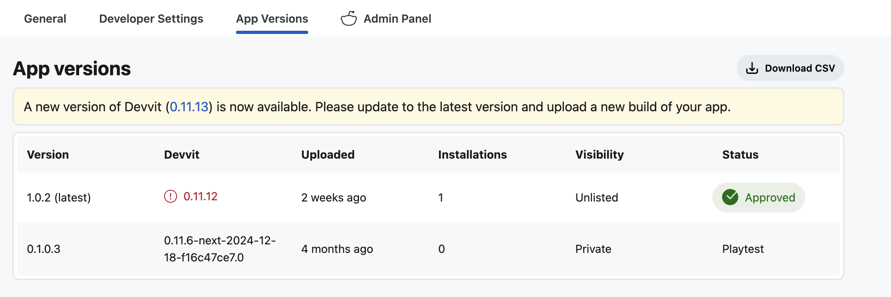

# Publishing an app

Once you [upload](./dev_guide.mdx#7upload) your app, a private version of it is added to the [Apps](https://developers.reddit.com/apps) directory. Only you will be able to see your app in the directory, and it’s available for you to use in small subreddits with fewer than 200 subscribers for testing purposes.

To use your app in larger subreddits, you’ll need to publish your app. To do this from the CLI, run:

```
devvit publish
```

Your app is automatically submitted to the Devvit team for review and approval. Published apps are either public or unlisted:

- **Unlisted** means that the app is only visible to you in the directory, and you can install your app on larger subreddits that you moderate.
- **Public** means that your app is visible to all users in the Apps directory and can be installed by mods and admins across Reddit.

:::note
By default, your app is published as unlisted.

To publish your app as public, use `devvit publish --public`.
:::

## Publishing requirements

Before submitting your app for review, please go through the following checklists to make sure your app is ready for prime time. This will expedite the review process.

### Requirements for public apps

Public apps are discoverable on our apps directory for anyone on Reddit. These apps should be fully functional, tested, and have detailed app descriptions that non-technical users can understand. Prior to publishing make sure to:

- Add an app description file to the root of your project directory with:
  - An app overview
  - Instructions on how to use the app
  - Changelogs for new versions
- Test your app across viewport sizes and user states
- Ensure app contents can be moderated
- Ensure app complies with our [Developer Terms](https://redditinc.com/policies/developer-terms) and [guidelines](guidelines.md)

### Requirements for unlisted apps

- Add an app description file to the root of your project directory with an app overview
- Ensure app contents can be moderated
- Ensure app complies with our [Developer Terms](https://redditinc.com/policies/developer-terms) and [guidelines](guidelines.md)

## App review

Apps are reviewed and published on a per version basis, and you'll get an email when your app is published.

During the app review, the Developer Platform team will look at your code, read through your app description, and potentially test your app. The review process typically takes one week, and you’ll be notified of your app status, which could be:

- Approved
- Approved with non-blocking feedback
- Rejected with feedback on how to get your app approved
- Rejected on the basis of a policy, guideline, or conflict with the intended behavior of our products

If you are submitting a new version of a previously approved app, review will typically go very quickly.

## App versions

Use the app version panel to track all the versions of your app. The panel displays the most recent versions of your app, and you can download a complete list of published versions via CSV.



## Changing app visibility

After your app has been approved, you may want to change the visibility status.

### Unlisted to public

To make your unlisted app public after it's been approved, run:

```tsx
devvit upload
devvit publish --public
```

### Public to unlisted

To hide all versions of your app from the public after it’s been listed, please reach out to the Developer Platform team via r/Devvit or Discord.

## Promotion

If you need help finding the right place on Reddit for your app, reach out to our team. In some cases we may be able to:

1. Provide guidance on the right home(s) for your app
2. Help you coordinate with subreddit moderators
3. Connect you with users that would be interested in your app
4. Run playtests for your app, provide feedback, and improve your app
5. Provide other materials, like visual assets, to help you market your app
6. Give guidance on how to grow a subreddit

We cannot help facilitate the success of all apps, but we will provide guidance whenever possible. Reach out to one of our support channels to chat with our team.

:::note
Make sure you don’t break subreddit rules or sitewide content policies when promoting your app on Reddit.
:::
