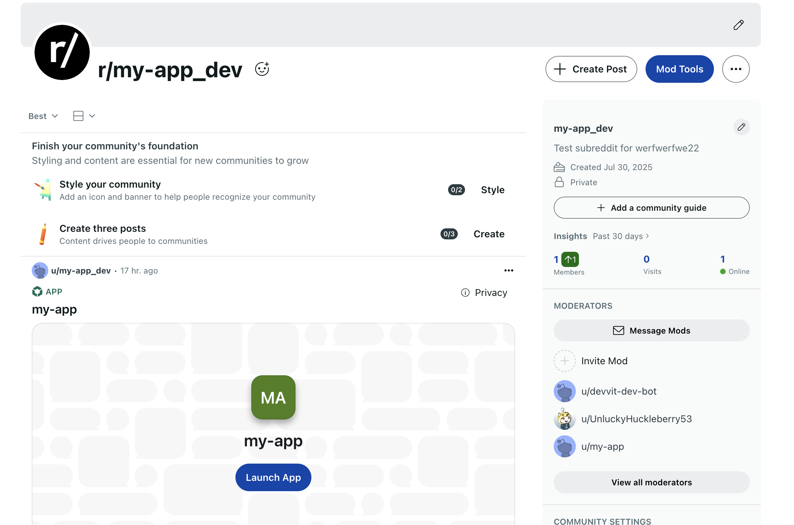

# App Quickstart

This tutorial takes you through the step-by-step process of building your first app with Devvit. It should take you about 1 minute to complete. Once complete, you'll be able to see your app in a Reddit post

## Try it out

This starter template will [create an app like this for you](https://www.reddit.com/r/test_devvit_demos/comments/1mk4ql4/test3jsdevvit/) running on Reddit. It consists of a simple react-based counter app that calls backend functions.

## What you'll need

- Node.JS (version 22.2.0+)
- A code editor

## Environment setup

1. Install Node.JS and NPM ([instructions](https://docs.npmjs.com/downloading-and-installing-node-js-and-npm))
2. Go to [developers.reddit.com/new](https://developers.reddit.com/new) and choose the React template.
3. Go through the wizard. You will need to create a Reddit account and connect it to Reddit developers.
4. Follow the instructions on your terminal.

On success, you should see something like this:

```sh
Your Devvit authentication token has been saved to /Users/user.name/.devvit/token
Fetching and extracting the template...
Cutting the template to the target directory...
 🔧 Installing dependencies...
 🚀🚀🚀 Devvit app successfully initialized!
┌────────────────────────────────────────────────────┐
│ • `cd my-app` to open your project directory       │
│ • `npm run dev` to develop in your test community  │
└────────────────────────────────────────────────────┘
```

## Running your app

To run your app, `cd my-app` and then run `npm run dev`. You should see some logs start up that finish with:

```
✨ https://www.reddit.com/r/my-app_dev?playtest=my-app
```

The dev command automatically creates a development subreddit for your app and a test post for you to develop against. When you visit the url, it should look something like this.



Click the `Launch App` button to see your app!

## Devvit architecture

Once the project is checked out you'll see the following folder structure. Each of the folders is responsible for a part of your app:

**`src/client`:**  
This contains the client-side code for your application. You can use any web framework for your frontend (React, Vue, Angular, etc.). In this example, we chose react.

**`src/server`:**  
This contains the server-side code for your application. You will need to build a node-compatible server that handles API calls from the client-side. This is where you will write code for persistence, real-time message sharing between players, payment validation, etc. For this example we chose to use [express.JS](https://expressjs.com/)

**`src/shared`:**  
This contains classes, types and interfaces that are shared between the client and the server

**`devvit.json`:**  
This special file in the root of the project contains configurations for many of the Reddit-specific services that your application can use. For more information on `devvit.json` please refer to Configuration (devvit.json)

## Testing your app on a specific subreddit

You need to test your app on a subreddit. Your backend calls will not work when testing the app locally. For that we will be leveraging Devvit's Playtest tool. If you have a preference for a specific subreddit to playtest, change the `package.json` file to include your subreddit name in `dev:devvit`:

```javascript title="package.json"
"scripts": {
    //...
    "dev:devvit": "devvit playtest r/MY_PREFERRED_SUBREDDIT",
    //...
}
```

After adding the subreddit, use `npm run dev` to see the app on the new subreddit.

## Launching your app

Use our [launch guide](../guides/launch/launch-guide.md) to guide you where to get your first users.

When you are ready to launch your app, run `npm run launch`. This will upload your app to Reddit for our team to review. All apps must be reviewed before they can be installed on subreddits > 200 members. We will send you an email once your app is approved.

## Result

Now you have an application that runs inside of a Reddit post. You can now use this scaffolding to build your own application or app with Devvit.

## Further reading

- [Launching and Promoting your game](../guides/launch/launch-guide.md)
