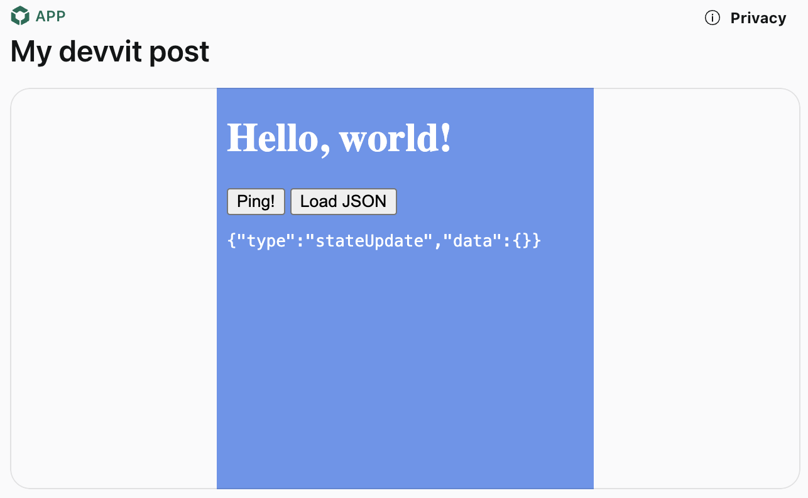

# Web views

:::note
Web views is currently experimental and optimized for desktop web. Mobile support is coming later this year.
:::

<iframe width="560" height="315" src="https://www.youtube.com/embed/BhbWn8TnXvo?si=mD_Hp5H90LpPGWbn&amp;controls=0" title="YouTube video player" frameborder="0" allow="accelerometer; autoplay; clipboard-write; encrypted-media; gyroscope; picture-in-picture; web-share" referrerpolicy="strict-origin-when-cross-origin" allowfullscreen></iframe>

Web views allow you include HTML, CSS, and JavaScript and have it run within your Reddit app. This gives you full control over your app's appearance and behavior while running within Reddit's platform.

## Quickstart

1. Create a new web view project:

```bash
devvit new --template web-view-post
cd my-project
```

2. Upload and test:

```bash
devvit upload
devvit playtest <my-subreddit>
```

3. Create a post in your subreddit using the "Create New Devvit Post (with Web View)" option in the post menu.

### Project structure

```
my-project/
├── webroot/           # All web content goes here
│   ├── page.html     # Main HTML file
│   ├── styles.css    # Stylesheets
│   └── app.js        # JavaScript code
└── src/
    └── main.tsx      # Devvit app code
```



## Examples

- [React/Tailwind/Vite template](https://github.com/mwood23/devvit-webview-react)
- Games
  - [Fiddlesticks](https://reddit.com/r/fiddlesticks) | [Code](https://github.com/reddit/devvit-fiddlesticks)
  - [Snoosings](https://reddit.com/r/snoosings) | [Code](https://github.com/reddit/devvit-snoosings)
  - [Corridor](https://reddit.com/r/corridorgame) | [Code](https://github.com/reddit/devvit-corridor)

## Known limitations

1. **CSS/JS requirements**

   - ❌ No inline CSS or JavaScript
   - ✅ Use separate .css and .js files

2. **Mobile gestures**

   - ❌ Complex gestures may conflict with the Reddit app
   - ✅ Use simple interactions and avoid scrolling (e.g. overflow: none)
   - 🔄 Fix coming soon

3. **Asset versioning**

   - ❌ Assets affect all versions when updated (including in a playtest)
   - ✅ Use separate apps for development/production
   - 🔄 Fix coming soon

4. **Forms**
   - ❌ No direct form submissions
   - ✅ Use JavaScript to handle form data
   - ✅ Send data via postMessage

## Best practices

1. **File organization**

   - Keep all web files in the `webroot/` directory
   - Use separate files for HTML, CSS, and JavaScript
   - Consider using a bundler for larger applications

2. **State management**

   - Use `localStorage` for web view only state
   - Use [Redis](./capabilities/redis.md) storage (via Devvit) for persistent data
   - Minimize state synchronization between web view and Devvit

3. **Performance**
   - Add a "Launch App" button to prevent UI flashing
   - Use local storage to cache data when possible
   - Create a compelling preview within Blocks
   - Prevent scaling the viewport

```html
<meta
  name="viewport"
  content="width=device-width, initial-scale=1.0, maximum-scale=1.0, user-scalable=no"
/>
```

## Communication Between Devvit and web view

Web views let you build custom UIs with HTML/CSS/JS while accessing Devvit's backend services ([Redis](./capabilities/redis.md), [fetch](./capabilities/http-fetch.md), [scheduler](./capabilities/scheduler.md), [triggers](./capabilities/triggers.md)) via message passing between the two contexts.


### From Devvit to web view

```typescript
// In main.tsx
context.ui.webView.postMessage('myWebView', {
  type: 'updateData',
  data: { count: 42 },
});

// In webroot/app.js
window.addEventListener('message', (event) => {
  if (event.data.type === 'devvit-message') {
    const { message } = event.data;
    console.log('Received from Devvit:', message);
  }
});
```

### From web view to Devvit

```typescript
// In webroot/app.js
window.parent.postMessage(
  {
    type: 'userAction',
    data: { clicked: true },
  },
  '*'
);

// In main.tsx
<webview
  id="myWebView"
  url="page.html"
  onMessage={(msg) => {
    console.log('Received from webview:', msg);
  }}
/>;
```

### Local, web view only state

The web view does not have direct access to Devvit's services, including `redis`, `realtime` and `scheduler`. Communicating with server-side logic always needs to go through the Devvit application (i.e. you need to send a `window.parent.postMessage`, capture that message in your Devvit application, and send information to the backend).

If you want to keep local state that does not need to be persisted to the backend you can use [`window.localStorage`](https://developer.mozilla.org/en-US/docs/Web/API/Window/localStorage).

Example (`webroot/app.js`)

```js
// Save data to localStorage
localStorage.setItem('gameState', JSON.stringify(stateToSave));

// Load data from localStorage
const loadedState = localStorage.getItem('gameState');
```

## Explaining the template app

Here's how this template app behaves.

Upon startup the app will:

- Load the current logged in user's username
- Load the last state of the app (counter) from Redis DB
- Display this data in Devvit Blocks

When the Launch App button is clicked, the app will:

- Show the web view and hide the other Devvit blocks
- Send an 'initialData' message from Blocks to the Webview so it can populate state
- The user is now seeing a web view with the contents of the `/webroot` folder

When the Increase/Decrease counter buttons are clicked the app will:

- Send a message from the web view to blocks so state can be persisted in Redis (web views can't communicate directly with Redis)
- Receive a response from blocks and update current state in the web view

In the steps below, more details will be provided about each of the above.

### Devvit blocks (`main.tsx`)

_Load username and data from redis_

```tsx
// Load username with `useAsync` hook
const {
  loading: usernameLoading,
  error: usernameError,
  data: username,
} = useAsync(async () => {
  const currUser = await context.reddit.getCurrentUser();
  return currUser?.username ?? 'anon';
});

// Load latest counter from redis with `useAsync` hook
const {
  data: counter,
  loading,
  error,
} = useAsync(async () => {
  var redisCount = await context.redis.get(`counter_${context.postId}`);
  console.log('redisCount:', redisCount);
  return Number(redisCount ?? 0);
});
```

_Send Initial data and show Webview_

```tsx
// When the Launch App button is clicked, send initial data to web view and show it
const onShowWebviewClick = () => {
  setWebviewVisible(true);
  context.ui.webView.postMessage('myWebView', {
    type: 'initialData',
    data: {
      username: username,
      currentCounter: counter,
    },
  });
};
```

_Define the web view component within blocks_

```tsx
<vstack grow={webviewVisible} height={webviewVisible ? '100%' : '0%'}>
  <vstack border="thick" borderColor="black" height={webviewVisible ? '100%' : '0%'}>
    <webview
      id="myWebView"
      url="page.html"
      onMessage={(msg) => onMessage(msg as WebViewMessage)}
      grow
      height={webviewVisible ? '100%' : '0%'}
    />
  </vstack>
</vstack>
```

_Respond to messages from Webview changing data in Redis DB_

```tsx
// When the web view invokes `window.parent.postMessage` this function is called
const onMessage = async (msg: WebViewMessage) => {
  if (msg?.type === 'setCounter') {
    // Get new counter value from the message
    var newCounter = msg.data.newCounter!;
    // Update Redis DB
    await context.redis.set(`counter_${context.postId}`, newCounter.toString());
    // Send confirmation of new value back to the Webview
    context.ui.webView.postMessage('myWebView', {
      type: 'updateCounter',
      data: {
        currentCounter: newCounter,
      },
    });
  }
};
```

### Web application (`webroot/page.js`)

_Listening to updates from the Devvit app_

```js
// When the Devvit app sends a message with `context.ui.webView.postMessage`, this will be triggered
window.addEventListener('message', (ev) => {
  const { type, data } = ev.data;

  // Reserved type for messages sent via `context.ui.webView.postMessage`
  if (type === 'devvit-message') {
    const { message } = data;

    // Load initial data
    if (message.type == 'initialData') {
      const { username, currentCounter } = message.data;
      usernameLabel.innerHTML = username;
      counterLabel.innerHTML = counter = currentCounter;
    }

    // Update counter
    if (message.type == 'updateCounter') {
      const { currentCounter } = message.data;
      counterLabel.innerHTML = counter = currentCounter;
    }
  }
});
```

_Sending messages to the Devvit app_

```js
window.parent?.postMessage(
  {
    type: 'setCounter',
    data: { newCounter: Number(counter + 1) },
  },
  '*'
);
```

## Questions

Don't forget to join our [Discord](https://discord.gg/Cd43ExtEFS) if you have any additional questions.
