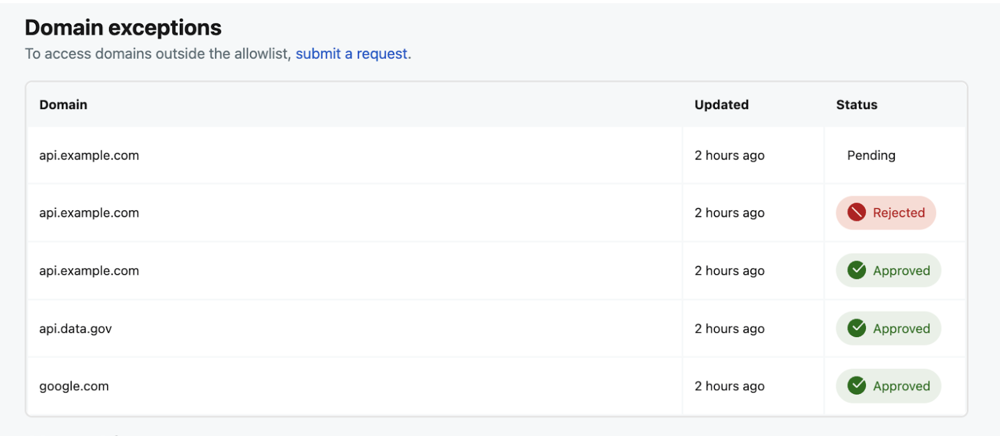

# Changelog

While we're always shipping fixes and improvements, our team bundles new features, breaking changes, and other user-facing updates into regular releases. This page logs the changes to each version of Devvit.

Before upgrading `@devvit/public-api` in your project, always update the CLI first by running `npm install -g devvit`.

## Devvit 0.11.17: Easier fetch domain requests

**Release Date: June 16, 2025**

We’ve simplified how to request new domains for HTTP fetch (no more forms!). Now you can just add domains in your app’s configuration, and when you playtest or upload the app, the domain is automatically submitted for approval.

```tsx
import { Devvit } from '@devvit/public-api';

Devvit.configure({
  http: {
    domains: ['my-site.com', 'another-domain.net'],
  },
});
```

:::note
Domains on the [global allow list](./capabilities/http-fetch-allowlist.md) don’t need approval—they just work.
:::

There’s also a new section in your app’s Developer Settings (https://developers.reddit.com/apps/[app-slug]/developer-setings) tab that lets you check the status of a domain.



To use this feature, you’ll need to be on the latest version of the public api. You can do this by running: `npm i @devvit/public-api` in your app.

Learn more about [HTTP fetch](./capabilities/http-fetch.md) and the[allow-listed domains](./capabilities/http-fetch-allowlist.md) in our docs.

## Devvit 0.11.16: CLI improvements and updated guidelines

**Release Date: May 27, 2025**

Release 0.11.16 has several CLI improvements. We’ve also updated our guidelines to clarify the app review process and use of LLMs, among other things. Check out [Devvit Rules](./devvit_rules) to see what’s new!

**CLI updates**

- **Removed versions from devvit.yaml**. Now you’ll see less of this annoying error: _your local version number doesn't match the server, do you want to continue anyway?_. Versions are handled on our server, and existing versions in devvit.yaml will not update or have any effect on uploads.

- **Require the latest CLI version to playtest**. You need to be on the latest version of the CLI in order to playtest your app properly. The latest CLI is now required to `devvit playtest` (just like it is for `devvit upload`). Things to note:

  - Updating your CLI does not require you to update your app code / devvit SDK (i.e. you do NOT have to run devvit update app to playtest).

  - You can update your CLI by doing `npm install -g devvit@latest`

- **Ensure @devvit/payments and @devvit/public-api have the same version**. Unexpected behavior resulted from mismatched payments and public api versions. Going forward, if you’re using payments the versions need to be the same.

- **Small security fix** - Thanks to a [community report](https://github.com/reddit/devvit/pull/180), we implemented a small CLI security fix.

**Other updates**

There’s a small change to mount() for webviews where you cannot mount() if a webview is already mounted. Doing so will now show a warning log for the developer.

## Devvit 0.11.15: Typescript update

**Release Date: May 7, 2025**

This little release updates typescript to 5.8.3 and fixes an internal issue that caused problems uploading webview assets.

## Devvit 0.11.14: App versions panel, gallery image support, and some smaller fixes

**Release Date: May 6, 2025**

We’ve released a new [app version panel](./publishing.md#app-versions) that lets you track all the versions of your app, so you can see your app’s status, visibility, and number of installations for each app version. The panel displays the most recent versions of your app, and you can download a complete list of published versions via CSV.

**Other fixes**  
This release also includes some small but mighty fixes:

- Public API

  - Added support for gallery media on Post objects
  - Fixed the issue where `Post.delete()` was not throwing an error on an unsuccessful delete call

- Settings

  - Added the ability to define and aggregate multiple addSettings calls

- CLI
  - Fixed issue with redirect links containing \* for Windows users
  - Added a `--withdraw` flag to `devvit publish` that allows you to withdraw an app you previously published
  - Added handling for UTF-16 encoded READMEs, and if a README’s encoding isn’t understood at upload time, the CLI will let you know

## Devvit 0.11.13: User actions API, developer email notifications, and a new way to get support for your app

**Release Date: Apr 21, 2025**

In this release, Devvit introduces a new way for apps to let users create content when interacting with your app. With the user's permission, an app can create posts or comments on behalf of the user. Our most successful apps, like [Pixelary](https://reddit.com/r/pixelary) and [Riddonkulous](https://www.reddit.com/r/riddonkulous/), leverage the creativity of the community by allowing users to create content as they play. This has helped these games grow quickly! The user actions API:

- **Boosts engagement**. Automatically sharing content increases reach, facilitates user interaction, and gives you insight into what’s working in your app.
- **Saves the user time and effort**. It’s easy for users to jump into the conversation.
- **Improves retention**. When people interact with your app, they’re more likely to stick around, and continued user engagement helps your app reach new people. Total positive feedback loop!

Check out our new [user action API](./capabilities/userActions.md) to see how you can add this to your own app.

Also in this release, we’ve streamlined developer communication. New devs will get automatic email notifications when they [upload](./dev_guide.mdx) their first app and every time an app is approved for [publishing](./publishing.md).

Last but certainly not least, we’ve added a way for you to garner user support while you develop your app! Use the [support this app](./payments/support_this_app.md) payments molecule to let your biggest fans show their love.

## Devvit 0.11.12: Everything but the kitchen sink updates

**Release Date: Apr 7, 2025**

Here’s what you can find in 0.11.12.

**Feature improvements**

- [Logging](./debug.md) improvements:
  - Retention has been increased from 100 events to the last 5,000 events.
  - There's a new CLI flag to turn on timestamps when requested.
- There's a new CLI command to easily generate payment products.
  - CLI helper to add/edit existing payment products
- Updated app [publishing](./publishing.md) workflow:
  - All apps are published unlisted by default.
  - We’ve added a new flag if you want to publish your app publicly: `devvit publish --public`.

**Other fixes**
Patched an issue that prevented some payments playtest errors from being logged due to reliance on `ux.action.stop`.

## Devvit 0.11.11: Adding web view unmount

**Release Date: Mar 24, 2025**

We've been working on making the web view experience better and more consistent across all platforms, and one new change we’re including is a `webview.unmount` function. This lets you unmount a [web view](./webviews.md#usewebview) that's in focus mode programmatically.

:::note
Unmount is only available in v2025.12+ on iOS and v2025.11+ on Android.
:::

**Other Fixes**

- You can now omit metadata in in your product config.
- We added a hook ID in logs to help debug invalid state errors.

## Devvit 0.11.8: Minor Redis, Reddit API, and CLI improvements

**Release Date: Mar 10, 2025**

This version of Devvit includes a few small quality-of-life updates for our developers. If you have any feedback, please let us know.

**New Features**

Additional Redis support, which includes:

- `bitfield` support for Redis
- Redis `rename`, `exist`, and `hSetNX` commands
- a limit option to `zRange`

Reddit API Client changes:

- added `hasVerifiedEmail` field on the user object
- added `setUserFlairBatch` to bulk update user flair

CLI changes:

- Added a small (100ms) debounce to devvit playtest to prevent issues from file generation causing multiple uploads. To modify this, you can:
  - Set your own debounce with a flag (e.g. `devvit playtest --debounce=0`)
  - Configure a debounce time in your `package.json`

```tsx
// in package.json

{
  "devvit": {
    "playtest": {
      "debounceConfigMs": 1000
    }
  }
}
```

**Fixes**

You can now create an image post that would previously error out.

## Devvit 0.11.7: The next step for web views

We’re impressed by the adoption of web views and the powerful apps the developer community has built with it. It’s exciting to see so many devs embrace this experimental feature!

We think you’ll love the next step for web views: focus mode.


Focus mode enables web view apps that:

- Take full advantage of native webview gestures and advanced capabilities (e.g. scroll, zoom, sound, etc).
- Are performant on all Reddit clients.
- Provide a consistent experience for redditors.


The <webview> component is being deprecated in favor of the new useWebView hook. Please follow the [migration guide](./webviews.md#migration-guide) to migrate over your existing web view apps and check out the updated[web view docs](./webviews.md). Apps using the <webview> component are no longer publishable.

Once your web view app is migrated to useWebView and works on all platforms, publish your app!

**New Feature**

- We added support for `context.uiEnvironment.colorScheme` (e.g. “light” or “dark”).

**Fix**

- The playtest lockfile feature was removed based on your feedback.

## Special Devvit Announcement: Payments

We’ve got a big update for our [payments pilot](./payments/payments_overview.md) that makes [testing payments](./payments/payments_test.md) in your apps even easier!

- **Instant Access to Sandbox Testing** – Now, all developers can immediately test sandbox payment products in their apps without needing to request allowlist access first. This means you can start experimenting with in-app purchasing right away! (You'll still need to complete the [verification process](./payments/payments_overview.md#prerequisites) before submitting your app for approval.)

- **New Developer Showcase** – We’re highlighting how fellow developers are using payments in their apps! First up: [Dark Dungeon](./showcase/payments_examples.md), a game with in-app purchasing thoughtfully integrated in. Check it out for inspiration on what’s possible!

We can’t wait to see what you build! If you have questions or feedback, drop questions here or in the [Payments Discord channel](https://discord.com/channels/1050224141732687912/1295856497917431879).

Happy coding!

## Devvit 0.11.6: Performance updates and some small fixes

**Release Date: Jan 28, 2025**

**New features**

Some apps at scale were running into performance bottlenecks, calling for the full subreddit or user object when the app only needed the current subreddit name or current username. Two new methods will speed this up and improve performance:

- `reddit.getCurrentSubredditName()` returns only the name of the current subreddit, instead of an entire subreddit object.
- `reddit.getCurrentUsername()` fetches only the username of the current user instead of an entire user object.

**Fixes**

- `devvit new` now works on Windows devices on node v22.13+.
- `devvit update app` will also update typescript versions, if applicable.

## Devvit 0.11.5: A security fix and some smaller updates

**Release Date: Dec 17, 2024**

We've identified a security vulnerability with forms that use the `forUserType: 'moderator'`. Apps that have mod-only actions should update to the latest version of the public API by January 15, 2025. Once updated, we will help you upgrade installations across subreddits that use your app. To update your app, run:

```
npm install -g devvit@latest // or package manager of choice
devvit update app
npm install
```

:::note
You may notice additional logs about CSRF tokens. These will be removed in the next version of the public API.
:::

**New features**

- Added an [`hMGet`](./capabilities/redis.md#hash) method to Redis to get the value of multiple keys from a hash.
- Redis is available to all apps now, so you don't have to define `redis: true` within the configuration object.

**Fixes**

- Updated `reddit.getCurrentUserByUserName` to return undefined when a user is not found instead of throwing an error.
- Fixed the hanging process when `devvit playtest` got stuck installing a playtest version.

## Devvit 0.11.4: Payments (pilot) and more

**Release Date: Dec 9, 2024**

Release 0.11.4 introduces [payments](./capabilities/payments.md)! This pilot program lets you add products to your app and get paid for what you sell. The payments plugin enables the capability for users to purchase in-app products, like additional lives in a game or custom flair.

Since this is a pilot program, you'll need to submit an [enrollment form](https://forms.gle/TuTV5jbUwFKTcerUA) before developing and playtesting payments in your app. Before you publish your app, you’ll need to complete additional steps outlined in the payments documentation.

We’ve also added a new [template](https://developers.reddit.com/docs/capabilities/payments#add-payments-to-your-app) to help you set up payments functionality without needing to code a full app from scratch.

**New features**
This release also includes:

- A `finally:` parameter for [useAsync](./working_with_useasync.md) that lets your app setState when an async response is returned.
- The ability to use runAs with [setCustomPostPreview](https://developers.reddit.com/docs/api/redditapi/classes/models.Post#-setcustompostpreview).
- Experimental [web views](./webviews.md) functionality on the latest iOS and Android clients.

**Fixes**
Release 0.11.4 corrected issues with duplicate logs and fixed the 502 error that was occurring during Redis transactions.

## Devvit 0.11.3: Web views (experimental), server-side functions, and other public API updates

**Release Date: Nov 18, 2024**

0.11.3 adds a new way for developers to build UI with web views and server-side functions.

**[Web views](./webviews.md)** - is an experimental alternative to Devvit blocks, where you can build interactive posts and bring your own html/css/js into apps. This allows you to have access to standard web APIs and frameworks and access to animations and gestures not available in blocks. Note that this is an experimental feature that only works on web and is subject to significant changes over the next few months.

**Server-side functions** - We heard that developers are concerned that their app code for interactive posts is exposed to clients (which is done for performance purposes). This release includes new [server-side functions](./capabilities/server-side-functions.md) so that you can run functions from a `/*.server.ts` or `/server/*.ts` file to keep your codebase private. Those functions will run server-side and trigger a re-render.

We also made a few other changes to our public API in this release:

- [post.getEnrichedThumbnail](./api/redditapi/classes/models.Post.md#getenrichedthumbnail) allows developers to get a better thumbnail
- Community fix: Allow [WikiPage revision author](./api/redditapi/classes/models.WikiPage.md) to be undefined (Thanks PitchforkAssistant)
- Community fix: Include conversations IDs sorted array from [modMail.getConversations](./api/redditapi/classes/models.ModMailService.md#getconversations) (Thanks Pitchfork Assistant x2!)

## Devvit 0.11.2: Text fallback and post API client changes

**Release Date: Oct 31, 2024**

0.11.2 adds [textFallback](./text_fallback.md) functionality to ensure that text in your app is accessible and functional on every surface. Old Reddit doesn't render interactive posts, and this ensures that your app can have a text fallback for those cases.

This release also includes a few API updates:

- [setCustomPostPreview](./api/redditapi/classes/models.Post.md#setcustompostpreview) lets you update and [customize the post preview](./interactive_posts.md#customize-the-post-preview) with real content in the loading screen after the post has been created.
- [setSuggestedCommentSort](./api/redditapi/classes/models.Post.md#setsuggestedcommentsort) provides options for sorting comments on a post.
- `forUserType: member’` has been removed from menu items. If you want a menu action to be visible to all users, omit the `forUserType` field.

## Devvit 0.11.1: New automod filter trigger, playtest connect, and other improvements

**Release Date: Oct 21, 2024**

0.11.1 includes [a new trigger](capabilities/triggers.md) for when posts and comments are filtered by automod. We’ve also included some other improvements including:

- Playtest now defaults to using `--connect`, which sends client side logs that are in your browser into your CLI/terminal if you use the `?playtest` [parameter](playtest.md).
- Public API changes:
  - Updated parameters to improve modmail conversation routing:
    - Added `createModInboxConversation()`, which sends a message from the app account to subreddit mods via Mod Inbox.
    - Added `createModDiscussionConversation()`, which does the same thing via Mod Discussions.
    - Deprecated `modMail.createConversation()`.
  - Fixed [`modMail.muteConversation`](api/redditapi/classes/models.ModMailService.md) to take in proper values for numHours (defaults to 72).
  - Fixed context that was not being properly passed in `reddit.banUser` methods (thanks to fsv for the community contribution!).

## Devvit 0.11.0: Platform updates, breaking changes, and useAsync

**Release Date: October 9, 2024**

One of the biggest issues for devs who are building experiences is that data fetching slows down the render of the app. Devvit 0.11.0 introduces a new platform architecture for improved performance and scalability. This release includes a new, experimental [useAsync](working_with_useasync.md) feature that allows you to fetch data in a non-blocking way and a new hook architecture that lets you build composable hooks.

These platform upgrades create breaking changes for some apps. We’re releasing 0.11.0 on [@Next](https://developers.reddit.com/docs/next/) (the experimental branch of Devvit), so current app functionality will still work as you migrate your apps over to the updated platform.

To get started on 0.11.0:

1. Run `npm install -g devvit`.
2. Run `devvit update app` and `npm i` to update your app.

**New Features**

- **Faster rendering**. `useAsync` is a new hook that lets you fetch data without blocking the render. This is an experimental feature that we will be iterating on over time.
- **Composable hooks**. Now you can create hooks that can be shared across projects. While you could do this with the old hooks off context, rendering bugs prevented you from using them in various parts of your app. With this release you can abstract everything into hooks.

```ts
import { Devvit, useState } from '@devvit/public-api';

const useCounter = (startingCount: number) => {
  const [counter, setCounter] = useState(startingCount);

  return {
    counter,
    increment: () => setCounter((x) => x + 1),
    decrement: () => setCounter((x) => x - 1),
  };
};

const MyComponent = () => {
  const { counter, increment } = useCounter(5);

  return (
    <vstack>
      <text>Count: {counter}</text>
      <button onPress={() => increment()}>Increment</button>
    </vstack>
  );
};
```

- Hooks can be imported from the package instead of relying on `context`:

```ts
// Old pattern
import { Devvit } from '@devvit/public-api';

const MyComponent = (context) => {
  const [count, setCount] = context.useState(0);

  return <hstack></hstack>;
};

// New pattern
import { Devvit, useState } from '@devvit/public-api';

const MyComponent = () => {
  const [count, setCount] = useState(0);

  return <hstack></hstack>;
};
```

**Breaking changes**

- Asynchronous components are no longer supported and will throw an error.

```ts
// Old pattern
const MyComponent = async () => {
  const data = await redis.get('count');

  return <hstack></hstack>;
};

import { useState } from '@devvit/public-api';

const MyComponent = () => {
  const [data] = useState(async () => redis.get('count'));

  return <hstack></hstack>;
};

// New pattern: if you want this request to be non-blocking you can use useAsync
import { useAsync } from '@devvit/public-api';

const MyComponent = () => {
  const { data, loading } = useAsync(async () => await redis.get('count'));

  return <hstack></hstack>;
};
```

- You can no longer use forms created with `Devvit.createForm` inside of render.

```ts
// Old pattern
const myForm = Devvit.createForm(
  {
    fields: [
      {
        type: 'string',
        name: 'food',
        label: 'What is your favorite food?',
      },
    ],
  },
  (event, context) => {
    // onSubmit handler
    context.ui.showToast({ text: event.values.food });
  }
);

const MyComponent = (context) => {
  return (
    <hstack>
      <button onPress={() => context.ui.showForm(myForm)}>Show form</button>
    </hstack>
  );
};

// New pattern
import { Devvit, useForm } from '@devvit/public-api';

const MyComponent = (context) => {
  const myForm = useForm(
    {
      fields: [
        {
          type: 'string',
          name: 'food',
          label: 'What is your favorite food?',
        },
      ],
    },
    (event, context) => {
      // onSubmit handler
      context.ui.showToast({ text: event.values.food });
    }
  );

  return (
    <hstack>
      <button onPress={() => context.ui.showForm(myForm)}>Show form</button>
    </hstack>
  );
};
```

**Deprecated Features**

- Using hooks (like useState) off `context` is deprecated and will be removed in a future release. This change improves the performance of your app and makes it easier to write shareable hooks.

```ts
// Old pattern
import { Devvit } from '@devvit/public-api';

const MyComponent = (context) => {
  const [count, setCount] = context.useState(0);

  return <hstack></hstack>;
};

// New pattern
import { Devvit, useState } from '@devvit/public-api';

const MyComponent = () => {
  const [count, setCount] = useState(0);

  return <hstack></hstack>;
};
```

- API methods related to Reddit's Post Collections functionality have been removed, as the [feature was removed from Reddit several months ago](https://www.reddit.com/r/modnews/comments/1am4b0e/deprecating_post_collections_mark_as_oc_and/).

**Improvements and updates**

**CLI**

- Improved error messaging
  - Pass 4xx errors up to developers
  - Ensure stack traces have the full path in message
  - New playtest error for app not yet existing
  - New error for apps blocked on upload due to asset folder sizes
- Improved image asset upload batching
- Added retry calls from CLI to Portal that fail
- `devvit new --help` output fixed

**Context**

- Set `appName` and `appVersion` on public Context
- Added `subredditName` to Context
- Added support for getting locale and timezone in uiEnvironment

**Portal**

- Improved error messaging
- Added an error for why an app is ineligible when installation fails

**Reddit API**

- Added `getSubredditInfo` methods to Reddit API plugin
- Made `redditId` and `label` optional on ModNotes
- Correctly set `revisionDate` on WikiPage type
- Now returns `contentHtml` on WikiPage
- Updated subredditStyles type
- Updated moderator permissions list to match API model
- Fixed bugs with reddit.inviteModerator() API call
- Added `ignoreReports()` to Comment model

**Other fixes**

- Added realtime channel message type errors.
- Reduced false alarms for hook errors. Previously, hook errors were firing in valid use cases. Hook rules still apply. If you see this error: `Error: Invalid hook call. Hooks can only be called at the top-level of a function component. Make sure that you are not calling hooks inside loops, conditions, or nested functions.`, it is most likely caused by an error inside of your code.
