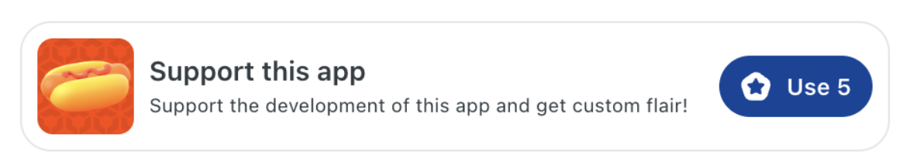
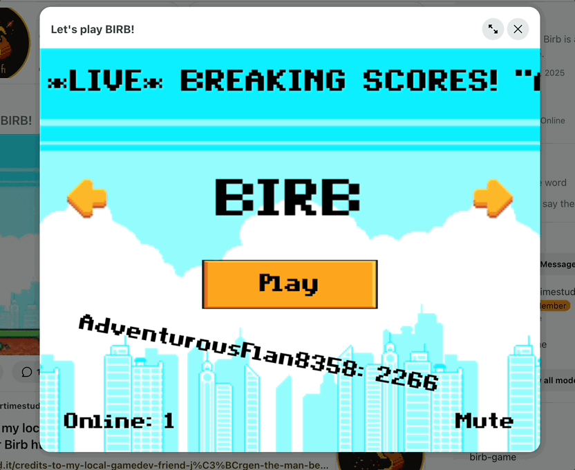
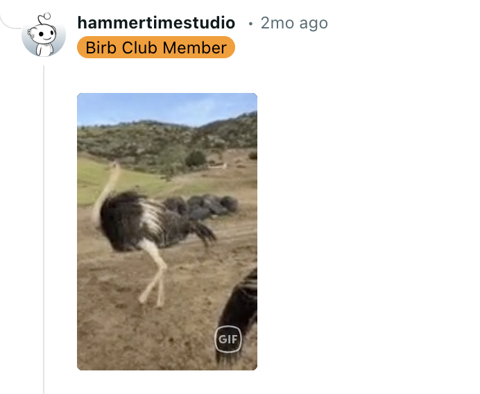

# Support this app

You can ask users to contribute to your app’s development by adding the “support this app” feature. This allows users to support your app with Reddit gold in exchange for some kind of award or recognition.

## Requirements

1. You must give something in return to users who support your app. This could be unique custom user flair, an honorable mention in a thank you post, or another creative way to show your appreciation.
2. The “Support this App” purchase button must meet the Developer Platform’s [design guidelines](./payments_add.md#design-guidelines).

## How to integrate app support

### Create the product

Use the Devvit CLI to generate the [product configuration](./payments_add.md#register-products).

```tsx
devvit products add support-app
```

### Add a payment handler

The [payment handler](./payments_add.md#complete-the-payment-flow) is where you award the promised incentive to your supporters. For example, this is how you can award custom user flair:

```tsx
addPaymentHandler({
  fulfillOrder: async (order, context) => {
    const username = await context.reddit.getCurrentUsername();
    if (!username) {
      throw new Error('User not found');
    }

    const subredditName = await context.reddit.getCurrentSubredditName();

    await context.reddit.setUserFlair({
      text: 'Super Duper User',
      subredditName,
      username,
      backgroundColor: '#ffbea6',
      textColor: 'dark',
    });
  },
});
```

### Initiate purchases

Next you need to provide a way for users to support your app:

- If you use Devvit blocks, you can use the ProductButton helper to render a purchase button.
- If you use webviews, make sure that your design follows the [design guidelines](./payments_add.md#design-guidelines) to [initiate purchases](./payments_add.md#initiate-orders).



Here's how you create a ProductButton in blocks:

```tsx
import { usePayments, useProducts } from '@devvit/payments';
import { ProductButton } from '@devvit/payments/helpers/ProductButton';
import { Devvit } from '@devvit/public-api';

Devvit.addCustomPostType({
  render: (context) => {
    const { products } = useProducts(context);
    const payments = usePayments((result: OnPurchaseResult) => {
      if (result.status === OrderResultStatus.Success) {
        context.ui.showToast({
          appearance: 'success',
          text: 'Thanks for your support!',
        });
      } else {
        context.ui.showToast(
          `Purchase failed! Please try again.`
        );
      }
    });
   const supportProduct = products.find(products.find((p) => p.sku === 'support-app');
   return (
     <ProductButton
       product={supportProduct}
       onPress={(p) => payments.purchase(p.sku)}
     />
   );
})
```

## Example

At [r/BirbGame](https://www.reddit.com/r/BirbGame/), they created the Birb Club. Members can join the club and get exclusive flair to support the app.




