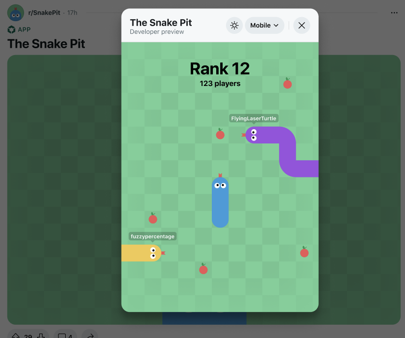
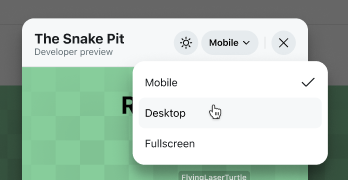
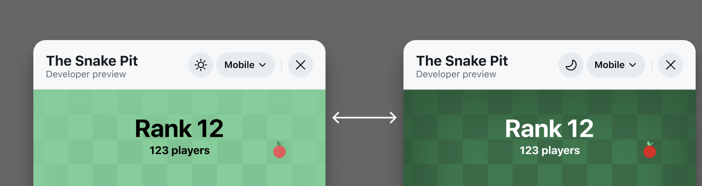

import Tabs from '@theme/Tabs';
import TabItem from '@theme/TabItem';

# UI Simulator

## Overview

Most Reddit users will see your app on a mobile device, so it’s important to know how your app will look and feel in that environment.  UI simulator is a specialized viewing mode that gives you tools to help you build, view, and test your app for a mobile audience. 


## Features

- **Mobile viewport simulation**: Displays your app in a mobile-sized container (matching common mobile device dimensions)
- **Size controls**: Toggle between mobile, desktop, and fullscreen views to test responsive behavior
- **Dark/light mode toggle**: Test your app's appearance in both light and dark themes

## Who can access UI simulator?

UI simulator mode is automatically enabled when you are the app developer and viewing the app in a subreddit where you are a moderator. You'll see it in the header of your webview app modal:



## Using UI simulator

1. When viewport simulator is enabled, your app will initially load in mobile view
2. Use the viewport controls to switch between different view sizes:
   - Mobile (default): Shows your app in a mobile-sized container
   - Desktop: Expands to a wider viewport
   - Fullscreen: Takes up the entire screen
3. Use the dark/light mode toggle to test both color schemes




## Mobile-first development principles

Always test your app in mobile view first to validate that all critical features are accessible on small screens.

### Why mobile-first?

- Most Reddit users access content through mobile devices
- Mobile constraints help create more focused, efficient designs
- Better performance due to progressive enhancement

## Best practices

1. **Start small, scale up**

   - Begin with the mobile layout, adding complexity as the viewport size increases
   - Use progressive enhancement rather than graceful degradation

2. **Content prioritization**

   - Focus on essential content and features first
   - Optimize images and media for smaller screens
   - Stack content vertically for mobile
   - Consider thumb zones and reachability: keep important actions within easy reach

3. **Accessibility**

   - Ensure main touch targets are easily tappable & there is sufficient spacing between interactive elements
   - Maintain proper color contrast ratios in both themes
   - Use relative units (rem, em, %) over fixed pixels
   - Ensure text is readable without zooming

4. **Regular testing**

   - Test all new features in mobile view before desktop
   - Verify both dark and light mode appearances

Remember: Mobile users are your primary audience. If it works well on mobile, it will likely work well everywhere else.

Example of how to use a CSS media query to set different colors for light and dark mode:

```css
/* Light mode (default) */
:root {
  --bg-color: #ffffff;
  --text-color: #000000;
}

/* Dark mode */
@media (prefers-color-scheme: dark) {
  :root {
    --bg-color: #000000;
    --text-color: #ffffff;
  }
}
```
