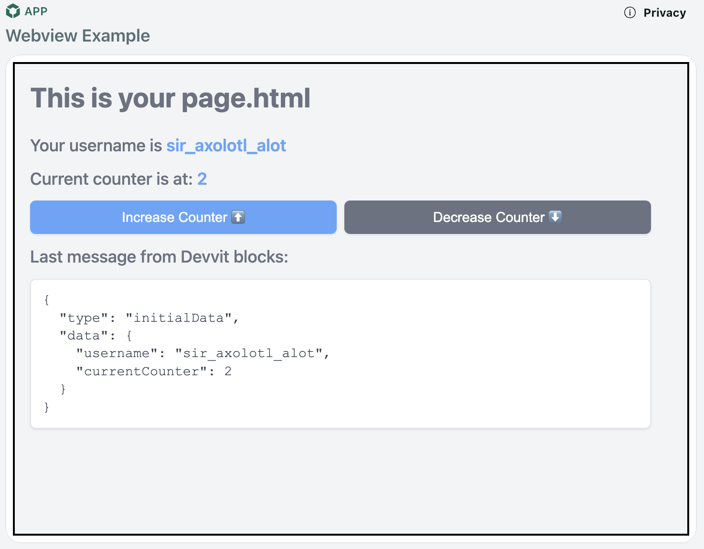

# Webviews

:::note
Webviews is currently experimental and optimized for desktop web. Mobile support is coming later this year.
:::

Webviews allow you include HTML, CSS, and JavaScript and have it run within your reddit app. This gives you full control over your app's appearance and behavior while running within Reddit's platform.

# Why use webviews over blocks?

Here’s a comparison between the two:

| Feature                                    | Webviews | Blocks |
| ------------------------------------------ | -------- | ------ |
| Rich multimedia (animations, video, audio) | ✅       | ❌     |
| Advanced gestures                          | ✅       | ❌     |
| Uses Reddit design system                  | ❌       | ✅     |
| Optimized for in-feed experience           | ❌       | ✅     |

**Choose Webviews if you:**

- Are experienced with web development
- Need rich multimedia or advanced interactions
- Want full control over styling and behavior

**Choose Blocks if you:**

- Want a Reddit-native look and feel
- Prefer a simpler, more constrained API
- Need optimal feed performance

## Quickstart

1. Create a new webview project:

```bash
devvit new --template web-view-post
cd my-project
```

2. Upload and test:

```bash
devvit upload
devvit playtest <my-subreddit>
```

3. Create a post in your subreddit using the "Create New Devvit Post (with Web View)" option in the post menu.

### Project Structure

```
my-project/
├── webroot/           # All web content goes here
│   ├── page.html     # Main HTML file
│   ├── styles.css    # Stylesheets
│   └── app.js        # JavaScript code
└── src/
    └── main.tsx      # Devvit app code
```



## Examples

- [React/Tailwind/Vite template](https://github.com/mwood23/devvit-webview-react)
- Games
  - [Fiddlesticks](https://reddit.com/r/fiddlesticks) | [Code](https://github.com/reddit/devvit-fiddlesticks)
  - [Snoosings](https://reddit.com/r/snoosings) | [Code](https://github.com/reddit/devvit-snoosings)
  - [Corridor](https://reddit.com/r/corridorgame) | [Code](https://github.com/reddit/devvit-corridor)

## Known limitations

1. **CSS/JS Requirements**

   - ❌ No inline CSS or JavaScript
   - ✅ Use separate .css and .js files

2. **Mobile Gestures**

   - ❌ Complex gestures may conflict with the Reddit app
   - ✅ Use simple interactions and avoid scrolling (e.g. overflow: none)
   - 🔄 Fix coming soon

3. **Asset Versioning**

   - ❌ Assets affect all versions when updated (including in a playtest)
   - ✅ Use separate apps for development/production
   - 🔄 Fix coming soon

4. **Forms**
   - ❌ No direct form submissions
   - ✅ Use JavaScript to handle form data
   - ✅ Send data via postMessage

## Best practices

1. **File Organization**

   - Keep all web files in the `webroot/` directory
   - Use separate files for HTML, CSS, and JavaScript
   - Consider using a bundler for larger applications

2. **State Management**

   - Use `localStorage` for webview-only state
   - Use Redis storage (via Devvit) for persistent data
   - Minimize state synchronization between webview and Devvit

3. **Performance**
   - Add a "Launch App" button to prevent UI flashing
   - Use local storage to cache data when possible
   - Create a compelling preview within Blocks
   - Prevent scaling the viewport

```html
<meta
  name="viewport"
  content="width=device-width, initial-scale=1.0, maximum-scale=1.0, user-scalable=no"
/>
```

## Communication Between Devvit and Webviews

Webviews let you build custom UIs with HTML/CSS/JS while accessing Devvit's backend services (Redis, fetch, scheduler, triggers) via message passing between the two contexts.


### From Devvit to Webview

```typescript
// In main.tsx
context.ui.webView.postMessage('myWebView', {
  type: 'updateData',
  data: { count: 42 },
});

// In webroot/app.js
window.addEventListener('message', (event) => {
  if (event.data.type === 'devvit-message') {
    const { message } = event.data;
    console.log('Received from Devvit:', message);
  }
});
```

### From Webview to Devvit

```typescript
// In webroot/app.js
window.parent.postMessage({
  type: 'userAction',
  data: { clicked: true }
}, '*');

// In main.tsx
<webview
  id="myWebView"
  url="page.html"
  onMessage={(msg) => {
    console.log('Received from webview:', msg);
  }}
/>
```

### Local, webview-only state

The webview does not have direct access to Devvit's services such as `redis`, `realtime` and `scheduler`. Communicating with server-side logic always needs to go through the Devvit application, i.e. you need to send a `window.parent.postMessage`, capture that message in your Devvit application, and send information to the backend.

If you want to keep local state that does not need to be persisted to the backend you can use [`window.localStorage`](https://developer.mozilla.org/en-US/docs/Web/API/Window/localStorage).

Example (`webroot/app.js`)

```js
// Save data to localStorage
localStorage.setItem('gameState', JSON.stringify(stateToSave));

// Load data from localStorage
const loadedState = localStorage.getItem('gameState');
```

## Explaining the Template App

Here's how this template app behaves.

Upon startup the app will:

- Load the current logged in user's username
- Load the last state of the app (counter) from Redis DB
- Display this data in Devvit Blocks

When the Launch App button is clicked, the app will:

- Show the webview and hide the other Devvit blocks
- Send an 'initialData' message from Blocks to the Webview so it can populate state
- The user is now seeing a webview with the contents of the `/webroot` folder

When the Increase/Decrease counter buttons are clicked the app will:

- Send a message from the Webviews to Blocks so state can be persisted in Redis (Webviews can't communicate directly with Redis)
- Receive a response from Blocks and update current state in the Webview

In the steps below, more details will be provided about each of the above.

### Devvit blocks (`main.tsx`)

_Load username and data from redis_

```tsx
// Load username with `useAsync` hook
const {
  loading: usernameLoading,
  error: usernameError,
  data: username,
} = useAsync(async () => {
  const currUser = await context.reddit.getCurrentUser();
  return currUser?.username ?? 'anon';
});

// Load latest counter from redis with `useAsync` hook
const {
  data: counter,
  loading,
  error,
} = useAsync(async () => {
  var redisCount = await context.redis.get(`counter_${context.postId}`);
  console.log('redisCount:', redisCount);
  return Number(redisCount ?? 0);
});
```

_Send Initial data and show Webview_

```tsx
// When the Launch App button is clicked, send initial data to webview and show it
const onShowWebviewClick = () => {
  setWebviewVisible(true);
  context.ui.webView.postMessage('myWebView', {
    type: 'initialData',
    data: {
      username: username,
      currentCounter: counter,
    },
  });
};
```

_Define the webviews component within blocks_

```tsx
<vstack grow={webviewVisible} height={webviewVisible ? '100%' : '0%'}>
  <vstack border="thick" borderColor="black" height={webviewVisible ? '100%' : '0%'}>
    <webview
      id="myWebView"
      url="page.html"
      onMessage={(msg) => onMessage(msg as WebViewMessage)}
      grow
      height={webviewVisible ? '100%' : '0%'}
    />
  </vstack>
</vstack>
```

_Respond to messages from Webview changing data in Redis DB_

```tsx
// When the webview invokes `window.parent.postMessage` this function is called
const onMessage = async (msg: WebViewMessage) => {
  if (msg?.type === 'setCounter') {
    // Get new counter value from the message
    var newCounter = msg.data.newCounter!;
    // Update Redis DB
    await context.redis.set(`counter_${context.postId}`, newCounter.toString());
    // Send confirmation of new value back to the Webview
    context.ui.webView.postMessage('myWebView', {
      type: 'updateCounter',
      data: {
        currentCounter: newCounter,
      },
    });
  }
};
```

### Web application (`webroot/page.js`)

_Listening to updates from the Devvit app_

```js
// When the Devvit app sends a message with `context.ui.webView.postMessage`, this will be triggered
window.addEventListener('message', (ev) => {
  const { type, data } = ev.data;

  // Reserved type for messages sent via `context.ui.webView.postMessage`
  if (type === 'devvit-message') {
    const { message } = data;

    // Load initial data
    if (message.type == 'initialData') {
      const { username, currentCounter } = message.data;
      usernameLabel.innerHTML = username;
      counterLabel.innerHTML = counter = currentCounter;
    }

    // Update counter
    if (message.type == 'updateCounter') {
      const { currentCounter } = message.data;
      counterLabel.innerHTML = counter = currentCounter;
    }
  }
});
```

_Sending messages to the Devvit app_

```js
window.parent?.postMessage(
  {
    type: 'setCounter',
    data: { newCounter: Number(counter + 1) },
  },
  '*'
);
```

## Questions

Don't forget to join our [Discord](https://discord.gg/Cd43ExtEFS) if you have any additional questions
