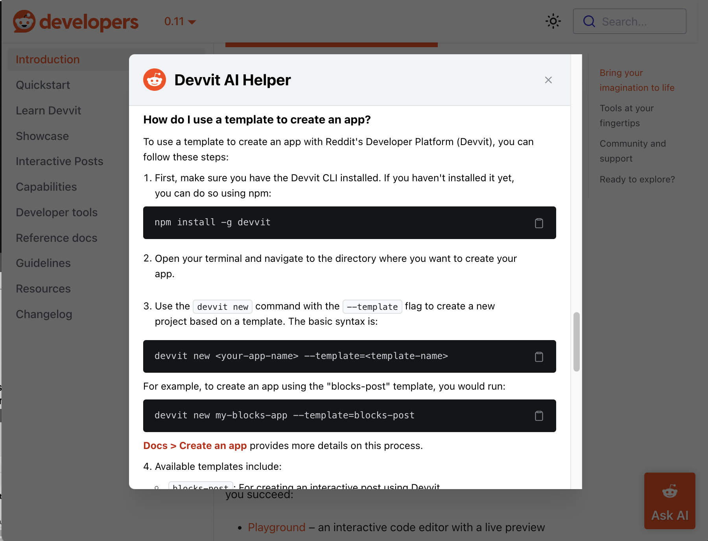
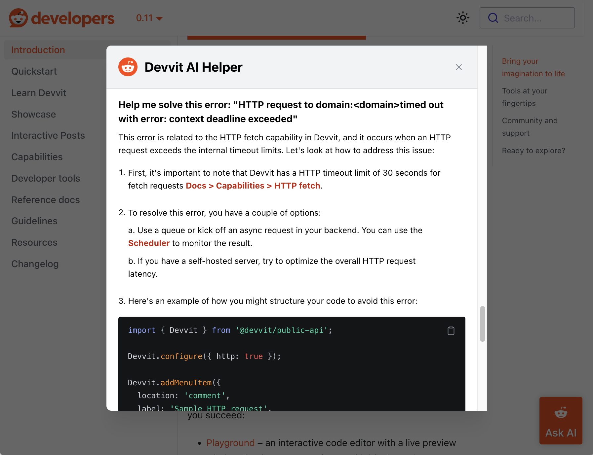

# Ask AI

You can use Ask AI to find answers to your questions, explore documentation, and troubleshoot common issues. The Ask AI chatbot is trained on Reddit’s developer documentation and code examples and uses information from the source to give you accurate, relevant guidance.

To use Ask AI, just click the icon in the bottom right corner of the page and ask a question.

:::note
You can also use Ask AI from the support section of our [Discord](https://discord.gg/Cd43ExtEFS) server. Simply create a new post in the #ask-ai channel and our bot will answer your question.
:::

## Ways to use Ask AI

### Get help starting your project

If you are just starting out, Ask AI can guide you through the basics, like creating a
chessboard using Reddit's developer tools and APIs. You’ll get a step-by-step explanation
and links to the relevant documentation to get your project off the ground.

### Troubleshoot your app

Ask AI can help identify the cause of common issues, such as HTTP Fetch request
errors. You’ll be guided through potential fixes, like checking your logs or reviewing your setup.

## Ask AI tips

Ask AI is designed to help you navigate the Developer Platform, but it isn’t going to write your code for you. To make the most of Ask AI:

- Be specific. Instead of asking “How do I create a bot?”, try asking “How do I use Reddit’s API to create a comment bot?”
- Use follow-up questions to continue the conversation and refine the answer.

:::note
Ask AI is configured to answer questions based on Reddit’s documentation and code examples. It’s not a general LLM and can’t answer questions about your specific system, other platforms, or the meaning of life.
:::
