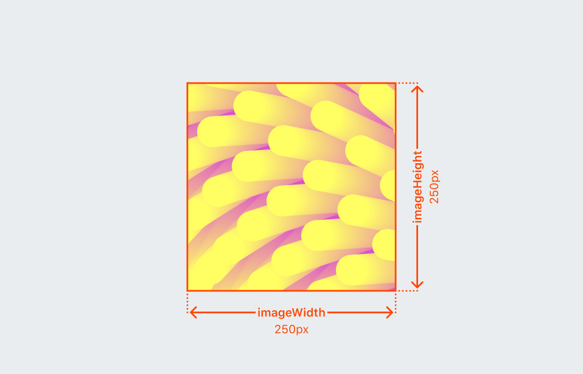
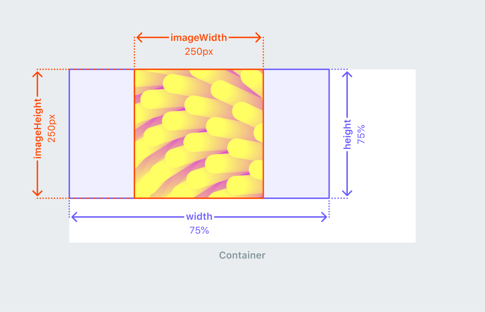
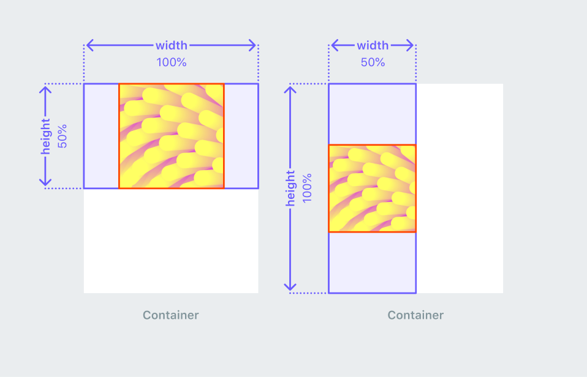
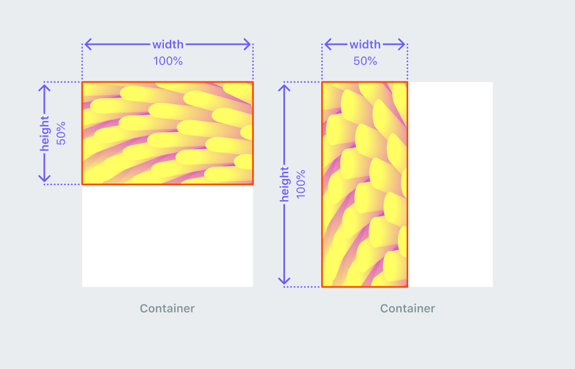
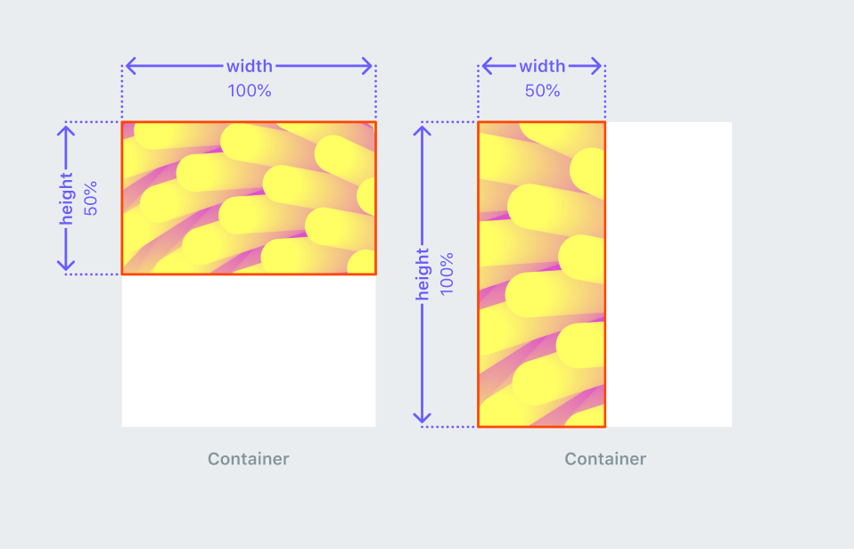

import AttributeMinHeight from './attributes/_minHeight.md';
import AttributeMaxHeight from './attributes/_maxHeight.md';
import AttributeMinWidth from './attributes/_minWidth.md';
import AttributeMaxWidth from './attributes/_maxWidth.md';
import AttributeGrow from './attributes/_grow.md';
import AttributeOnPress from './attributes/_onPress.md';
import AttributeWidth from './attributes/_width.mdx';
import AttributeHeight from './attributes/_height.mdx';

# Image

The `<image>` element is used for embedding images into the UI.

## Image size

To add an image to a block, you’ll use the `<image>` tag and set the `imageHeight` and `imageWidth` attributes. These fields specify the preferred size of the image in pixels (usually this is the size of the file you uploaded). The `imageHeight` and `imageWidth` attributes are required when adding an image.

In this example, `imageHeight` and `imageWidth` are set to 250 pixels, and the block size is not specified.

```tsx
<blocks>
  <image
    url="fuzzyFingers.png"
    imageWidth={250}
    imageHeight={250}
    description="Generative artwork: Fuzzy Fingers"
  />
</blocks>
```



## Block size

You can also set the block size that holds the image using the `height` and `width` parameters to set the maximum percentage of the block’s size relative to the parent.

When you set the block size, the same 250 pixel `imageHeight` and `imageWidth` fields specify the resolution and aspect ratio of the image itself and no longer only the size. Notice the image renders differently than when you didn’t set the block size above.

```tsx
<blocks>
  <image
    url="fuzzyFingers.png"
    height="75%"
    width="75%"
    imageWidth={250}
    imageHeight={250}
    resizeMode="fit"
    description="Generative artwork: Fuzzy Fingers"
  />
</blocks>
```



## Attributes

### `url`

A `string` pointing to an image resource. Possible values:

- Local file
  - `spinner.gif`
  - For referencing local files in the `/assets` folder
- URL
  - Only works for reddit hosted domains
  - `https://www.redditstatic.com/desktop2x/img/id-cards/snoo-home@2x.png`
- SVG String
  - `data:image/svg+xml, <svg>...</svg>`

#### Examples

A local image that resizes to cover its entire area

```tsx
<image
  imageHeight={1024}
  imageWidth={1500}
  height="100%"
  width="100%"
  url="background.png"
  description="striped blue background"
  resizeMode="cover"
/>
```

SVG template literal

```tsx
<image
  imageWidth={400}
  imageHeight={300}
  width="200px"
  height="150px"
  url={`data:image/svg+xml,
    <svg
      width="400"
      height="300"
      viewBox="0 0 400 300"
      xmlns="http://www.w3.org/2000/svg"
    >
      <rect x="50" y="50" width="300" height="200" fill="red" />
    </svg>
  `}
/>
```

### `imageHeight`

A `number` representing the intrinsic image height.

### `imageWidth`

A `number` representing the intrinsic image width.

### `width`

<AttributeWidth />

### `minWidth`

<AttributeMinWidth />

### `maxWidth`

<AttributeMaxWidth />

### `height`

<AttributeHeight />

### `minHeight`

<AttributeMinHeight />

### `maxHeight`

<AttributeMaxHeight />

### `description`

A `string` for describing an image. Helpful for improving accessibility, as it's used by screen readers to read the attribute value out to users so they know what the image means.

### `resizeMode`

An `enum` specify how to display the image in the block. Possible values:

- `fit` (default) resizes the image to fit the container and maintain aspect ratio.



- `fill` resizes the image to fill the container but may lose aspect ratio.



- `cover` scales the image to fit the entire container and maintain aspect ratio. The image may be cropped based on the container size.



- `scale-down` resizes the image to the smallest fit and maintains the aspect ratio.

### `grow`

<AttributeGrow />

## Functions

### `onPress`

<AttributeOnPress />

#### Examples

```tsx
<image onPress={() => console.log('world')}>Hello</image>
```

## Notes

## Examples

A button that increments a counter

```tsx
import { Devvit, useState } from '@devvit/public-api';

Devvit.addCustomPostType({
  name: 'Say Hello',
  render: (context) => {
    const [votes, setCounter] = useState(0);
    return (
      <blocks>
        <vstack alignment="center middle" height="100%" width="100%">
          <button icon="upvote-outline" onPress={() => setCounter(votes + 1)}>
            {votes}
          </button>
        </vstack>
      </blocks>
    );
  },
});
```

### Example

Something you might run into when adding assets is that the images could be large enough to push some content outside of the visible frame. If you notice that happening, you can adjust the container height and image width using `height`, `grow`, and `resizeMode`. See the following example:

```tsx
<blocks height="tall">
  <vstack gap="medium" padding="medium" height={100}>
    <text>
      Lorem ipsum dolor sit amet, consectetur adipiscing elit. Ut sed malesuada tortor. Phasellus
      velit eros, fermentum vitae cursus ut, condimentum nec tellus.
    </text>
    ​
    <image url="asset.png" imageWidth={123} imageHeight={123} grow width={100} resizeMode="fit" />​
    {/* Footer */}
    <hstack gap="medium">
      <button grow>Option 1</button>
      <button grow>Option 2</button>
    </hstack>
  </vstack>
</blocks>
```
