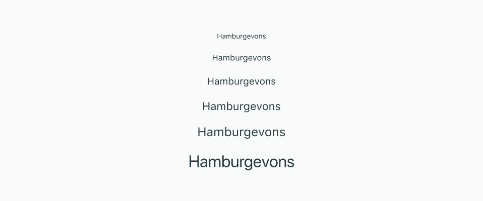
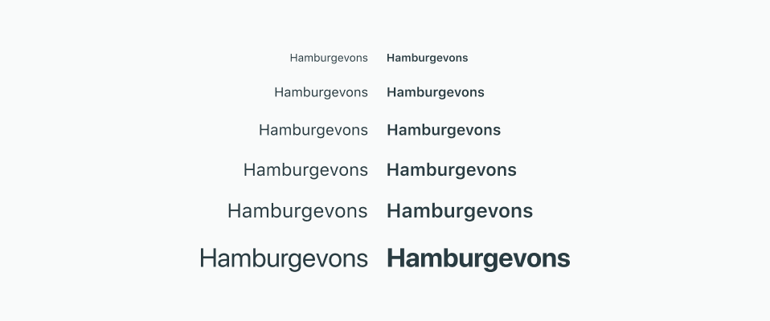
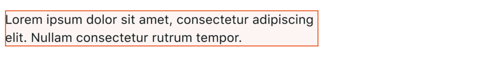
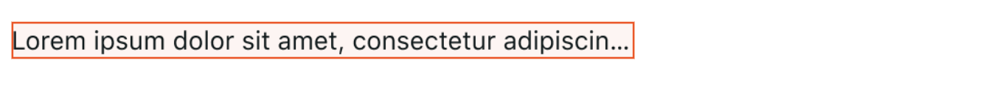
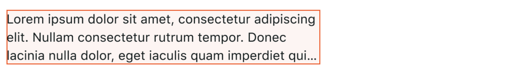
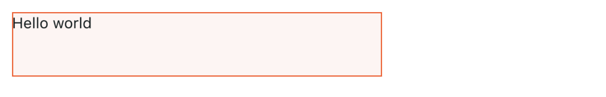

import AttributeMinHeight from './attributes/_minHeight.md';
import AttributeMaxHeight from './attributes/_maxHeight.md';
import AttributeMinWidth from './attributes/_minWidth.md';
import AttributeMaxWidth from './attributes/_maxWidth.md';
import AttributeGrow from './attributes/_grow.md';
import AttributeAlignment from './attributes/_alignment.md';
import AttributeOnPress from './attributes/_onPress.md';
import AttributeWidth from './attributes/_width.mdx';
import AttributeHeight from './attributes/_height.mdx';
import AttributeColor from './attributes/_color.md';

# Text

The `<text>` element enables you add and format text in your UI.

By default, text blocks are limited to a single line. If you have a lot of text, it grows horizontally and the overflow gets clipped. There are two properties to make working with multi-line text easier: `wrap` and `overflow`. For text to wrap onto a new line, there needs to be a width defined.

## Attributes

### `style`

An `enum` for defining the text style. Shorthand for setting `size`, `weight`, and `color` at the same time. Possible values:

- `metadata`
- `body`: The default if the attribute is not used.
- `heading`

### `size`

An `enum` for setting the text size and line height. Overrides the `style` attribute if both are set. Possible values:

- `xsmall`
  - Text size: 10px
  - Line height: 16px
- `small`
  - Text size: 12px
  - Line height: 16px
- `medium`: The default if the attribute is not used.
  - Text size: 14px
  - Line height: 20px
- `large`
  - Text size: 16px
  - Line height: 20px
- `xlarge`
  - Text size: 18px
  - Line height: 24px
- `xxlarge`
  - Text size: 24px
  - Line height: 28px



### `weight`

An `enum` for setting the text weight. Possible values:

- `regular`: The default if the attribute is not used.
- `bold`



### `color`

<AttributeColor />

Defaults to `neutral-content`.

### `alignment`

<AttributeAlignment />

### `grow`

<AttributeGrow />

### `outline`

An `enum` for adding an outline to text. The outline is either `white` or `black`, depending on which color provides the most contrast against the text color. Possible values:

- `none`: The default if the attribute is not used.
- `thin`: 1px
- `thick`: 2px

### `selectable`

A `boolean` for determing if users can select the text. Possible values:

- `true`: The default if the attribute is not used.
- `false`

### `wrap`

A `boolean` for toggling text wrapping, enabling text to wrap onto multiple lines. Only wraps if the width is constrained. Possible values:

- `true`
- `false`: The default if the attribute is not used.

### `overflow`

An `enum` for determing how text overflow is handled. Possible values:

- `clip`: The default if the attribute is not used.
- `ellipsis`

### `width`

<AttributeWidth />

### `minWidth`

<AttributeMinWidth />

### `maxWidth`

<AttributeMaxWidth />

### `height`

<AttributeHeight />

### `minHeight`

<AttributeMinHeight />

### `maxHeight`

<AttributeMaxHeight />

## Functions

### `onPress`

<AttributeOnPress />

#### Examples

```tsx
<text onPress={() => console.log('world')}>Hello</text>
```

## Examples

### Text wrapping

Wrap the text onto a new line once the available width has been filled. The number of lines is a function of the font size and the text string length.



```tsx
<text wrap>
  Lorem ipsum dolor sit amet, consectetur adipiscing elit. Nullam consectetur rutrum tempor.
</text>
```

### Changing the overflow symbol

Set the overflow attribute to “ellipsis” provides a visual cue to users that there is additional text.



```tsx
<text overflow="ellipsis">
  Lorem ipsum dolor sit amet, consectetur adipiscing elit. Nullam consectetur rutrum tempor. Donec
  lacinia nulla dolor, eget iaculis quam imperdiet quis. Duis nec velit dignissim, lobortis ligula
  eu, mattis arcu.
</text>
```

### Constricting height and overflow indicator

Define the height to limit the number of lines occupied by the text.



```tsx
<text maxHeight="60px" wrap overflow="ellipsis">
  Lorem ipsum dolor sit amet, consectetur adipiscing elit. Nullam consectetur rutrum tempor. Donec
  lacinia nulla dolor, eget iaculis quam imperdiet quis. Duis nec velit dignissim, lobortis ligula
  eu, mattis arcu. Lorem ipsum dolor sit amet, consectetur adipiscing elit. Nullam consectetur
  rutrum tempor. Donec lacinia nulla dolor, eget iaculis quam imperdiet quis. Duis nec velit
  dignissim, lobortis ligula eu, mattis arcu.
</text>
```

### Constricting height with limited content

Avoid UI shift by setting a fixed height.



```tsx
<text height="60px">Hello world</text>
```
