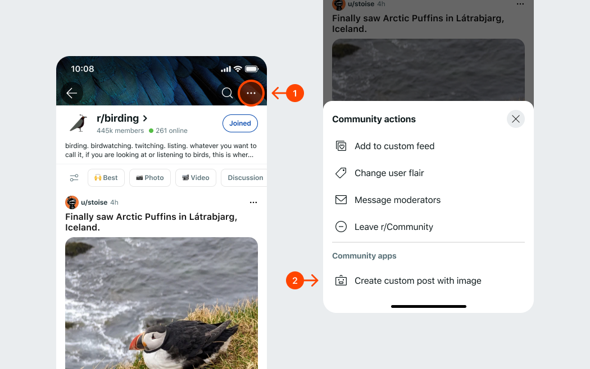
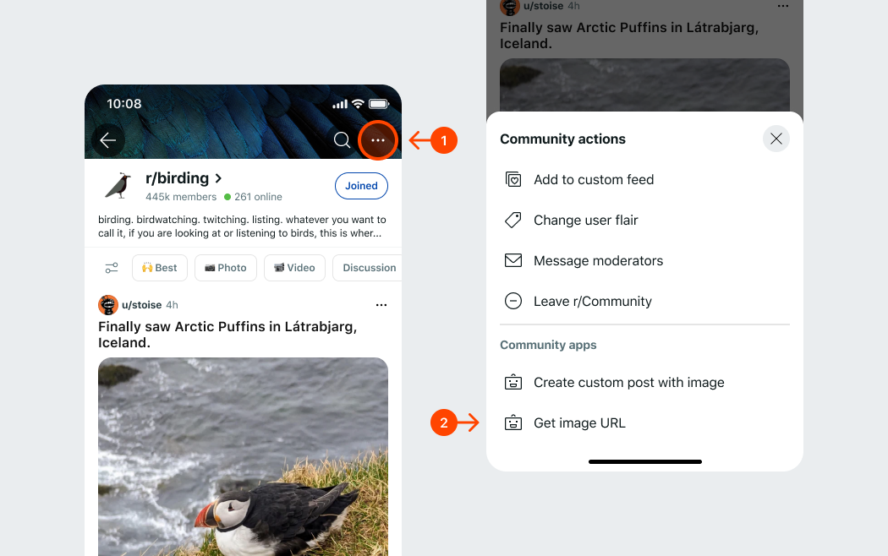

# Adding Images

Add images to your interactive post.

You can add things like a logo for the community, a special artistic expression, or new characters to unlock in your game.

:::note
The [Reddit Content Policy](https://www.redditinc.com/policies/content-policy) applies to images in your app. All project assets are subject to an app review and screened by automated Reddit systems at upload. Images that violate the content policy will be removed.
:::

## What’s supported?

- File types: JPG/JPEG, PNG, or GIF
- Image size: 20MB for JPG/PNG; 40MB for GIF
- Folder size: 1GB per app version

The image file name does not have any constraints, but needs to reside in the “assets” folder. The file type is determined by inspecting its contents.

## How it works

Add an image to your app’s `assets` folder. The image is uploaded to Reddit and accessible in your app source code when you upload your app. New projects should have an `assets` folder in the root directory. If you’re updating an existing project, you’ll need to add the `assets` folder.

Once the images are uploaded to Reddit, you can show the image in one of two ways:

1. Use the Blocks UI component to embed your image in a post (to learn more about how to style images, check out our [blocks gallery](https://www.reddit.com/r/Devvit/post-viewer/1545cls/custom_post_block_kit_gallery/)).

:::note
The imageWidth and imageHeight attributes are in device independent pixels (DIPs).
:::

```tsx
<image url="imageName.jpg" imageWidth={100} imageHeight={100} />
```

2. Use the URL string to get the image’s public URL from the code.

```ts
context.assets.getURL('imageName.jpg');
```

:::note
The image name is case-sensitive. Additionally, you can use nested folders to organize your assets. For example,
`assets/images/imageName.jpg` will be uploaded to Reddit as `images/imageName.jpg`.
:::

## Use an image in a post

1. Locate the `assets` folder at the root of your project directory (or create one if it’s not there).
2. Create your image and add it to the `assets` folder.
3. Update your code to import the new asset. Here’s an example:

```tsx
Devvit.configure({
  redditAPI: true,
});

const render: Devvit.CustomPostComponent = () => {
  return (
    <vstack padding="medium" gap="medium" cornerRadius="medium">
      <text style="heading" size="xxlarge">
        Hello!
      </text>
      <image url="hello.png" imageWidth={128} imageHeight={128} />
    </vstack>
  );
};

Devvit.addCustomPostType({
  name: 'My custom post',
  description: 'Test custom post for showing a custom asset!',
  render,
});

Devvit.addMenuItem({
  location: 'subreddit',
  label: 'Make custom post with image asset',
  onPress: async (event, context) => {
    const subreddit = await context.reddit.getSubredditById(context.subredditId);

    await context.reddit.submitPost({
      subredditName: subreddit.name,
      title: 'Custom post!',
      preview: render(context),
    });
  },
});
```

4. Run `devvit upload`.
5. Install or update your app on your subreddit.
6. From the subreddit menu, click "Make custom post with image asset". This will create a new post with the image embedded in it.



## Show an image URL in a toast

1. Locate the `assets` folder at the root of your project directory (or create one if it’s not there).
2. Create your image and add it to the `assets` folder.
3. Update your code to import the new asset. Here’s an example:

```ts
Devvit.addMenuItem({
  location: 'subreddit',
  label: 'Get image URL',
  onPress: async (event, context) => {
    const url = await context.assets.getURL('hello.png');
    context.ui.showToast(url); // should show 'https://i.redd.it/<id>.png'
    // and if you go to the URL it showed, it should be your art
    // Note, it doesn't display the image this way, just the URL as text!
  },
});
```


