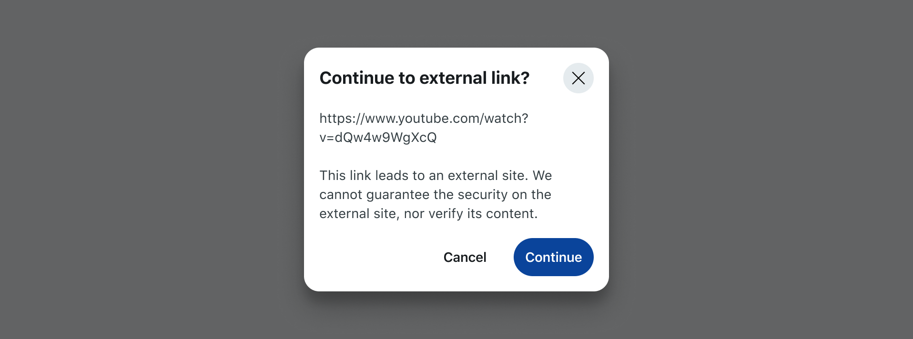

import Tabs from '@theme/Tabs';
import TabItem from '@theme/TabItem';

# Navigation

Use navigation functions to redirect users to Reddit content or external websites in response to user actions, such as button clicks. You can redirect to a `url` string or to objects such as [`Subreddit`](/api/redditapi/models/classes/Subreddit.md), [`Post`](/api/redditapi/models/classes/Post.md), or [`Comment`](/api/redditapi/models/classes/Comment.md).

**For most navigation interactions, use the direct client library functions.** These provide immediate navigation and are perfect for user interactions within your app components.

:::warning
When linking to Reddit content, the navigation function requires the app account to have access to the content. If the app account does not have access, the redirect will fail.
:::

## Basic navigation

<Tabs>
  <TabItem value="web" label="Devvit Web">
  ```ts title="client/index.ts"
  import { navigateTo } from '@devvit/web/client';
  
  // Navigate to external URLs
  navigateTo('https://www.youtube.com/watch?v=dQw4w9WgXcQ');
  
  // Navigate to Reddit URLs
  navigateTo('https://www.reddit.com/r/movies/comments/tzxev3/');
  
  // Navigate to Reddit objects
  async function goToPost() {
    const post = await fetch('/api/getPost').then(r => r.json());
    navigateTo(post);
  }
  
  // Use in button handlers or user interactions
  function handleNavigateClick() {
    navigateTo('https://www.reddit.com/r/webdev');
  }
  ```

  ### Parameters

  **`navigateTo(target)`**

  - `target`: Either a URL string or a Reddit object (Subreddit, Post, Comment)

  </TabItem>
  <TabItem value="blocks" label="Devvit Blocks / Mod Tools">
  ```tsx
  import { Devvit } from '@devvit/public-api';

  Devvit.configure({ redditAPI: true });

  // Navigate to URL
  Devvit.addMenuItem({
    label: 'Navigate to url',
    location: 'subreddit',
    onPress: async (_event, context) => {
      const url = 'https://www.reddit.com/r/movies/comments/tzxev3/';
      context.ui.navigateTo(url);
    },
  });

  // Navigate to subreddit
  Devvit.addMenuItem({
    label: 'Navigate to subreddit',
    location: 'subreddit',
    onPress: async (_event, context) => {
      const subredditId = 't5_2qh1o';
      const subreddit = await context.reddit.getSubredditById(subredditId);
      context.ui.navigateTo(subreddit);
    },
  });

  // Navigate to post
  Devvit.addMenuItem({
    label: 'Navigate to post',
    location: 'subreddit',
    onPress: async (_event, context) => {
      const postId = 't3_tzxev3';
      const post = await context.reddit.getPostById(postId);
      context.ui.navigateTo(post);
    },
  });

  // Navigate to comment
  Devvit.addMenuItem({
    label: 'Navigate to comment',
    location: 'subreddit',
    onPress: async (_event, context) => {
      const commentId = 't1_i426ob1';
      const comment = await context.reddit.getCommentById(commentId);
      context.ui.navigateTo(comment);
    },
  });

  // Interactive post with navigation
  Devvit.addCustomPostType({
    name: 'Navigation Post',
    render: (context) => {
      return (
        <vstack height="100%" alignment="middle center">
          <button
            onPress={async () => {
              const postId = 't3_tzxev3';
              const post = await context.reddit.getPostById(postId);
              context.ui.navigateTo(post);
            }}
          >
            Navigate to post
          </button>
        </vstack>
      );
    },
  });

  // Menu action to create interactive post
  Devvit.addMenuItem({
    label: 'Add navigation post',
    location: 'subreddit',
    onPress: async (_event, context) => {
      const subreddit = await context.reddit.getCurrentSubreddit();
      await context.reddit.submitPost({
        title: 'Navigate to post',
        subredditName: subreddit.name,
        preview: (
          <vstack height="100%" width="100%" alignment="middle center">
            <text>Loading ...</text>
          </vstack>
        ),
      });
      context.ui.showToast('Created post!');
    },
  });
  ```

  ### Parameters

  **`context.ui.navigateTo(target)`**

  - `target`: Either a URL string or a Reddit object (Subreddit, Post, Comment)

  </TabItem>
</Tabs>

:::tip Menu response navigation
For navigation in menu response workflows (when you need server processing before navigation), see the [Menu Actions](./menu-actions.mdx) documentation.
:::

## External URLs

Users see a confirmation dialog before going to external URLs.



## Limitations

- `url` must be http/https
- `url` must have a domain
