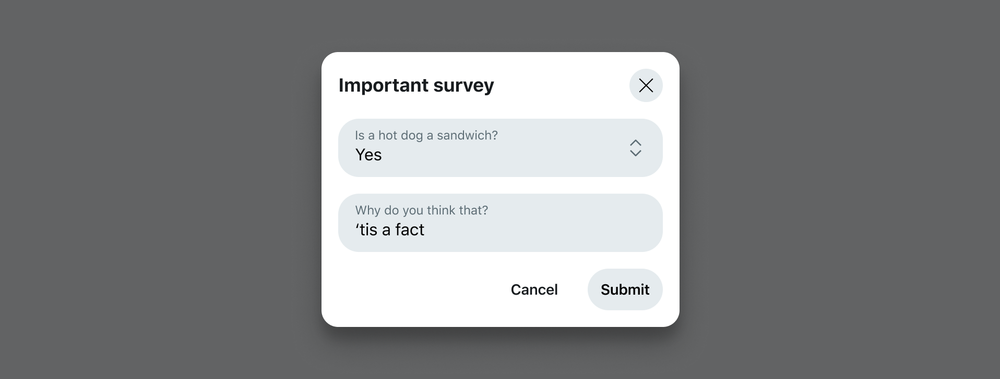
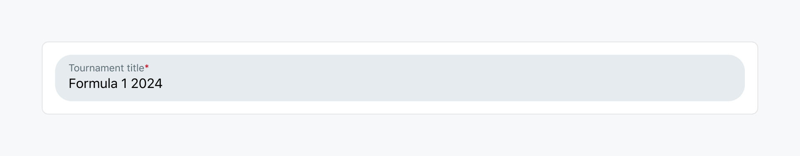
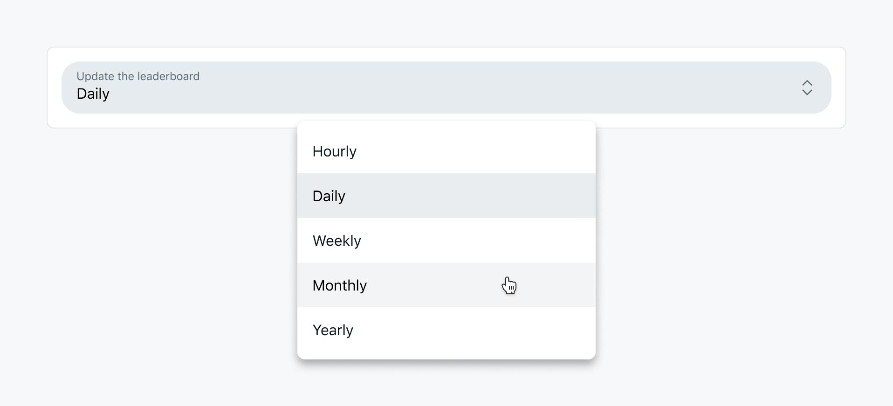
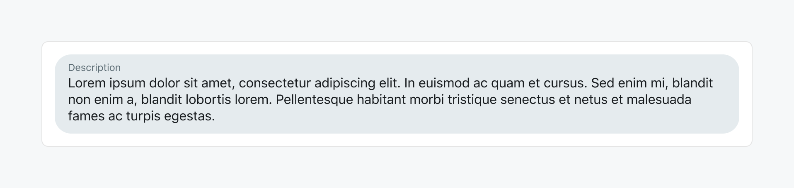
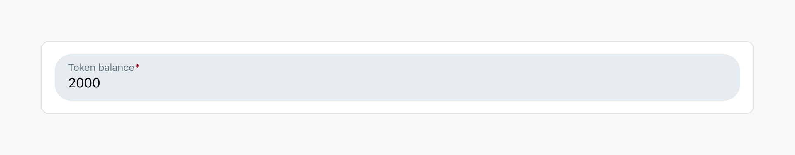
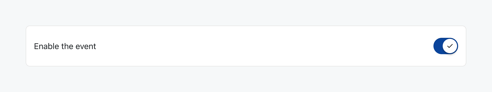
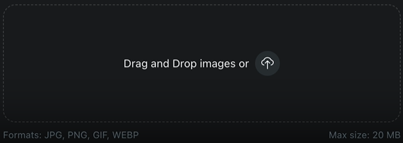

# Forms

A form lets your app ask users to input and submit data. Forms can be defined with a simple [form object](#form-object) that takes a [list of fields](#supported-fields-types), and an [onSubmit handler](#on-submit-handler).



## Using forms

There are several ways to add a form to your app, and the method you'll use depends on what you’re doing.

- For [interactive posts](#interactive-posts), use the `context.ui.useForm` hook.
- For [menu actions](#menu-actions), use the [`devvit.createForm`](/docs/api/public-api/classes/Devvit-1.md#createform) method.
- For [app configurations](#app-configurations), use the [`devvit.addSettings`](/docs/api/public-api/classes/Devvit-1.md#addsettings) method.

### Interactive posts

This example shows an interactive post with a text label and a button that triggers a form. When the form is submitted, the onSubmit handler takes the form input and manipulates state with [`useState`](/docs/working_with_usestate.md). The state update triggers a rerender and the new data is displayed.

```tsx
import { Devvit, useState, useForm } from '@devvit/public-api';

Devvit.addCustomPostType({
  name: 'TemplateName',
  render: (context) => {
    const [name, setName] = useState('unknown');

    const myForm = useForm(
      {
        fields: [
          {
            type: 'string',
            name: 'name',
            label: 'Name',
          },
        ],
      },
      (values) => {
        // onSubmit handler
        setName(values.name);
      }
    );

    return (
      <vstack gap="medium" height="100%" alignment="middle center">
        <text>Hello {name}!</text>
        <button
          onPress={() => {
            context.ui.showForm(myForm);
          }}
        >
          Set name
        </button>
      </vstack>
    );
  },
});

export default Devvit;
```

[Explore example in playground](https://developers.reddit.com/play#pen/N4IgdghgtgpiBcIBiB7ATlABASzJgogB4AOMa2MYAxjJgAooDOALiADQiNpUIjZTF0zTMEwARGADdJ2YQF9MAMzQosAcgACAEykzmAemIBXAEYAbbFQC0EYtjUBuADpgXE6bIB0ELVoDCRiyqDCwAKgCepAAUwC6YmJCw8JhqoTACZhDMMABy0DBqbHGYaJQ6aMlRVChg2YTMAJSYALwAfCLF8dVgLJgA2okwbJiMMMx5sAC6LZjddcyegTAAysxZMFFqRmAA1mAoAO5gag3OrnjxszW9UOGoGDNzMPWLo-dQUZ2XsReXl4oUMxaRjJPpfP7xH4Q6GYZiRGDJNQschgADmhXBMMGiMGGN+MPimRMMDMiImBSK+OhckpBMmtIhNMxUUkEDMRhgjCabQ6VMuo3G+RZbI5jE8g1OmLkX0l5z+pWYRjQeE+fIAPJIWBAqDtMKjbM0nCBYFpsEYoEbMAALGDYVFW5iGkAARgADK6AKSWtl2sCwWpOqDYXxmWg0WpkI2tTHxNXzVoACRJZhQIkGcgAhGr9PGY5g1SYjMxmDU8-EanRSoxGM1gFFue0oQTLk8XkZsJ5GFbDu8ord3rLm5g5NK+fFo2PLssxgl8nns4XizUJ9Ds5q1jqV5dB8PKXJZS5noI0MIdIoIEYzMJ3HoHOwQJIyIxsDUEM65EA).

### Menu actions

This example defines a new form and a onSubmit handler called `myForm` using the `devvit.createForm` method. This form is shown via a [menu action](./menu-actions.md) using `context.ui.showForm()`.

```ts
import { Devvit } from '@devvit/public-api';

const myForm = Devvit.createForm(
  {
    fields: [
      {
        type: 'string',
        name: 'food',
        label: 'What is your favorite food?',
      },
    ],
  },
  (event, context) => {
    // onSubmit handler
    context.ui.showToast({ text: event.values.food });
  }
);

Devvit.addMenuItem({
  label: 'Show a form',
  location: 'subreddit',
  onPress: async (_event, context) => {
    context.ui.showForm(myForm);
  },
});

export default Devvit;
```

### App configurations

For more details see the [app configurations page](./app-configurations.md).

## Form object

The form object enables you to customize the form container and the [list of form fields](#supported-fields-types) included. The form object is passed along to `context.ui.useForm`, [`devvit.createForm`](/docs/api/public-api/classes/Devvit-1.md#createform), or [`devvit.addSettings`](/docs/api/public-api/classes/Devvit-1.md#addsettings) to create the form.

#### Usage

```tsx
const myForm = {
  title: 'My form',
  description: 'This is my form. There are many like it, but this one is mine.',
  fields: [
    {
      type: 'string',
      name: 'food',
      label: 'What is your favorite food?',
    },
    {
      type: 'string',
      name: 'drink',
      label: 'What is your favorite drink?',
    },
  ],
  acceptLabel: 'Submit',
  cancelLabel: 'Cancel',
};
```

#### Supported properties

| Property      | Supported types      | Description                                   |
| :------------ | :------------------- | :-------------------------------------------- |
| `title`       | `string` `undefined` | An optional title for the form                |
| `description` | `string` `undefined` | An optional description for the form          |
| `fields`      | `FormField[]`        | The fields that will be displayed in the form |
| `acceptLabel` | `string` `undefined` | An optional label for the submit button       |
| `cancelLabel` | `string` `undefined` | An optional label for the cancel button       |

## onSubmit handler

When creating a form, you also specify a callback function that is called when the form is submitted. It takes two parameters: `event` and `context`. The `event` parameter contains the results of the form submission, while the `context` parameter represents the current app context of the form submission event.

```ts
const onSubmitHandler = (event, context) => {
  context.ui.showToast({ text: event.values.food });
};

const myForm = Devvit.createForm(
  {
    fields: [
      {
        type: 'string',
        name: 'food',
        label: 'What is your favorite food?',
      },
    ],
  },
  onSubmitHandler
);
```

:::note
Note: The `context` object is not available in onSubmit handlers within the `useForm` hook. For interactive posts, you already have access to the context element via the outer function's scope.
:::

## Supported fields types

The following field types are supported: [String](#string), [Select](#select), [Paragraph](#paragraph), [Number](#number), [Boolean](#boolean), and [Group](#group).

### String

A single-line text input.



#### Usage

```ts
const stringField = {
  type: 'string',
  name: 'title',
  label: 'Tournament title',
};
```

#### Properties

| Property       | Supported types                                                                   | Description                                                                                                                                                      |
| :------------- | :-------------------------------------------------------------------------------- | :--------------------------------------------------------------------------------------------------------------------------------------------------------------- |
| `type`         | `string`                                                                          | The desired field type.                                                                                                                                          |
| `name`         | `string`                                                                          | The name of the field. This will be used as the key in the `values` object when the form is submitted.                                                           |
| `label`        | `string`                                                                          | The label of the field. This will be displayed to the user.                                                                                                      |
| `helpText`     | `string` `undefined`                                                              | An optional help text that will be displayed below the field.                                                                                                    |
| `required`     | `boolean` `undefined`                                                             | If true the field will be required and the user will not be able to submit the form without filling it in. Defaults to `false`.                                  |
| `disabled`     | `boolean` `undefined`                                                             | If true the field will be disabled. Defaults to `false`.                                                                                                         |
| `defaultValue` | ` ValueType` `undefined`                                                          | The default value of the field.                                                                                                                                  |
| `scope`        | [`SettingScopeType`](/docs/api/public-api/README.md#settingscopetype) `undefined` | This indicates whether the field (setting) is an app level or install level setting. App setting values can be used by any installation. `undefined` by default. |
| `placeholder`  | `string` `undefined`                                                              | Placeholder text for display before a value is present.                                                                                                          |
| `isSecret`     | `boolean` `undefined`                                                             | Makes the form field secret.                                                                                                                                     |

### Select

A dropdown menu with predefined options.



#### Usage

```ts
const selectField = {
  type: 'select',
  name: 'interval',
  label: 'Update the leaderboard',
  options: [
    { label: 'Hourly', value: 'hourly' },
    { label: 'Daily', value: 'daily' },
    { label: 'Weekly', value: 'weekly' },
    { label: 'Monthly', value: 'monthly' },
    { label: 'Yearly', value: 'yearly' },
  ],
};
```

#### Properties

| Property       | Supported types                                                                   | Description                                                                                                                                                      |
| :------------- | :-------------------------------------------------------------------------------- | :--------------------------------------------------------------------------------------------------------------------------------------------------------------- |
| `type`         | `string`                                                                          | The desired field type.                                                                                                                                          |
| `name`         | `string`                                                                          | The name of the field. This will be used as the key in the `values` object when the form is submitted.                                                           |
| `label`        | `string`                                                                          | The label of the field. This will be displayed to the user.                                                                                                      |
| `options`      | `FieldConfig_Selection_Item[]`                                                    | The list of options available.                                                                                                                                   |
| `helpText`     | `string` `undefined`                                                              | An optional help text that will be displayed below the field.                                                                                                    |
| `required`     | `boolean` `undefined`                                                             | If true the field will be required and the user will not be able to submit the form without filling it in. Defaults to `false`.                                  |
| `disabled`     | `boolean` `undefined`                                                             | If true the field will be disabled. Defaults to `false`.                                                                                                         |
| `defaultValue` | ` string[]` `undefined`                                                           | The default value of the field. Note that the default value is wrapped in an array to support multiple selected values.                                          |
| `scope`        | [`SettingScopeType`](/docs/api/public-api/README.md#settingscopetype) `undefined` | This indicates whether the field (setting) is an app level or install level setting. App setting values can be used by any installation. `undefined` by default. |
| `multiSelect`  | `boolean` `undefined`                                                             | Enables users to select more than 1 item from the set.                                                                                                           |

### Paragraph

A multi-line text input for longer responses.



#### Usage

```ts
const paragraphField = {
  type: 'paragraph',
  name: 'description',
  label: 'Description',
};
```

#### Properties

| Property       | Supported types                                                                   | Description                                                                                                                                                      |
| :------------- | :-------------------------------------------------------------------------------- | :--------------------------------------------------------------------------------------------------------------------------------------------------------------- |
| `type`         | `string`                                                                          | The desired field type.                                                                                                                                          |
| `name`         | `string`                                                                          | The name of the field. This will be used as the key in the `values` object when the form is submitted.                                                           |
| `label`        | `string`                                                                          | The label of the field. This will be displayed to the user.                                                                                                      |
| `helpText`     | `string` `undefined`                                                              | An optional help text that will be displayed below the field.                                                                                                    |
| `required`     | `boolean` `undefined`                                                             | If true the field will be required and the user will not be able to submit the form without filling it in. Defaults to `false`.                                  |
| `disabled`     | `boolean` `undefined`                                                             | If true the field will be disabled. Defaults to `false`.                                                                                                         |
| `defaultValue` | ` ValueType` `undefined`                                                          | The default value of the field.                                                                                                                                  |
| `scope`        | [`SettingScopeType`](/docs/api/public-api/README.md#settingscopetype) `undefined` | This indicates whether the field (setting) is an app level or install level setting. App setting values can be used by any installation. `undefined` by default. |
| `placeholder`  | `string` `undefined`                                                              | Placeholder text for display before a value is present.                                                                                                          |
| `lineHeight`   | `number` `undefined`                                                              | Sets the field height by number of lines.                                                                                                                        |

### Number

An input for numerical values.



#### Usage

```ts
const numberField = {
  type: 'number',
  name: 'tokens',
  label: 'Token balance',
};
```

#### Properties

| Property       | Supported types                                                                   | Description                                                                                                                                                      |
| :------------- | :-------------------------------------------------------------------------------- | :--------------------------------------------------------------------------------------------------------------------------------------------------------------- |
| `type`         | `string`                                                                          | The desired field type.                                                                                                                                          |
| `name`         | `string`                                                                          | The name of the field. This will be used as the key in the `values` object when the form is submitted.                                                           |
| `label`        | `string`                                                                          | The label of the field. This will be displayed to the user.                                                                                                      |
| `helpText`     | `string` `undefined`                                                              | An optional help text that will be displayed below the field.                                                                                                    |
| `required`     | `boolean` `undefined`                                                             | If true the field will be required and the user will not be able to submit the form without filling it in. Defaults to `false`.                                  |
| `disabled`     | `boolean` `undefined`                                                             | If true the field will be disabled. Defaults to `false`.                                                                                                         |
| `defaultValue` | ` ValueType` `undefined`                                                          | The default value of the field.                                                                                                                                  |
| `scope`        | [`SettingScopeType`](/docs/api/public-api/README.md#settingscopetype) `undefined` | This indicates whether the field (setting) is an app level or install level setting. App setting values can be used by any installation. `undefined` by default. |

### Boolean

A yes/no or true/false type input.



#### Usage

```ts
const booleanField = {
  type: 'boolean',
  name: 'enable',
  label: 'Enable the event',
};
```

#### Properties

| Property       | Supported types                                                                   | Description                                                                                                                                                      |
| :------------- | :-------------------------------------------------------------------------------- | :--------------------------------------------------------------------------------------------------------------------------------------------------------------- |
| `type`         | `string`                                                                          | The desired field type.                                                                                                                                          |
| `name`         | `string`                                                                          | The name of the field. This will be used as the key in the `values` object when the form is submitted.                                                           |
| `label`        | `string`                                                                          | The label of the field. This will be displayed to the user.                                                                                                      |
| `helpText`     | `string` `undefined`                                                              | An optional help text that will be displayed below the field.                                                                                                    |
| `disabled`     | `boolean` `undefined`                                                             | If true the field will be disabled. Defaults to `false`.                                                                                                         |
| `defaultValue` | ` ValueType` `undefined`                                                          | The default value of the field.                                                                                                                                  |
| `scope`        | [`SettingScopeType`](/docs/api/public-api/README.md#settingscopetype) `undefined` | This indicates whether the field (setting) is an app level or install level setting. App setting values can be used by any installation. `undefined` by default. |

### Image

An image upload field.



#### Usage

```ts
const imageField = {
  type: 'image', // This tells the form to expect an image
  name: 'myImage',
  label: 'Image goes here',
  required: true,
};
```

#### Properties

| Property      | Supported types                                                                | Description                                                                                                                                                      |
| :------------ | :----------------------------------------------------------------------------- | :--------------------------------------------------------------------------------------------------------------------------------------------------------------- |
| `type`        | `string`                                                                       | The desired field type.                                                                                                                                          |
| `name`        | `string`                                                                       | The name of the field. This will be used as the key in the `values` object when the form is submitted.                                                           |
| `label`       | `string`                                                                       | The label of the field. This will be displayed to the user.                                                                                                      |
| `helpText`    | `string` `undefined`                                                           | An optional help text that will be displayed below the field.                                                                                                    |
| `required`    | `boolean` `undefined`                                                          | If true the field will be required and the user will not be able to submit the form without filling it in. Defaults to `false`.                                  |
| `disabled`    | `boolean` `undefined`                                                          | If true the field will be disabled. Defaults to `false`.                                                                                                         |
| `scope`       | [`SettingScopeType`](../api/public-api/README.md#settingscopetype) `undefined` | This indicates whether the field (setting) is an app level or install level setting. App setting values can be used by any installation. `undefined` by default. |
| `placeholder` | `string` `undefined`                                                           | Placeholder text for display before a value is present.                                                                                                          |
| `isSecret`    | `boolean` `undefined`                                                          | Makes the form field secret.                                                                                                                                     |

### Group

A collection of related fields that allows for better readability.

#### Usage

```ts
const groupField = {
  type: 'group',
  label: 'This is a group of input fields',
  fields: [
    {
      type: 'paragraph',
      name: 'description',
      label: 'How would you describe what happened?',
    },
    {
      type: 'number',
      name: 'score',
      label: 'How would you rate your meal on a scale from 1 to 10?',
    },
  ],
};
```

#### Properties

| Property   | Supported types      | Description                                                   |
| :--------- | :------------------- | :------------------------------------------------------------ |
| `type`     | `string`             | The desired field type.                                       |
| `label`    | `string`             | The label of the group that will be displayed to the user.    |
| `fields`   | `FormField[]`        | The fields that will be displayed in the group.               |
| `helpText` | `string` `undefined` | An optional help text that will be displayed below the group. |

## Examples

Below is a collection of common use cases and patterns.

### Dynamic forms

Instead of passing a static Form, you can create a function that returns a Form. This enables us to dynamically determine which fields to show and what default values to populate them with. We can also pass along any data via the `context.ui.showForm` method's optional 2nd argument.

```tsx
import { Devvit } from '@devvit/public-api';

Devvit.configure({
  redditAPI: true,
});

const myForm = Devvit.createForm(
  (data) => {
    return {
      fields: [
        {
          type: 'string',
          name: 'username',
          label: 'Username',
          defaultValue: data.username,
        },
      ],
      // Adding `as const` helps you get accurate types in the onSubmit function below
      // This will only work if the function does not have any branching logic
    } as const;
  },
  (event, context) => {
    context.ui.showToast({
      text: `Hello ${event.values.username}`,
    });
  }
);

Devvit.addMenuItem({
  label: 'Show a dynamic form',
  location: 'subreddit',
  onPress: async (_event, context) => {
    const user = await context.reddit.getCurrentUser();
    const username = user?.username;
    context.ui.showForm(myForm, { username });
  },
});

export default Devvit;
```

### One of everything

This example includes one of each of the [supported field types](#supported-fields-types).

```tsx
import { Devvit } from '@devvit/public-api';

const exampleForm = Devvit.createForm(
  {
    title: 'My favorites',
    description: 'Tell us about your favorite food!',
    fields: [
      {
        type: 'string',
        name: 'food',
        label: 'What is your favorite food?',
        helpText: 'Must be edible',
        required: true,
      },
      {
        label: 'About that food',
        type: 'group',
        fields: [
          {
            type: 'number',
            name: 'times',
            label: 'How many times a week do you eat it?',
            defaultValue: 1,
          },
          {
            type: 'paragraph',
            name: 'what',
            label: 'What makes it your favorite?',
          },
          {
            type: 'select',
            name: 'healthy',
            label: 'Is it healthy?',
            options: [
              { label: 'Yes', value: 'yes' },
              { label: 'No', value: 'no' },
              { label: 'Maybe', value: 'maybe' },
            ],
            defaultValue: ['maybe'],
          },
        ],
      },
      {
        type: 'boolean',
        name: 'again',
        label: 'Can we ask again?',
      },
    ],
    acceptLabel: 'Submit',
    cancelLabel: 'Cancel',
  },
  (event, context) => {
    console.log(event.values);
    context.ui.showToast('Thanks!');
  }
);

Devvit.addMenuItem({
  location: 'subreddit',
  label: 'One of everything form',
  onPress: (_event, context) => {
    context.ui.showForm(exampleForm);
  },
});

export default Devvit;
```

### Multi-step forms

Add a multi-step dynamic form to an interactive post

```tsx
import { Devvit, useState, useForm } from '@devvit/public-api';

Devvit.configure({
  redditAPI: true,
});

Devvit.addCustomPostType({
  name: 'Multi-step Form',
  render: (context) => {
    const [name, setName] = useState('');
    const [food, setFood] = useState('');
    const [drink, setDrink] = useState('');

    const form3 = useForm(
      {
        fields: [
          {
            type: 'string',
            name: 'drink',
            label: "What's your favorite drink?",
            required: true,
          },
        ],
      },
      (values) => {
        setDrink(values.drink);
      }
    );

    const form2 = useForm(
      {
        fields: [
          {
            type: 'string',
            name: 'food',
            label: "What's your favorite food?",
            required: true,
          },
        ],
      },
      (values) => {
        setFood(values.food);
        context.ui.showForm(form3);
      }
    );

    const form1 = useForm(
      {
        fields: [
          {
            type: 'string',
            name: 'name',
            label: "What's your name?",
            required: true,
          },
        ],
      },
      (values) => {
        setName(values.name);
        context.ui.showForm(form2);
      }
    );

    function restart() {
      setName('');
      setFood('');
      setDrink('');
      context.ui.showForm(form1);
    }

    const isAnswered = name && food && drink;

    return (
      <vstack height="100%" alignment="center middle" gap="none">
        {isAnswered && (
          <>
            <text>Name: {name}</text>
            <text>Favorite food: {food}</text>
            <text>Favorite drink: {drink}</text>
            <spacer size="large" />
            <button onPress={restart}>Restart</button>
          </>
        )}
        {!isAnswered && <button onPress={restart}>Take questionnaire</button>}
      </vstack>
    );
  },
});

Devvit.addMenuItem({
  location: 'subreddit',
  label: 'Add post with multi-step form',
  onPress: async (_event, context) => {
    const currentSubreddit = await context.reddit.getCurrentSubreddit();
    await context.reddit.submitPost({
      title: 'Interactive post with multi-step form',
      subredditName: currentSubreddit.name,
      preview: (
        <vstack width="100%" height="100%" alignment="middle center">
          <text>Loading ...</text>
        </vstack>
      ),
    });
    context.ui.showToast('Submitted post!');
  },
});

export default Devvit;
```

[Explore example in a playground](https://developers.reddit.com/play#pen/N4IgdghgtgpiBcICyBXANgFwJYFoDOGMADgAQBmA9gE5QlZgkwAeRMVWMYAxjCURQRAAaEHipcEILFH5UMJYCQAiMAG6qs8gL7kqFWgHIAAgBM1GjAHoiKAEZosXHBCJYDAbgA6YbyvWaAOi4KMDIsAHMUKhgACmBvEhJokxNNAEEABQBJeBIMKhQYIW8tAEovHzA-CwCIFIBhFAJ9DIEMABUAT1Y4hJJIWFyDVExcAmISADFqKANihiTOMypcmOCwQiYMUpIAXgA+BT7E9YISAG0BopI8GAwAOWgYAF09knXNjACmmABlDAghBiBgM5WO7xCZ3OlAoJiENzu01hr12EI2zC+P3+gNiILBCxOkPk5xM7DAAGt4bcMEoyeSUWjPt9btigXiKuDTvJKDQAMxvD4Y5kwaY0GLgxLxAmJGVhGBoEx4XLnCUyyWqtWJDDdGBDAhk8JzDWaq5DUn0clG6WamVoCC2eW5TwgADqAAtAQY8CROhQouQIKpqJpeOaKQB+Z3zG026IARxQWGSuXyhWjMcSWnTNue2ZlWdVMVUEDQhTwOwOR2tMuptItRZLZYCYfJ+JtWnB+M5RPIMwATAKQkyfqKoOLq1KM3KFUqLsb1dWbdrWHr8vRDXmM6aSAYYSYrRm1XaHWgna6PRgvT6-VQA0H2IRe7DI8J5zL44nk3kCkU3wXFyQuaqv+NoNqWMDlnshyTjG1JIiYYFNnubYxoKWzfFgAR4G6FAAO6jjEPJQLyKFqh20pdtKXK9jQACMg7ouhI4zOONowTa06Ksqb7sYey66ju+rrgeh6JNuBhXCJonHo6JDOu6nrer6-pXC+m4xh+SYwCYKY-upZH6YB6kgZqiEQRW0HGtSjywGZeABFcpGamhmKYdheEEURfZOZmnYctKZAoNw2AhIsBAQHIMQ7LxiTWU8wKghUNpwRQsIJT5CI0nS6VJc5Q5ComWE4fhLFEbRTnkd2YBnFgeBpNVuFsNpbxXCQABkbVPiY7WdS2-lqtEGBRAwrGagAPKo4VcOSJBujAERuhguzOrRAAMq0AKTOiQJYRGAsAbMtIA8Oit5QFgKRoDA23hC4R1gCE10gPsxrALV9V4I1yQ9SQo0ZmNL0AWqY2fPsNkCcAVxaGNlig2+iQgxi+yTIGwaPnuuTAHu0Ow0j8MkIjWzI6jD6hnSmMtjjcNAzKY14EQEA8LeeBYAAXjAR12lQ4RPSQliA6JCO2CgGAYKFIQZNEeB4LswBSwCchaPsABKEEKxgMPC6LIQC4eMO6zapTkRmwAAITvQ1TXdR1BNa2LDAS1LMty2rEUYEr7QQOSvAJmrWAhJAWmayL9v7Mb42WJNALTQbJAof+ZT+cwsjyGYZAQOg8jVJoFTCCAqhsCzIQILRWhAA).

### Image uploads

Add an image upload input to a form.

```tsx
import { Devvit } from '@devvit/public-api';

const form = Devvit.createForm(
  {
    title: 'Upload an image!',
    fields: [
      {
        name: 'myImage',
        type: 'image', // This tells the form to expect an image
        label: 'Image goes here',
        required: true,
      },
    ],
  },
  (event, context) => {
    const imageUrl = event.values.myImage;
    // Use the mediaUrl to store in redis and display it in an <image> block, or send to external service to modify
  }
);
```
