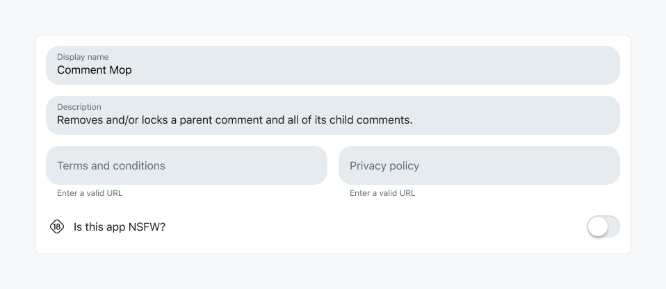

# HTTP Fetch Policy

When requesting domains to be allow-listed, they fall into three categories:

1. **APIs that provide data or specific services** (e.g., `api.openai.com`, `api.wikipedia.org`) \- These will be approved if they have a **publicly documented and publicly accessible API** for valid use cases, and if they adhere to the Devvit rules. Please reference our AI providers and account linking policies for common invalid use cases.

2. **Limited scope cloud providers** (e.g., `username.supabase.com`, `my-app.firebase.com`) \- May be granted with exceptions. You must:

   - Follow user privacy guidelines and data governance requirements
   - Use an approved provider from the list below (please include your subdomain, and request for the most granular domain possible, e.g. `my-app.s3.amazonaws.com`)
     - `supabase.com`
     - `firebase.com`
     - `spacetimedb.com`
     - `s3.amazonaws.com`
     - `storage.googleapis.com`
   - Demonstrate a capability that `@devvit/server` doesn't support
   - Valid use cases include:
     - Asset hosting (videos, images, music)
     - Relational databases
   - Note: Approval can be revoked at any time

3. **Personal domains** (e.g., `personaldomain.com`) \- Will not be approved. If you have a use case that our Devvit server does not support, please submit your request with detailed justification.

### Documentation requirements

If your app uses fetch domains, you must add context to your app's README for the approval process:

1. Create a "Fetch Domains" section in your README
2. List each domain you're requesting and explain why you need it
3. Ensure your usage complies with our fetch guidelines

Example README section:

```
## Fetch Domains

The following domains are requested for this app:

- `api.wikipedia.org` - Used to fetch article summaries for the knowledge base feature
- `username.supabase.com` - Required for relational database storage of user preferences (Devvit KV store doesn't support complex queries needed for this feature)
```

….

### Domain Requirements

Domain entries must be exact hostnames only, such as nytimes.com or wikipedia.org. These fetch requests are not allowed:

- Be specific. No using `*.example.com` when you need `api.example.com`
- No wildcards: `*.example.com`
- No protocols: `https://api.example.com`
- No paths: `api.example.com/webhooks`

Domains that are approved for your app will be displayed in the Developer Settings section for your app at `https://developers.reddit.com/apps/{your-app-slug}/developer-settings`.
These domains are allow-listed for **your app only** and not globally.

Apps must request each individual domain that it intends to fetch, even if the domain is already globally allowed. See the [global fetch allowlist](#global-fetch-allowlist) to view the list of globally allowed domains.

### Terms and conditions

Any app that uses `fetch` must upload Terms and Conditions and a Privacy Policy. Links to each of these documents must be saved in the app details form.



## Global fetch allowlist {#global-fetch-allowlist}

The following domains are globally allowed and can be fetched by any app:

- example.com
- site.api.espn.com
- cdn.espn.com
- discord.com
- api.polygon.io
- polygon.io
- slack.com
- lichess.org
- api.telegram.org
- commentanalyzer.googleapis.com
- language.googleapis.com
- statsapi.mlb.com
- api.openai.com
- api.scryfall.com
- api.nasa.gov
- api.sportradar.us
- api.sportradar.com
- random.org
- generativelanguage.googleapis.com
- youtube.googleapis.com
- api.weather.gov
- wikipedia.org
- finance.yahoo.com
- api.twitter.com
- api.petfinder.com
- fonts.googleapis.com
- nytimes.com
- npr.org
- propublica.org
- pbs.org
- i.giphy.com
- chessboardjs.com
