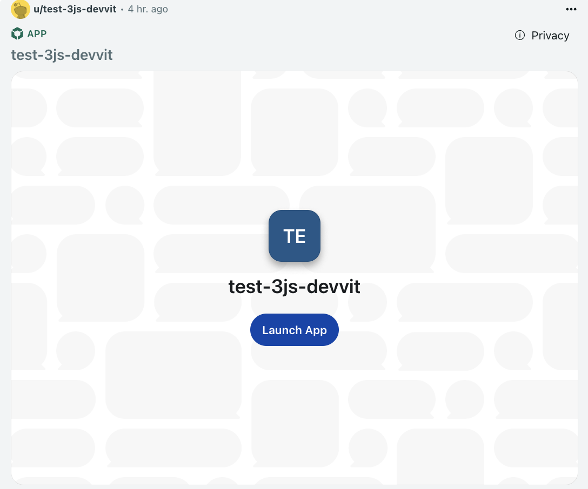

import Tabs from '@theme/Tabs';
import TabItem from '@theme/TabItem';

# Splash Screens

Splash screens provide a personalized entry point for your Reddit Dev Platform apps, displaying a customized loading view before users interact with your post. A well-designed splash screen improves first impressions and drives better user engagement.

The splash screen appears when users first view your post, featuring your app's branding, a description, and a call-to-action button that launches the main experience.



:::note
Splash screens are only available for web view apps on Devvit Web.
:::

## Creating posts with splash screens

When creating a post, include the `splash` parameter to customize the splash screen appearance.

<Tabs>
  <TabItem value="web" label="Devvit Web">
  ```ts title="server/index.ts"
  import { reddit } from '@devvit/web/server';

  const post = await reddit.submitCustomPost({
    subredditName: context.subredditName!,
    title: 'My Interactive Post',
    splash: {
      appDisplayName: 'My Amazing App', // only required field
      backgroundUri: 'background.png',
      buttonLabel: 'Start Playing',
      description: 'An exciting interactive experience',
      entryUri: 'index.html',
      heading: 'Welcome to the Game!'
    },
    postData: {
      gameState: 'initial',
      score: 0
    }
  });
  ```
  </TabItem>
</Tabs>

## Splash screen properties

The `splash` object supports the following customization options:

| Property | Type | Description | Default |
|----------|------|-------------|---------|
| `appDisplayName` | string | Your app's display name | Required |
| `backgroundUri` | string | Background image URL (relative to media directory or data URI) | None |
| `buttonLabel` | string | Text for the launch button | `'Launch App'` |
| `description` | string | Secondary text describing the post experience | None |
| `entryUri` | string | Web view URI relative to client directory | `'index.html'` |
| `heading` | string | Large text naming the post under app name | `appDisplayName` |
| `appIconUri` | string | Icon URL relative to media directory or data URI | None |

### Using images

Images can be referenced in two ways:

1. **Local assets**: Place images in your app's assets directory and reference them by filename:
    For example, if your image is in `assets/splash-background.png`, then you can just reference it with `splash-background.png`
    
    :::note
    If you put the images in a different directory, you can configure that by adding the `media` property to your `devvit.json` file. Set `media.dir` to the directory path you are using.
    :::
    For example, if you are putting the image in `assets/images`, then you can write it like this: 
   ```json title="devvit.json"
   "media": {
     "dir": "assets/images"
   }
   ```

    And you can reference them by their filename

    ```ts title="server/index.ts"
    backgroundUri: '/splash-background.png'
    appIconUri: '/app-icon.png'
    ```
    Without configuring `media.dir`, you have to reference the images relative to the `assets` directory, which would be `images/splash-background.png` in this example

   

2. **External URLs**: Use full HTTPS URLs for hosted images:
   ```ts
   backgroundUri: 'https://i.redd.it/your-image.png'
   ```

## Example: Dynamic splash screens

You can modify the splash screen to make sure the content is relevant:

```ts title="server/index.ts"
import { reddit } from '@devvit/web/server';

  const date = (new Date()).toLocaleString('en-US', {
    weekday: 'long',
    year: 'numeric',
    month: 'long',
    day: 'numeric'});

  return await reddit.submitCustomPost({

    subredditName: context.subredditName!,
    title: `App Post Title`,

    splash: {
      appDisplayName: 'test-app',
      backgroundUri: '/splash-background.png',
      buttonLabel: 'Begin Journey',
      description: `${date}'s game`,
      entryUri: 'index.html',
      heading: 'Welcome to the Game!',
      appIconUri: 'default-icon.png',
    }
  });
```

## Best practices

- **Keep it lightweight**: Use optimized images to ensure fast loading times
- **Clear call-to-action**: Make your button label descriptive and action-oriented
- **Consistent branding**: Use your app icon and consistent visual elements
- **Informative description**: Tell users what to expect when they launch your app

## Limitations

- Image files must be included in your app bundle or hosted externally
- Maximum recommended image size: 2MB for optimal performance
- The `entryUri` must point to a valid HTML file in your client directory

:::tip
A compelling splash screen is your app's first impression. Invest time in creating an engaging design that clearly communicates your app's value and encourages users to interact.
:::
