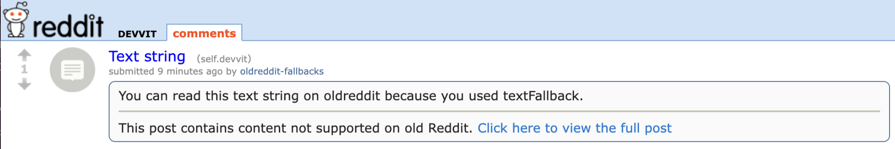
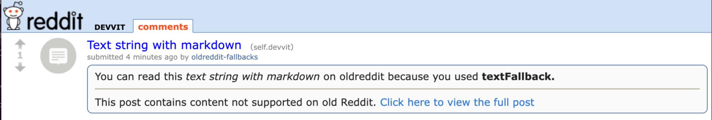
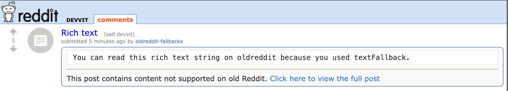

import Tabs from '@theme/Tabs';
import TabItem from '@theme/TabItem';

# Text Fallback for old.reddit

Old.reddit does not render interactive posts. To remedy this, use textFallback to ensure that you can specify the text for the instances when Devvit cannot render your post. You can do this with a text string or in rich text.

Setting a relevant text fallback is critical for SEO and growth of your app.

## [Reddit API](./reddit-api.mdx)
The text fallback is only available when using the Reddit API to create a post. It is available for both [Devvit Web](../devvit-web/devvit_web_overview.mdx) and [Devvit Blocks](../blocks/overview.md) applications. 
The code samples below assume that you already have a reference to the Reddit API client. Please see below how to obtain a refere
nce to the Reddit API client in both Devvit Web and Devvit Blocks.

<Tabs>
  <TabItem value="web" label="Devvit Web">
  ```json title="devvit.json"
  {
    "permissions": {
      "redditApi": true
    }
  }
  ```

  ```ts title="server/index.ts"
  import { reddit } from '@devvit/web/server';
  ```
  </TabItem>
  <TabItem value="blocks" label="Devvit Blocks / Mod Tools">
  ```ts
  import { Devvit } from '@devvit/public-api';

  Devvit.configure({
    redditApi: true,
  });

  //Then, in any function that has a reference to Devvit.Context:
  const reddit = context.reddit;
  ```
  </TabItem>
</Tabs>

## Use a text string

```tsx
import { reddit } from '@devvit/web/server';

const post = await reddit.submitCustomPost({
  title: 'Text String',
  subredditName: subreddit.name,
  textFallback: { text: 'You can read this text string on oldreddit because you used textFallback' },
  splash: { appDisplayName: 'Test App' },
});
```

**Result**



## Use a text string with markdown

```tsx
import { reddit } from '@devvit/web/server';

const post = await reddit.submitCustomPost({
  title: 'Text string with markdown',
  subredditName: subreddit.name,
  textFallback: {
    text: 'You can read this _text string with markdown_ on oldreddit because you used **textFallback**',
  },
  splash: { appDisplayName: 'Test App' },
});
```

**Result**



## Use rich text

```tsx
import { reddit } from '@devvit/web/server';

const textFallbackRichtext = new RichTextBuilder()
  .heading({ level: 1 }, (h) => {
    h.rawText('Yay for text fallbacks!');
  })
  .codeBlock({}, (cb) => cb.rawText('You can read this rich text on old.reddit because you used textFallback'));

const post = await reddit.submitCustomPost({
  title: 'Rich Text',
  subredditName: subreddit.name,
  textFallback: { richtext: textFallbackRichtext },
  splash: { appDisplayName: 'Test App' },
});
```

**Result**



## Update a post’s text fallback

The post author can edit and update text fallback content after it’s been created. To do this, call post.setTextFallback with the desired fallback content.

```tsx
import { reddit } from '@devvit/web/server';

// from a menu action, form, scheduler, trigger, custom post click event, etc
const newTextFallback = { text: 'This is an updated text fallback' };
const post = await reddit.getPostById(context.postId);
await post.setTextFallback(newTextFallback);
```
