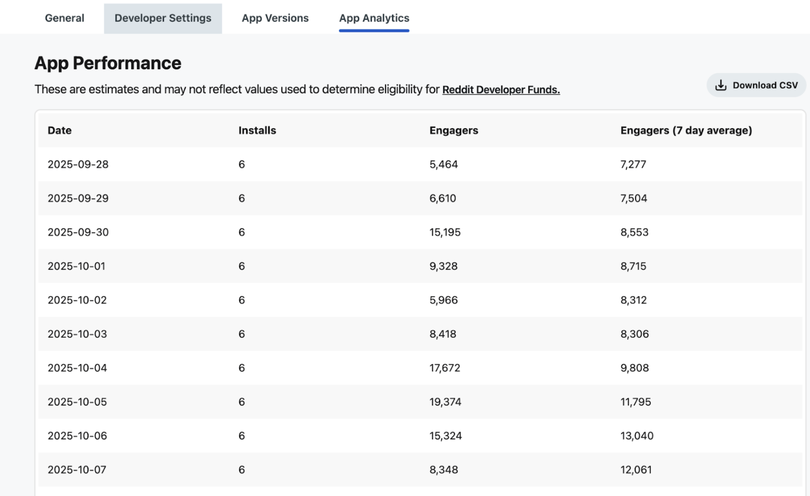

# Changelog

While we're always shipping fixes and improvements, our team bundles new features, breaking changes, and other user-facing updates into regular releases. This page logs the changes to each version of Devvit.

To use the latest version of Devvit:

1. Run `npm install devvit@latest` to update your CLI.
2. Run `npx devvit update app` to update your @devvit dependencies.

**Please note**: you may see features available across Devvit packages that are not documented or noted in our changelog. These are experimental features that are not stable and are subject to change, or removal, from the platform. Please use caution when testing or implementing experimental features.

## Devvit 0.12.6: End-of-the-Year Updates

**Release Date: Dec 15, 2025**

In the last release of 2025, we’ve made a slew of minor updates (they're still cool, though!).

- **Added explicit version flag:** You can now specify an exact version number (e.g., `--version 1.2.3`) when publishing.
- **Deprecated `webViewModeListener`:** Now you can use the `"focus"` event on the inline view to reliably detect when control returns from the expanded view.
- **Fixed inconsistent casing:** The `Subreddit` type was previously printed in all lowercase for `getCurrentSubreddit()`, but in all uppercase for `getSubredditInfoByName()` and `getSubredditInfoById()`. This inconsistency has now been resolved.
- **Clarified non-functional fields:** The Payments plugin does not currently support filtering, so specifying `start` or `end` has no effect. This will be supported in a later release.
- **Added new User fields:** The `User` object now includes `displayName` and `about` to streamline user data experience.
- **Bug fixes**
  - Corrected post height for Devvit Web apps to prevent layout jumps on the initial web view render.
  - Fixed an issue with the `reddit.reorderWidgets` method.
  - Resolved an issue where fetching image widgets without a linked URL would throw an error.

:::note
**2025 is a wrap!** All of us on the Dev Platform team wish you and yours the absolute best holiday season, and we can’t wait to create with you in 2026!
:::

## Devvit 0.12.5: Payments for Devvit Web

**Release Date: Dec 1, 2025**

In this release, we’re excited to bring payment support to Devvit Web. If you’re looking to add payments to your app, check out our [updated docs](./earn-money/payments/payments_overview.md).

Devvit Web has reached full feature parity with blocks, and we strongly recommend using Devvit Web for all new apps. If you want to convert your existing blocks apps (including mod apps) to Devvit Web, check out the [migration guide](./guides/migrate/devvit-singleton.md).

To keep things clear (and friendlier to AI-assisted IDEs), we're moving all [blocks documentation](./capabilities/blocks/overview.md) into its own dedicated section.

## Devvit 0.12.4: Ins and Outs

**Release Date: Nov 24, 2025**

Devvit 0.12.4 is packed with payments (experimental) polish, and new tooling for monitoring WebView traffic

**Devvit Web Payments (experimental) bugfixes and improvements**

- Fixed a bug with payments refunds hitting incorrect backend endpoint
- Fixed a bug where duplicate “Get Payments Help” menu items were showing
- The CLI’s `playtest` command watches your products file for live reloads, and `devvit products add` understands both legacy JSON files and the new config block so Devvit Web apps stay in sync.
- Payments types are re-exported from `@devvit/payments/shared`to `@devvit/web/shared`, preventing mismatched product/order typings downstream.

**WebView analytics and APIs**

- Improved accuracy of clicks measurement for App Directory Analytics
- Bundle size improvements
- Deprecated remaining splash screen APIs (`setSplash` and `SubmitCustomPostSplashOptions` fields)

## Devvit 0.12.3: Odds and Ends

**Release Date: Nov 17, 2025**

This release focuses on Reddit data access and instrumenting WebView clients

**Reddit data & proto updates**

- `@devvit/reddit` now exposes `getUserKarmaForSubreddit()` (later renamed to `getUserKarmaFromCurrentSubreddit()).
- `ModAction` trigger payloads now carries a stable `id` field for downstream tooling.

**Web client & realtime instrumentation**

- `@devvit/realtime` now publishes separate `client/` and `server/` entry points, preventing accidental server-only imports in browser bundles.
- Bundle size improvements
- Web clients now annotate the request `Context` with the user’s client name/version
- Improved accuracy of clicks measurement for App Directory Analytics

**Payments status**

- `@devvit/payments` now tagged as `experimental`

## Devvit 0.12.2: Inline Mode, Launch Screens,Expanded App Experiences, and Developer Logs

**Release Date: Nov 10, 2025**

Release 0.12.2 delivers a major evolution in how interactive Devvit apps load, display, and engage users. With this update, you can now leverage inline web views, in addition to expanded mode, to build your interactive posts with Devvit Web. We’re also deprecating [Splash Screens](./capabilities/server/launch_screen_and_entry_points/splash_migration) in favor of more customizable HTML inline launch screens.

**Inline Mode**

Your app's web view can now load directly inside the post unit—right in the feed or on the post details page. Users can start interacting immediately, with no extra taps or page loads.

Inline experiences blend smoothly into Reddit’s native post layout, which means that inline apps must meet performance standards and avoid conflicting with Reddit gestures for a native-quality experience. We encourage developers to read the guidance and rules around inline carefully before building with this feature.

Check out [r/HotAndCold](https://www.reddit.com/r/HotAndCold/) and [r/Honk](https://www.reddit.com/r/honk/) for examples, and learn how to add [inline mode](./capabilities/server/launch_screen_and_entry_points/view_modes_entry_points.md#view-modes) to your app.

:::note
Devvit apps using inline web views are currently seeing inflated metrics in their App Analytics Dashboard. We're working on improving these estimations.
:::

**Improved Inline Launch Screens**

Splash screens are yesterday’s news. The improved inline launch screens are now fully customizable, HTML-based entry points for your interactive posts. This update gives you control over design, animation, and loading behavior and uses the same tools and styles as the rest of your app.

The new first screen automatically loads before your app’s main entry point. Read the docs to learn how to [upgrade your app](./capabilities/server/launch_screen_and_entry_points/splash_migration) and [customize your launch screen](./capabilities/server/launch_screen_and_entry_points/launch_screen_customization).

:::note
**Deprecation notice**: We're deprecating the splash parameter in submitCustomPost() and removing it in the next major version update. Learn how to [update your app](./capabilities/server/launch_screen_and_entry_points/splash_migration).
:::

**Multiple App Entry Points**

[Entry points](./capabilities/server/launch_screen_and_entry_points/view_modes_entry_points.md#multiple-entry-points) act as a router that organizes your app across different view modes. Each entry point specifies the initial HTML file for the specific context. A user might experience your app inline, when it’s embedded in a post, or launch it in expanded mode for a larger, full-screen mobile experience.

**Expanded Mode**

Expanded Mode lets users open your app or game in a full-screen experience, which is perfect for mobile devices. This feature works hand-in-hand with multiple entry points, letting users start small (interacting inline in the feed) and then expanding into a full experience.

Learn how to add [Expanded Mode](./capabilities/server/launch_screen_and_entry_points/view_modes_entry_points.md#view-modes) functionality to your app.

**Developer Logs**

We’ve also shipped our first installation-level developer permissions. Developer logs read permission lets mods share read-only logs and install history of an installation with you. This is useful for debugging issues with a particular installation without having to be added as a mod to the subreddit.

We’re really excited about these updates and can’t wait to hear what you think!

## Devvit 0.12.1: Cache Helper, Analytics dashboard for developers, and smaller fixes

**Release Date: October 10, 2025**

In this release, we’ve added back the cache helper for Devvit Web and also included an App Analytics tab for you to track your app’s engagement metrics.

**Cache Helper**
The cache helper helps your app reduce the number of server side calls by caching the response for all users. This is great for any data that you plan to share across users, like a global leaderboard or consistent data from an external source like the score of a sports game. We now have this feature available in Devvit Web, and you can look up how to use it in the [cache helper docs](./capabilities/server/cache-helper.mdx).

**App Analytics**
There’s a new App Analytics tab in your app settings that lets you track your progress against Reddit Developer Funds.

**Other fixes**
This release also includes a handful of other fixes including:

- Added a method mergePostData() to append to postData.
- Fixed reddit.setPostFlair() method.
- Added a new triggers field that fixed the issue where triggers within the blocks entrypoint weren’t working. The migration guide has been updated.
- Added error handling when trying to `devvit new`on an already existing app name.
- Added disconnectRealtime() and isRealtimeConnected() as helper methods for the realtime plugin.

## Devvit 0.12.0: Devvit Web

**Release Date: August 13, 2025**

We're excited to introduce [Devvit Web](./capabilities/devvit-web/devvit_web_overview.mdx), a new way to build [games](./quickstart/quickstart.md) and [apps](./quickstart/quickstart-mod-tool.md) on Reddit using standard web technologies you already know and love. This release brings the power of modern web development to the Reddit platform, letting you build with React, Three.js, Phaser, and other industry-standard frameworks while maintaining access to all the Devvit capabilities you rely on. Moving forward, this will be the preferred way of building interactive post apps.

**What's New**

Devvit Web transforms how you build Reddit apps:

- **Standard web development**: Build apps just like you would for the web, using familiar frameworks and tools
- **Server endpoints**: Define /api/ endpoints using Node.js frameworks like Express.js or Koa
- **New configuration system**: devvit.json provides a clean, declarative way to configure your app
- **Unified SDK**: @devvit/web package with clear client/server separation
  Better AI compatibility: Standard web technologies work seamlessly with AI coding tools

There's also a new [web-based creation flow](https://developers.reddit.com/new/) that makes creating new apps faster:

- A step-by-step UI guides you through the initial steps to create an app
- Automatically builds a playtest subreddit for testing
- Gives you the code you need to access your new app via the terminal

**Key Features**

- **Client/server architecture**: Clear separation between frontend (@devvit/web/client) and backend (@devvit/web/server)
- **Full platform access**: Continued access to Redis, Reddit API, and Devvit's hosting services
- **Flexible development**: Use Devvit Web alongside existing Blocks - choose the right tool for each feature

**Current Limitations**

- Serverless endpoints only (no long-running connections or streaming)
- Package restrictions (no fs or external native packages)
- Single request/response model (no websockets)
- Client-side fetch is limited to app domain (enforced via CSP)

**Getting Started**

- **New apps**: Go to developers.reddit.com/new to start building new apps
- **Existing apps**: Migration is optional - your current apps continue to work on 0.11, but we recommend using these migration guides to move your app over to Devvit Web.
  - [Devvit Web Experimental to Devvit Web](./guides/migrate/devvit-web-experimental.md)
  - [useWebView to Devvit Web](./guides/migrate/inline-web-view.md)
  - [Blocks app to Devvit Web](./guides/migrate/devvit-singleton.md)

**Support & Feedback**

We'd love to hear about your experience with Devvit Web! Join the conversation in #devvit-web on Discord to share feedback, report issues, and connect with other developers building with Devvit Web.

**Even More Features**

In addition to Devvit Web, release 0.12 also adds:

- **Post data** - [Post data](./capabilities/server/post-data.mdx) allows you to add data to your post when you submit it so that you can retrieve and use in your app without an additional Redis call.
- **Splash screen** - Having a compelling first screen of your app is one of the most important indicators of good post engagement. Every submitPost will come with a default per-post [splash screen](./capabilities/server/splash-screen.mdx) you can customize.
