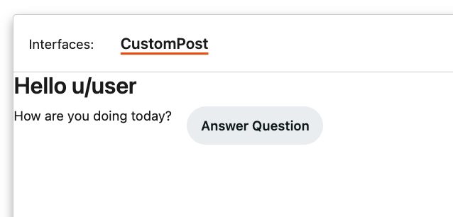
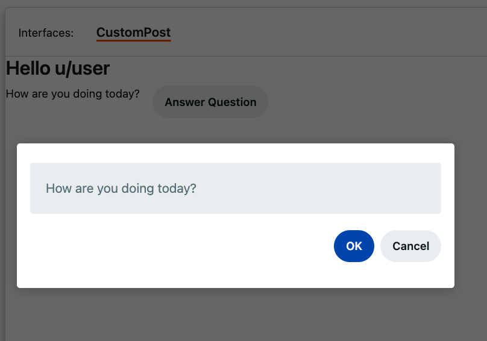

# Create a custom post with a form

## Prerequisites

Read through our [custom post tutorial](./basic_custom_post.md) to learn what a custom post is and how to create one. We'll use that custom post to make a simple form asking your users how they’re doing.

| Custom post                | Form                                   |
| -------------------------- | -------------------------------------- |
|  |  |

### Start a project

To create a form, use the `custom-post` template to start a new custom post project.

1. From the terminal, navigate to a directory where you'll store your project.
2. Enter the following command to create a project folder on your local machine.

```bash
devvit new <replace-with-your-app-name> --template=custom-post
```

### Install dependencies

3. To have your package manager install the dependencies, run the following command in the root of your project:

```bash
npm i
```

-OR-

```bash
yarn install
```

### Add imports

4. Add the following code to the top of your file (you can replace the existing import statement).

```ts
import { Devvit } from '@devvit/public-api';
```

5. Configure your app to use the Reddit API. Paste the following code under the import statement:

```ts
Devvit.configure({
  redditAPI: true,
});
```

## Create a form

Copy and paste the following code snippets into your `main.tsx` file below the import statements
(replace the code from the template with this).

6. Create a custom post component.

```jsx
Devvit.addCustomPostType({
  name: 'My Custom Post Type',
  render: () => {
    return (
      <vstack>
        <text style="heading" size="xxlarge">
          Hello!
        </text>
      </vstack>
    );
  },
});
```

7. Use the Reddit API to say hello to the user.

```jsx
import { Devvit, useState } from '@devvit/public-api';

Devvit.addCustomPostType({
  name: 'My Custom Post Type',
  render: (context) => {
    const [currentUsername] = useState(async () => {
      const currentUser = await context.reddit.getCurrentUser();
      return currentUser.username;
    });

    return (
      <vstack>
        <text style="heading" size="xxlarge">
          Hello! {currentUsername}
        </text>
      </vstack>
    );
  },
});
```

8.  Create a form to collect user input.

```tsx
import { Devvit, useState, useForm } from '@devvit/public-api';

Devvit.addCustomPostType({
  name: 'My Custom Post Type',
  render: (context) => {
    const [currentUsername] = useState(async () => {
      const currentUser = await context.reddit.getCurrentUser();
      return currentUser.username;
    });

    const [answer, setAnswer] = useState('');

    const howAreYouForm = useForm(
      {
        fields: [
          {
            name: 'answer',
            label: 'How are you doing today?',
            type: 'string',
            required: true,
          },
        ],
      },
      async (data) => {
        context.ui.showToast({
          text: 'Thanks for answering!',
          appearance: 'success',
        });
        setAnswer(data.answer);
      }
    );

    return (
      <vstack>
        <text style="heading" size="xxlarge">
          Hello {currentUsername}
        </text>
        <spacer />
        <hstack gap="medium">
          <text>How are you doing today?</text>
          {answer ? (
            <text>{answer}</text>
          ) : (
            <button
              onPress={() => {
                context.ui.showForm(howAreYouForm);
              }}
            >
              Answer Question
            </button>
          )}
        </hstack>
      </vstack>
    );
  },
});
```

9. Add a subreddit menu item to submit your custom post.

```jsx
Devvit.addMenuItem({
  location: 'subreddit',
  label: 'Submit custom post',
  onPress: async (_, context) => {
    const currentSubreddit = await context.reddit.getCurrentSubreddit();
    await context.reddit.submitPost({
      title: 'My custom post',
      subredditName: currentSubreddit.name,
      preview: (
        <vstack>
          <text>Loading...</text>
        </vstack>
      ),
    });
    context.ui.showToast(`Submitted custom post to ${currentSubreddit.name}`);
  },
});
```

10. Paste this as the last line of your file:
    All of the code above this line modified the core Devvit object. This line makes the updated Devvit object (which now implements the custom post) available to the Reddit Developer Platform.

```ts
export default Devvit;
```

## Testing

You can use [playtest](./playtest.md) to test your custom post or install it on a test subreddit.

To install to a test subreddit:

- Add a custom subreddit menu action that creates a sample post to your code.
- Install your app on a test subreddit.
- Click on the subreddit menu and create a post.

### Next steps

Congratulations on building your interactive form! Next up: add [logging](./debug.md) to your app to help you debug.
