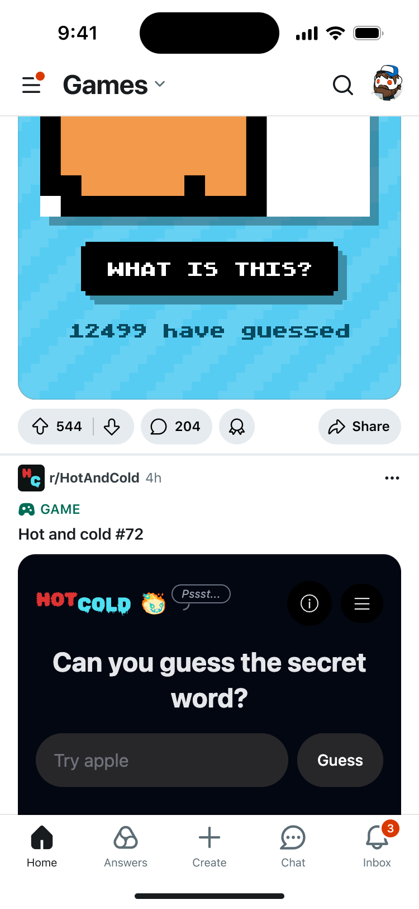
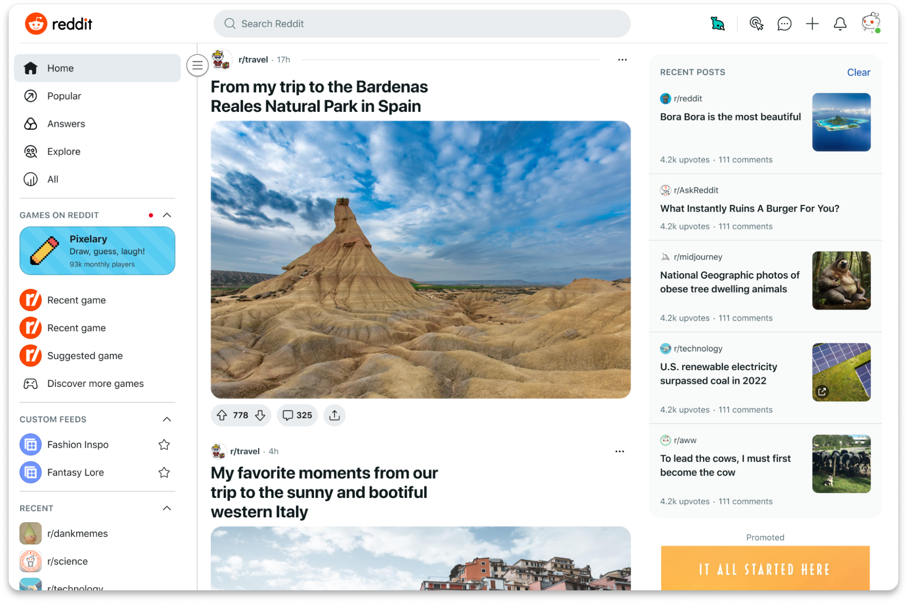
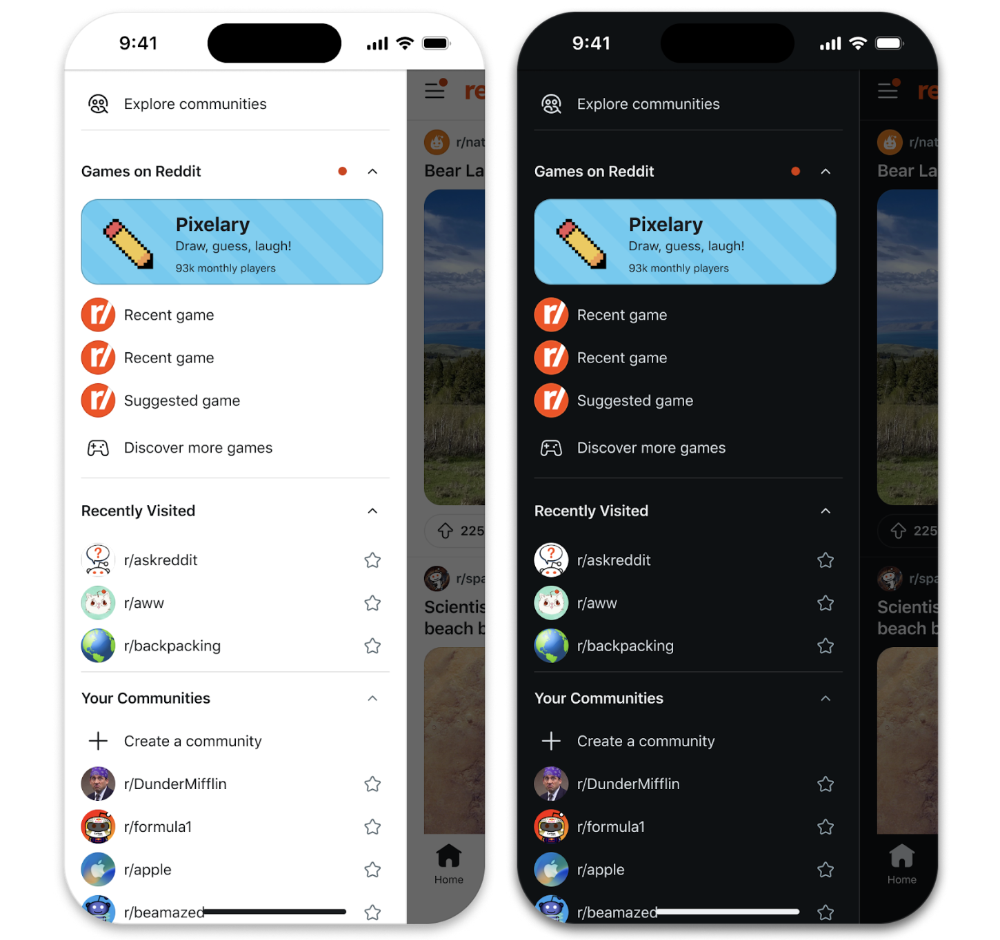

# Get Featured

Reddit celebrates creative games and experiences built by developers from our global community. Our Featuring Program does this by connecting exciting new apps with millions of active redditors.

Once your game has been launched, you may be the perfect candidate for our Featuring Program. As part of this program, Reddit works with developers to accelerate their game distribution and viewership.

Games that see great engagement as they grow will be featured across more prominent surfaces, which can expedite their qualification for [Reddit Developer Funds](https://developers.reddit.com/docs/earn-money/reddit_developer_funds), where developers can make up to $167,000 per app.

Learn how your game can be featured across Reddit and reach thousands of players.

---

## What is featuring?

Whether you’re prototyping an early version of your first Reddit game or launching a polished experience to a wide audience, you have an opportunity to be featured. Our mission is to help developers grow by connecting their work with the Reddit users that will love it. Featuring selections are curated by our team and refreshed regularly to spotlight innovation, polished play, and player engagement.

Note that our top featuring slots are reserved for games that are of professional quality, as well as games that see exceptional engagement as they grow (CTR, dwell times, positive user engagement, retention).

Once your game is part of the program, it will be rotated in and out of featuring slots to support curitorial diversity.

---

## How to get featured

Once your game has been published and approved, it may be considered for the Featuring Program. You can also apply directly for consideration using the [Featuring Request Form](https://forms.gle/BeKcqQy8yZEqEmtR6).

Please ensure you read this guide — especially the [requirements](#featuring-requirements) and [considerations](#featuring-considerations) — in its entirety before submitting your game.

Games that see organic growth are also likely to be scouted by our team for featuring.

---

## Ways we highlight developers

Reddit features games and developers across multiple discovery surfaces to help players find new favorites:

- **Games Feed.** The Games Feed showcases playable experiences directly within Reddit. When featured, games are rotated into a list of games that is algorythmically served to users visiting the feed.

- **Community Drawer.** Our lefthand drawer provides an easy access point for any redditor to see a mix of recently played games and curated popular games.

- **Home Feed boosting.** One selected game per week is given an extra algorithmic boost in user home feeds, reaching broad audiences.
- **r/GamesOnReddit.** The curated [r/GamesOnReddit](https://www.reddit.com/r/GamesOnReddit/) banner highlights new and trending games for Reddit players.
- **Developer stories.** The [r/devvit](https://www.reddit.com/r/devvit/) community and [Devvit blog](https://kiro.dev/) regularly highlight developer journeys, tips, and behind-the-scenes insights. Some developers will also be tapped for key Reddit marketing and PR materials.

---

## Featuring tiers

| Tier            | Description                                                    | Featuring Spots                                                                                   | Who It’s For                                    | Level of Polish                                    | Approximate Impressions\*                   |
| --------------- | -------------------------------------------------------------- | ------------------------------------------------------------------------------------------------- | ----------------------------------------------- | -------------------------------------------------- | ------------------------------------------- |
| **Distributed** | Games get initial exposure on r/GamesOnReddit featuring        | Cross-posted by Reddit, pinned banner on r/GamesOnReddit                                          | Developers seeking first players                | Early builds of launched apps                      | Thousands                                   |
| **Promoted**    | Polished games selected to gain more visibility and engagement | Games Feed listing, more visibility in r/GamesOnReddit launch pad                                 | Developers ready to expand their reach          | Polished, working seamlessly across all platforms  | Tens of thousands of impressions            |
| **Highlighted** | High-performing games that drive significant player engagement | Games Feed top positions, added to Community Drawer “recently played” or one of the popular slots | Developers with highly polished, iterated games | Highly polished, optimized for scale and retention | Hundreds of thousands of impressions        |
| **Hero**        | Top-tier, standout games featured broadly across Reddit        | Games Feed highlight, featured in Community Drawer, Home Feed highlight                           | Developers with flagship-quality games          | Pro quality, high retention and engagement         | Millions to tens of millions of impressions |

\*This is a rough estimate and does not reflect what any particular game will reach at this tier.

Games can be promoted to our highest featuring tiers if they see exceptional engagement and retention at lower featuring levels. Our team looks at CTRs, day 1 and day 3 retention, dwell time, as well as qualitative user feedback. We hope to add more of these metrics to the developer analytics panel in the coming months.

---

## Featuring requirements

In order to promote a game, we need to ensure the experience for redditors meets certain quality criteria. To be featured at any level you must have:

- **A compelling first screen.** Your game must have a custom [splash screen](https://developers.reddit.com/docs/capabilities/server/splash-screen).
- **Cross platform support.** Your game's viewport must be accessible and clean on both mobile and desktop platforms.
- **Self-explanatory design.** Anyone should be able to click into your post and have the context needed to learn, play, or participate.
- **Responsive design.** All screens should be visible within fullscreen, mobile, and desktop. Avoid unnecessary scrolls. Scrolling within inline webviews is prohibited.

---

## Featuring considerations

Our goal is to feature games that feel great to play and reflect Reddit’s creative spirit. With each featuring tier, the quality of featured apps becomes more stringent. Beyond the basic featuring requirements, we want to see:

- **Standout user experience.** Fast, intuitive, and responsive gameplay across devices.
- **Design and polish.** Cohesive visuals, appealing splash screens, and optimized mobile layouts.
- **Community engagement.** Features that encourage posts, comments, and user-generated content.
- **Innovation.** Fresh mechanics or concepts that make Reddit play unique.
- **Performance and retention.** Stable technical performance and meaningful player return rates.
- **Iteration.** Regular updates and responsiveness to player feedback.

---

## Celebrating your app

Games that reach featured tiers often see thousands of daily players and dedicated community followings. When your game is featured, you’ll receive promotional visibility through banners, feeds, and subreddit posts, as well as the opportunity to share your success across social channels and developer communities.

See stories about successful games like [Honk](https://developers.reddit.com/docs/blog/honk) and [Syllocrostic](https://www.reddit.com/r/Devvit/comments/1n0vn97/reddit_has_acquired_syllacrostic/), which Reddit acquired after successful featuring.
