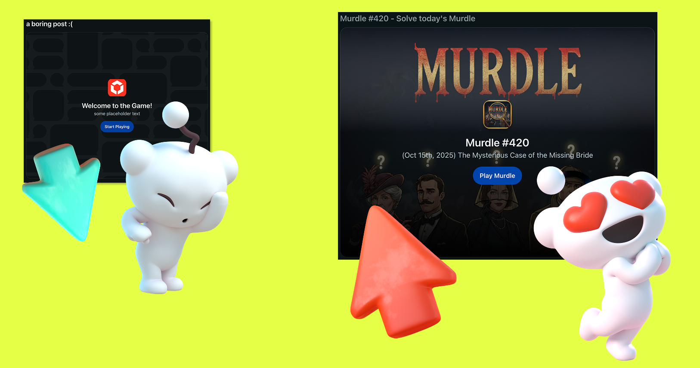

# Reddit x Kiro: Community Games Challenge 2025

Reddit and Kiro are hosting a virtual hackathon from October 13th to October 29th, 2025. We’re offering $45,000 in prizes for the best apps built for redditors.

[Register for the Hackathon here!](https://communitygames2025.devpost.com/)

## How to participate

Check out the hackathon website to read the rules and sign up for the competition.

[Hackathon Website](https://communitygames2025.devpost.com/)

In this Hackathon we have two main categories:

- **Community Play**: Apps that make great use of massively multiplayer game mechanics to bring redditors together. We’re looking for both synchronous and asynchronous experiences built with the intention of bringing a multitude of players together.

- **Best Kiro Developer Experience**: How creatively did they integrate Kiro capabilities into their development workflow to make their life easier?

## Devvit x Kiro examples

Need some inspiration? Check out these clips from our recent livestream showcasing how to build community games with Devvit and develop games using Kiro. You can also find more examples in our [App Showcase](./examples/app-showcase.mdx).

<iframe width="400" height="225" src="https://www.youtube.com/embed/Q6SGJLJJ9Sg" title="Community Games" frameborder="0" allow="accelerometer; autoplay; clipboard-write; encrypted-media; gyroscope; picture-in-picture; web-share" allowfullscreen></iframe>
<iframe width="400" height="225" src="https://www.youtube.com/embed/4mV5pbwsOsg" title="Build Games With Kiro" frameborder="0" allow="accelerometer; autoplay; clipboard-write; encrypted-media; gyroscope; picture-in-picture; web-share" allowfullscreen></iframe>

## Get started with Kiro

1. [Download Kiro](https://kiro.dev/downloads/?trk=097e3904-44bf-4aaf-8973-98d13e4e3a18&sc_channel=el) - Hackathon participants will receive an access code via DevPost within 12 hours of registration

2. [Create a new Devvit App](https://developers.reddit.com/new/template)

3. Choose your favourite template (Phaser, React, ThreeJS, basic) - every template contains a Kiro folder

4. Once your project is cloned and set up, open your project with Kiro

5. Make sure to enable the Devvit MCP so that Kiro automatically searches Devvit documentation throughout development

## Customize your Splash Screen

The splash screen is the first thing your players will see when your game shows up in their feeds. Make it engaging, vibrant and inviting.

Our templated Kiro configuration will always try to update your splash screen to best reflect your game. However, we recommend creating a custom, high quality assets that will invite your players to click into your experience.

To customize your splash screen you need to replace two images in your assets folder:

- assets/default-splash.png
- assets/default-icon.png

Make sure that the post titles are also inviting and unique to each post.

#### Splash Screens Best Practices:

❌ **Don't**:

- Don't keep the default splash screen assets included with your template

✅ **Do**:

- Do create an engaging asset for the background (replace `assets/default-splash.png`)
- Do create an engaging game logo (replace `assets/default-icon.png`)
- Do personalize the header, description based on the context for that post
- Do personalize the post title based on the context for that post

👩‍🏫 **Tips and tricks**:

- If you have levels with varying difficulties, consider including the level's difficulty on the splash screen (easy, medium, hard)
- If you have a daily puzzle, consider including the date of that puzzle on the splash screen
- If you have a level builder, can consider using base64 strings to dynamically set different backgrounds for each post

For more info, read the [documentation on splash screens](./capabilities/server/splash-screen.mdx)

## Getting in touch

Feeling stuck? Need some inspiration? You can get technical help and interact with other hackathon participants on the [Devvit Discord](https://discord.com/invite/Cd43ExtEFS) as well as the [Kiro Discord](https://discord.com/invite/kirodotdev)
