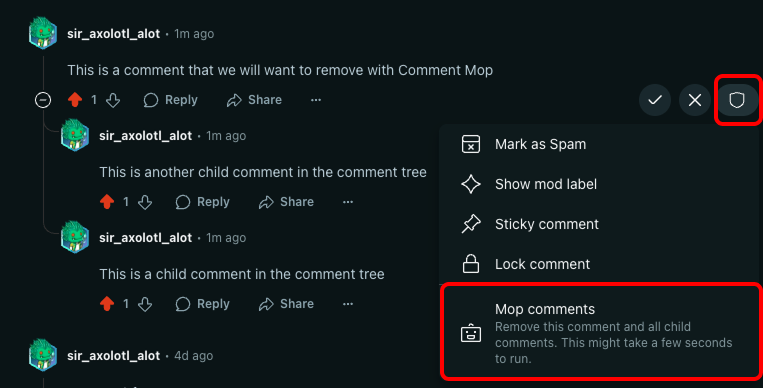
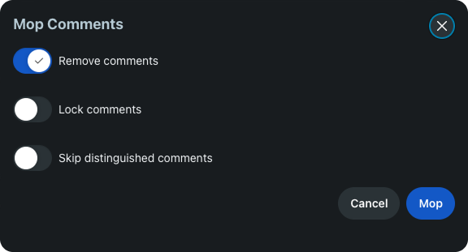

# Mod Tool Quickstart

Devvit allows you to build Mod Tools \- subreddit-installed applications that help moderators of that community to take action on conversations, keeping their communities safe and engaged.

This tutorial should take about 10 minutes to complete. Once complete, you'll be able to run a version of [Comment Mop](https://developers.reddit.com/apps/comment-nuke) in your test subreddit from your own codebase.

## What you'll need

- Node.JS (version 22.2.0+)
- A code editor

## Environment setup

1. Install Node.JS and NPM ([instructions](https://docs.npmjs.com/downloading-and-installing-node-js-and-npm))
2. Go to `https://developers.reddit.com/new` and choose Mod Tool under Other templates.
3. Go through the wizard. You will need to create a Reddit account and connect it to Reddit developers.
4. Follow the instructions on your terminal.

On success, you should see something like this:

```sh
Your Devvit authentication token has been saved to /Users/user.name/.devvit/token
Fetching and extracting the template...
Cutting the template to the target directory...
 🔧 Installing dependencies...
 🚀🚀🚀 Devvit app successfully initialized!
┌────────────────────────────────────────────────────┐
│ • `cd my-app` to open your project directory       │
│ • `npm run dev` to develop in your test community  │
└────────────────────────────────────────────────────┘
```

## Understanding the template

This tutorial lets you build your own version of [Comment Mop](https://developers.reddit.com/apps/comment-nuke). This tool allows moderators to remove and/or lock a full comment tree with a single menu action, avoiding repetitive mechanical tasks for community moderators.

### Create a menu action for moderators

The template leverages [Menu Actions](../capabilities/client/menu-actions) to enable moderators to Delete/Lock child comments of a post or comment. Menu Actions appear in the moderator menu:  


The following code adds a menu action to comments. Once the app is installed on a subreddit, all moderators of the subreddit will see this option appear in the moderator menu for all comments.

```ts
Devvit.addMenuItem({
  label: 'Mop comments',
  description: 'Remove this comment and all child comments. This might take a few seconds to run.',
  location: 'comment',
  forUserType: 'moderator',
  onPress: (_event, context) => {
    context.ui.showForm(nukeForm);
  },
});
```

You'll notice that the `onPress` handler of this Menu Item action invokes a form with `context.ui.showForm()`. This will be explained in the next step.

### Devvit forms

Optionally, some moderator tools might need to request some additional information from the moderator before they can execute. In these cases we can leverage [Devvit Forms](../capabilities/client/forms). Comment Mop will display a form with some options regarding the action to be taken:



The code that defines this form is:

```ts
// Define form fields
const nukeFields: FormField[] = [
  {
    name: 'remove',
    label: 'Remove comments',
    type: 'boolean',
    defaultValue: true,
  },
  {
    name: 'lock',
    label: 'Lock comments',
    type: 'boolean',
    defaultValue: false,
  },
  {
    name: 'skipDistinguished',
    label: 'Skip distinguished comments',
    type: 'boolean',
    defaultValue: false,
  },
] as const;

// Create form
const nukeForm = Devvit.createForm(
  () => {
    return {
      fields: nukeFields,
      title: 'Mop Comments',
      acceptLabel: 'Mop',
      cancelLabel: 'Cancel',
    };
  },
  // Form confirmation handler
  async ({ values }, context) => {
    if (!values.lock && !values.remove) {
      context.ui.showToast('You must select either lock or remove.');
      return;
    }

    if (context.commentId) {
      // ...
      // mop comments here
      // ...
    }
  }
);
```

The code that handles mopping the comment has been redacted from the sample above. It uses the Reddit API to traverse through the comments and perform the necessary actions. It will be explained in the next step.

### Reddit API

Apps made with Devvit can leverage the Reddit API to perform actions on comments, posts, get information about the current session, etc. The following code uses the Reddit API to find the child comments of the selected comment and delete all of them:

```ts
Devvit.configure({
  redditAPI: true,
});

export async function handleNuke(props: NukeProps, context: Devvit.Context) {
  try {
    // Get Comment and User from Reddit API
    const comment = await context.reddit.getCommentById(props.commentId);
    const user = await context.reddit.getCurrentUser();

    // Get Comments for Removal
    const comments: Comment[] = [];
    for await (const eachComment of getAllCommentsInThread(comment, skipDistinguished)) {
      comments.push(eachComment);
    }

    // Remove all comments
    await Promise.all(comments.map((comment) => comment.removed || comment.remove()));

    // Add to Mod Log
    try {
      await context.modLog.add({
        action: 'removecomment',
        target: props.commentId,
        details: 'comment-mop app',
        description: `u/${user.username} used comment-mop to ${verbage} this comment and all child comments.`,
      });
    } catch (e: unknown) {
      console.error(`Failed to add modlog for comment: ${props.commentId}.`, (e as Error).message);
    }

    // Show Toast with Result
    context.ui.showToast('Comments removed! Refresh the page to see the cleanup.');
  } catch (err: unknown) {
    context.ui.showToast('Mop failed! Please try again later.');
    console.error(err);
  }
}

// Helper Function - Depth-first traversal to get all comments in a thread
async function* getAllCommentsInThread(comment: Comment): AsyncGenerator<Comment> {
  const replies = await comment.replies.all();
  for (const reply of replies) {
    yield* getAllCommentsInThread(reply);
  }
}
```

## Building and Testing

To build and run your Mod tool, run the following commands on terminal:

```shell
npm run dev
```

If you didn't provide a test subreddit, one will be created for you. Once you run `npm run dev`, you will receive a link to test the mod tool in your test subreddit.

> Note that this mod tool is intended to be run on comments, so you will need to create a post and comment in your subreddit to see it.

## Result

Now you have a mod tool running from the code that you deployed yourself. Feel free to experiment with the code and run `npm run dev` again to see the changes. Notice that you don't need to worry about running costs for your mod tool, because Reddit hosts all Devvit applications for free. Also, if your mod tool becomes popular and gets installed by many subreddits, you may become eligible to earn [Reddit Developer Funds](../earn-money/reddit_developer_funds).

## Further reading

- Use our [launch guide](../guides/launch/launch-guide.md) to guide you where to get your first users.
- [Devvit Forms](../capabilities/client/forms)
- [Menu Actions](../capabilities/client/menu-actions)
- [Reddit Developer Funds](../earn-money/reddit_developer_funds)
