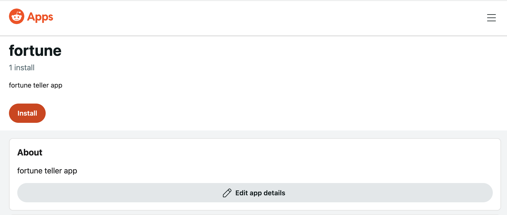
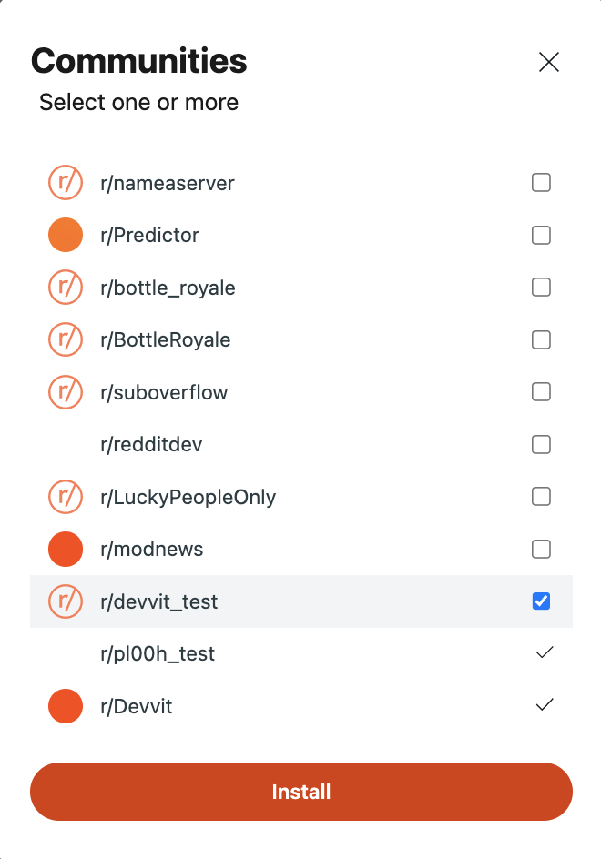

# Release

Now you're ready to make your app available to other redditors.

## Upload your app

Uploading your app creates a private version of the app that you can see on developers.reddit.com. You can install this private version into subreddits you moderate to test and debug your app before you publish it.

To upload your app, enter `devvit upload` in your project directory. Your app's version number will be automatically incremented by 1 at this time, e.g. if this is your second upload, then your app would be version 2.0.0.0.

```
$ devvit upload
```

:::note

You can use devvit upload to test new versions of your app before making it available to other moderators.

:::

## Publish your app

Publishing your app will make it discoverable to other users with permissions to install apps on developers.reddit.com. It is not yet possible for you to publish your own app. To publish your app, please [contact us](https://reddit.com/message/compose/?to=/r/Devvit).

:::note

Publishing a new version does not automatically upgrade existing installations of your app.

:::

## Add your app to a subreddit

To add an app to your subreddit, find it on developers.reddit.com/apps. Go to the app details screen, and click "Install".



This will give you a list of subreddits that will allow you to add the app. Generally, you can only add an app to subreddits that you moderate.

Select a subreddit to install the app.



## Load or refresh your subreddit

Navigate to the subreddit. If the page is already open, **refresh the page**. It may take a few seconds for apps to load.
