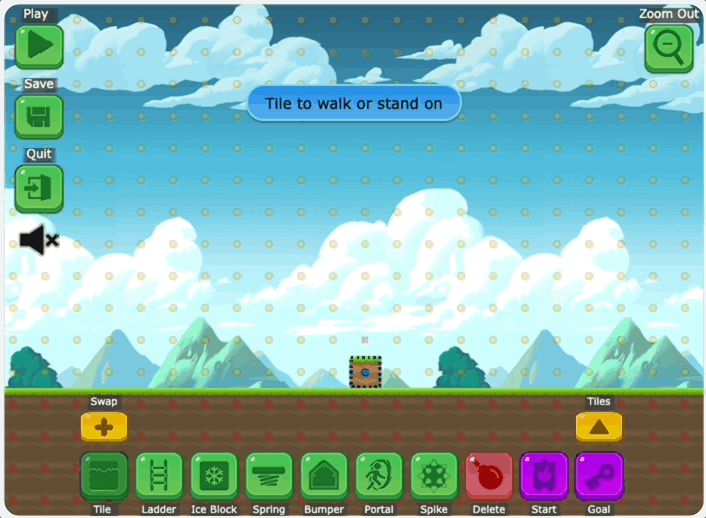
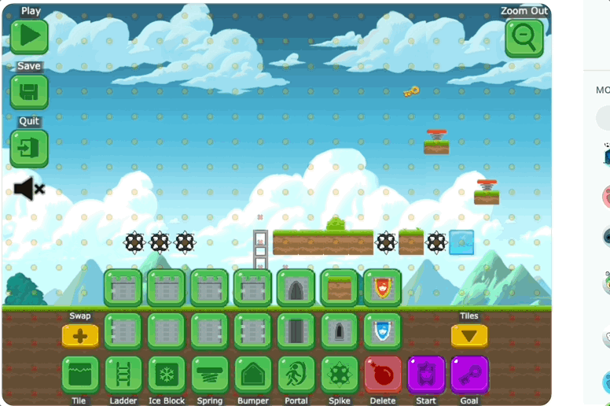
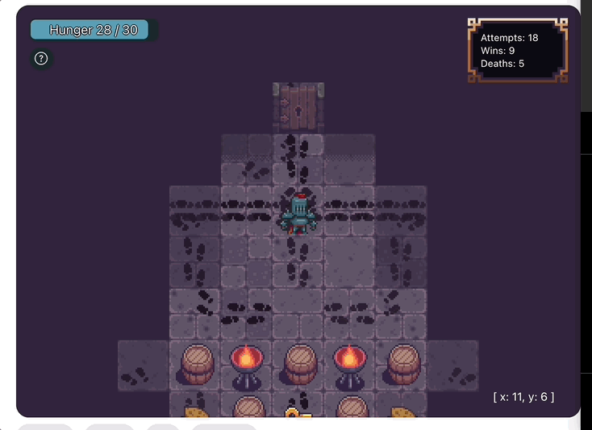
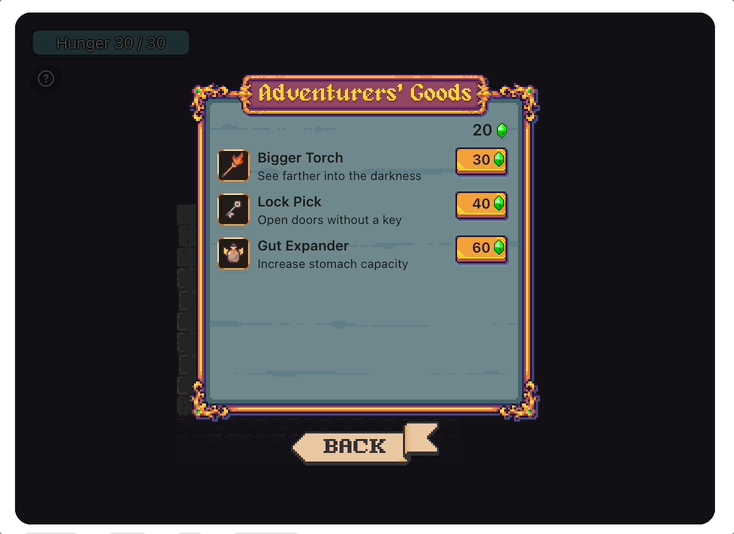
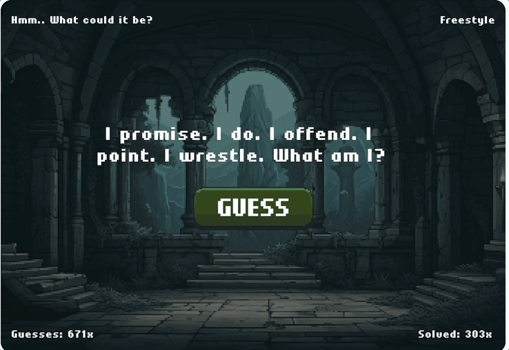
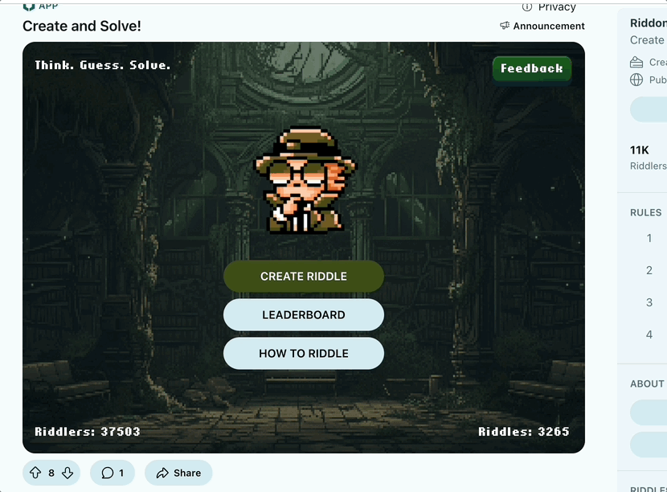

# Monetization

See how other developers add products and payments to [monetize](../payments/payments_overview.md) their apps.

## Buildit

[Buildit](https://www.reddit.com/r/buildit/) is a 2D platformer game developed by [5th Cell](https://www.5thcell.com/) exclusively for Reddit.

Redditors compete in challenges to earn a top spot on the leaderboard, unlock custom flair, and shitpost in the comments along the way. They can also build their own challenges to share with the community.

### How to play

Use your keyboard or the virtual buttons to move your Snoo. Try to reach the key as fast as possible, but watch out for traps!

You can also build a new level. Add tiles and objects to a custom map and throw down your challenge by posting it to the community.

### Adding payments

In-game purchasing is integrated into the “build” aspect of the game. There are a variety of free tiles available for redditors to use in the building process, or they can purchase special tile sets to customize their challenge. 5th Cell used the [monetization](../payments/payments_overview.md) feature to add premium items to their game.

### From the developer

_Although the primary focus of buildit was on competition, we also wanted to allow players to customize the tile sets behind the levels. This was a perfect fit for monetization using Reddit gold. Including the SDK was quick and easy, and offers a small but important customization element to the final game._

_It’s proven that adding optional purchases for core users can increase engagement and boost retention. We’re excited to see how players customize their levels in the future!_

## Dark Dungeon

[Dark Dungeon](https://www.reddit.com/r/DarkDungeonGame/) is an experimental game developed by [Cabbage Systems](https://www.cabbagesystems.com/) exclusively for Reddit. Each [interactive post](interactive_posts.md) contains a trap-filled dungeon, and you need to find the exit if you want to survive.

### How to play

Click or tap to move your knight, and use the footsteps of past redditors to try to figure out an exit route. Along the way you’ll find much-needed food—and also the skulls of players who died in a trap and tombstones marking players who died of hunger.

### Adding payments

Players are rewarded with gems (in-game currency) for every dungeon they successfully escape. These gems can be used to purchase powerful boosts—like lock picks that open any door, gut expanders to extend the hunger limit, and brighter torches to illuminate their path. Using the [payments](../payments/payments_overview.md) feature, Cabbage Systems added the ability for players to also purchase in-game gems using Reddit Gold.

### From the developer

_Cabbage Systems is proud to be the first team to integrate the payments API into a game for Reddit. Implementation was very straightforward, and went off without a hitch._

_Our game wasn't designed from the beginning to include in-game purchases, so we were careful not to disrupt the game's original intention when adding the shop. By allowing Redditors to earn gems through gameplay or purchase them with Reddit Gold, we tried to leave room for Redditors who wanted to use Gold and those who didn't._

_Dark Dungeon is a single-player game with community features, so we wanted to stock the game's shop with items that might help players when they're stuck, or encourage players to find secrets to share with the community. We believe it's important in games that include any kind of multiplayer interaction to avoid perceptions of "pay to win," so we did our best to keep the game fair for everyone._

## Riddonkulous

[Riddonkulous](https://www.reddit.com/r/riddonkulous/) is a game developed by [Hammertime Studio](https://hammertime.studio/en) (a Devvit Community Developer) using Reddit’s Developer Platform. Each [interactive post](../interactive_posts.md) lets you create and solve riddles while earning XP and leveling up!

### How to play

Players craft riddles in three ways:

- Classic: Use pre-set riddle templates (remplates) and a word catalog to create riddles.
- Freestyle: Make riddles with any word and text of your choice.
- AI Riddle: Let AI help generate riddles based on a given word.

Redditors rack up XP by creating and solving riddles:

- +10 points for creating a riddle
- +5 points for correctly solving a riddle
- +3 points for the riddle creator if someone solves their riddle
- +5 bonus points for cracking a tricky riddle

XP stay within each subreddit, and your level determines what features you unlock!

### Adding payments

Using the [monetization](../payments/payments_overview.md) feature, Hammertime Studio added the ability for players to purchase AI credits using Reddit gold. Each AI credit enables players to generate one riddle using AI or unlock an AI generated hint for everyone as a comment. The option to unlock AI Riddle mode and buy AI credits becomes available once players reach level 5.

### From the developer

_Riddonkulous is bringing in In-App Purchases (IAP) as a way to earn extra in-game credits, without turning the game into a pay-to-play grind. Credits can be earned naturally through gameplay - solving and creating riddles - so progression feels rewarding, whether you spend real world money or not._

_From a technical perspective, tying IAP products to an in-game currency keeps things flexible. It reflects a single source of truth for exclusive and non-exclusive features. The Purchase API, through its integrated payment providers, is made easy for new or experienced Devvit developers._

_Good in-game purchasing isn’t just about monetization, from my personal standpoint, it’s about making the game more fun. Instead of just unlocking perks for themselves, players can use credits to the benefit of the whole community, for example unlocking a hint for everyone in the comments. A shared experience is way more engaging than just buying an edge for yourself, and is intended to boost the community-driven spirit of Riddonkulous._

_For the planned Riddle Raid Boss event features, players will be able to re-buy health while working together to take down a massive Riddle Raid Boss. The goal isn’t PVP dominance - it’s about collaborative riddle-solving. By giving players ways to stay in the game when things get tough, IAP helps keep the challenge fun rather than frustrating, encouraging players to stick around longer and stay invested in the experience. You might find yourself also giving health to your Raid friends through IAP as well._

## Next steps

Learn how to [monetize](../payments/payments_overview.md) your app!
