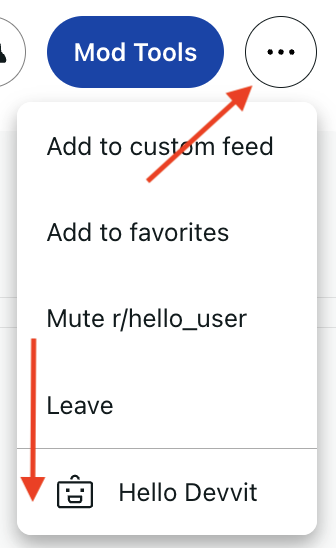
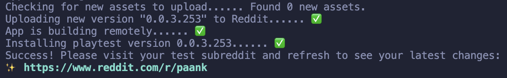
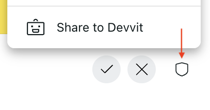

import Tabs from '@theme/Tabs';
import TabItem from '@theme/TabItem';

# Intro to Devvit

:::note
This tutorial assumes that you have already set up your environment and installed Devvit via the [Quickstart](https://developers.reddit.com/docs/quickstart).
:::

## Step 1: Create a project

Once you are logged in, create a new project (aka a new app). Run:

```
devvit new
```

## Step 2: Name your project

For this tutorial, we suggest using:

```
Hello-[username]
```

## Step 3: Select the template

When prompted to chose a template, scroll and select:

```
intro-to-devvit
```

## Step 4: Upload and build

Run the following commands to get your app up and running:

```
cd <project-name>
devvit upload
devvit playtest <subreddit-name>
```

Every app you make will have a corresponding project folder on your local machine. Here you are "changing directory"[^1] into the project folder so you can run app-specific devvit commands. Uploading your project from this folder converts it to a private test app on the platform, which you can view from [my apps](https://developers.reddit.com/my/apps).

The "playtest" command is for testing your code - more on that soon.

[^1]: If you're less familiar with the terminal and command line interfaces, check out this [overview with some common commands](https://tutorials.codebar.io/command-line/introduction/tutorial.html).

## Step 5: Open your project

Open your project from your IDE[^2]. It should look like this:

```text
my-project
├── assets
├── src
│   └── main.tsx
│   └── weird.tsx
│   └── guts // don't worry about this section
├── devvit.yaml
├── package.json
├── tsconfig.json
├── README.md
```

You'll be making updates to `main.tsx` and the `assets` folder in this tutorial.

[^2]: If you don't have an IDE on your machine, we recommend using [VS Code](https://code.visualstudio.com/).

## Step 6: Create a post

Visit your test subreddit. From the subreddit menu, select "Hello Devvit" and wait for your post to load.



## Step 7: Playtesting

As you make and save code modifications, playtest will automatically build and deploy the app to your subreddit. Simply refresh the post to view the latest changes. Press Ctrl + C to exit the playtest.



From here, the post will guide you through three simple code changes! You can stop there, but we encourage you to experiment and make the post your own.

## Step 8: Share your post

When you're happy with your post, considering sharing it with the community. You can see [creations made by other devs here](https://www.reddit.com/r/hello_user/?f=flair_name%3A%22hello%20devvitor%22).

Make sure your subreddit is set to public, and select "Share with Devvit" from the mod menu on the post:



## More resources

Now you know how to create and deploy apps! Next up, try the following:

- Check out the [showcase](/docs/showcase/) to see what others have created.
- Learn how to [publish](/publishing) your app and make it public in the Apps directory.
- Follow the [Remind Me](/docs/showcase/tutorials/remind_me.md) tutorial.
