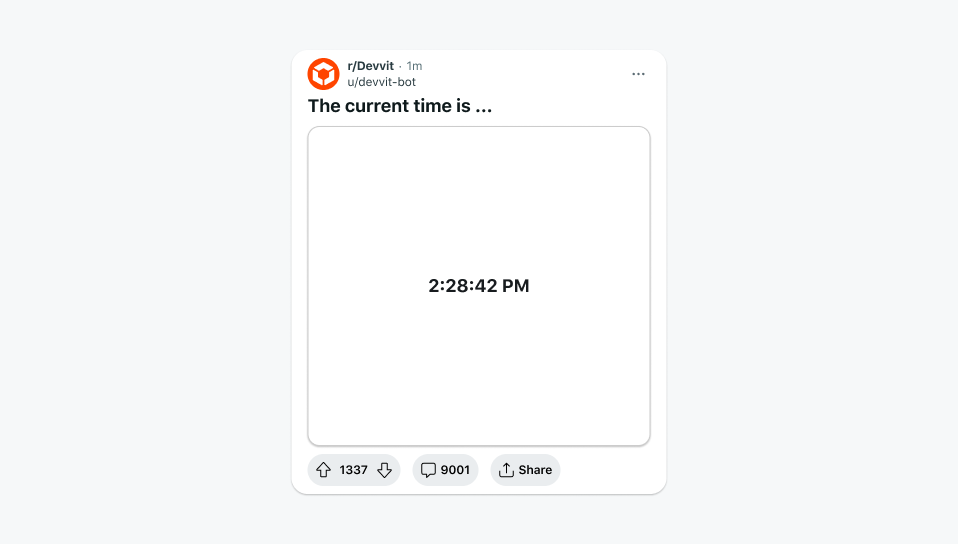

# Working with useInterval

Update live interactive posts in real time.

:::note
This feature is experimental. There are known issues with interval timing especially when using server side calls, like calling Redis, within the useInterval function. This would result in intervals longer than what a developer specifies.
:::

The `useInterval` method lets you build live apps that automatically update in real time. You can use this method to trigger a render of your interactive post to do things like add a countdown timer, update a scoreboard with new play information, or set up a clock.



## How it works

The `useInterval` method lets you request that your app be re-rendered at a specified interval. Intervals are set in milliseconds, with a 1000ms minimum.

```tsx
import { Devvit, useState, useInterval } from '@devvit/public-api';

const [counter, setCounter] = useState(1000);

const updateInterval = useInterval(() => {
  setCounter((counter) => counter - 1);
}, 1000);

updateInterval.start();
```

## Key limitations

- You can only use one active, running `useInterval` per app.
- The minimum allowed interval time is 1 second.
- The timing is specific to the app. Timing begins when a user engages with the app, and the time interval triggers a refresh. For example:
  - If you build a stopwatch and add 1000 ms each time the interval runs, the actual elapsed time would include the time between interval triggers and would be something like 1020 ms.
  - If you build a countdown timer, the time interval trigger subtracts the current time at render, so it will match the elapsed time.
- An interval runs while the post is visible on screen. If a user navigates away, it is suspended.

## useInterval vs scheduler

The `useInterval` method is different from the scheduler, in a few important ways:

- `useInterval`executes on the client and triggers updates to your app locally (it’s similar to setInterval on the web). It can re-render on the user's device to do things like create animations or refresh the screen.
- Scheduler executes on the server and can be used to run background processes.

## Example clock app

### [Playground link](https://developers.reddit.com/play#pen/N4IgdghgtgpiBcIQBoQGcBOBjBICWUADgPYYAuABMACIwBudeZAvhQGYbFQUDkAAgBN6jMgHpCAVwBGAGzxYAtBEJ4eAHTAa2EsFjJ5iYCgHMYZAMISMGGGDIAVAjAAUASioaKFLIbSUwxADuFAC8FGAwwdQQZC6unt6+lAAWxFZooRQAymQYeGDGzgGBAHSmZAASaRhobq4lhBACORDkzgBMyLwADDzxRolgfhRQ+RKxGWE5eQVFQWVmALJjE3UNTS1tnT19CT5DlGgw+wKT2bn5hcULZFnHhqdrjc1krWQdXTy9-V42ZFZGAAGABJgKl0sx4KDRmBxjA0JDQUcTgjARpmBoNLQGEwSk0BJY-FwAArEPz2ACehBcwASkFg8F45hkxCwAGseMgEjYwEIMIz9rEAB6UEIAPg8Ay8+2GAG19LAukcHE4ALqZQUwEUlCRHFqxZxuUIS8qWay2FWwOoJaVJCj6dmZI3iijKxxW50msxmnmWuI-LyDYVkHVHACSdhgGDoEBkzgdbK6AEZuqn6n43m5MVKKH8ARRnDbAwAeOgZx2xvDGMCwOwhHhYC1RkZ4AQCGQwHgUZIwKvJMghNQgFPdACkQ7FRcDFGLwddeAAXjB60KhTJWqYeGLgAqYMxi6Jg5Oc14D2XXuzj9OAxiwMx+hotSRyBQhGwIBIZJRsSINCgQHQUZoAYYAIEmzBAA)

### Code sample

```tsx
import { Devvit, useState, useInterval } from '@devvit/public-api';

function getCurrentTime() {
  const now = new Date();
  const hours = String(now.getHours()).padStart(2, '0');
  const minutes = String(now.getMinutes()).padStart(2, '0');
  const seconds = String(now.getSeconds()).padStart(2, '0');
  return `${hours}:${minutes}:${seconds}`;
}

Devvit.addCustomPostType({
  name: 'Clock',
  render: (context) => {
    const [time, setTime] = useState(() => getCurrentTime());
    const tick = () => setTime(() => getCurrentTime());
    useInterval(tick, 1000).start();

    return (
      <vstack alignment="center middle" height="100%">
        <text size="xxlarge">{time}</text>
      </vstack>
    );
  },
});

export default Devvit;
```
