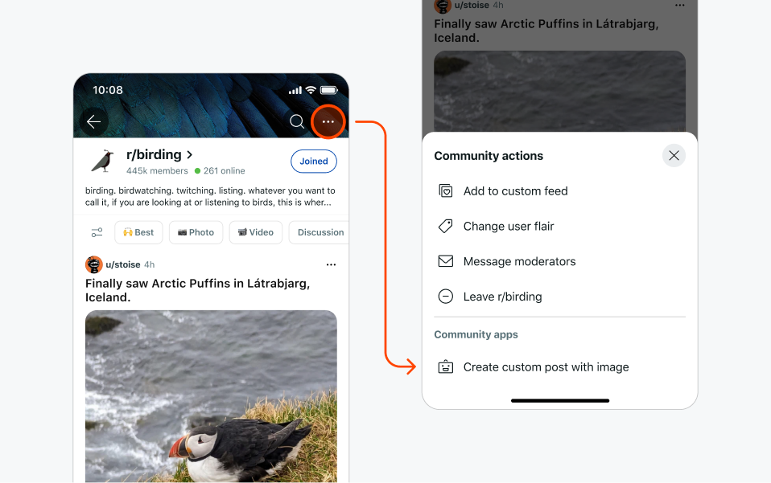

import Tabs from '@theme/Tabs';
import TabItem from '@theme/TabItem';

# Menu Actions

Add an item to the three dot menu for posts, comments, or subreddits. Menu actions can perform immediate client effects or trigger server processing followed by client effects.



## Basic Menu Actions

**For most menu actions, use direct client effects.** These provide immediate responses and are perfect for simple actions that don't require server processing.

<Tabs>
  <TabItem value="web" label="Devvit Web">
  
  **Menu items defined in devvit.json:**

  ```json title="devvit.json"
  {
    "menu": {
      "items": [
        {
          "description": "Show user information",
          "endpoint": "/internal/menu/show-info",
          "location": "post"
        }
      ]
    }
  }
  ```

  **Simple endpoint with direct client effects:**

  ```ts title="server/index.ts"
  router.post("/internal/menu/show-info", async (_req, res) => {
    // Simple actions don't need server processing
    res.json({
      showToast: 'Menu action clicked!'
    });
  });
  ```

  </TabItem>
  <TabItem value="blocks" label="Devvit Blocks / Mod Tools">
  
  ```tsx
  import { Devvit } from '@devvit/public-api';

  // Simple menu action with direct client effects
  Devvit.addMenuItem({
    label: 'Show user info',
    location: 'post', // 'post', 'comment', 'subreddit', or array
    onPress: async (event, context) => {
      // Direct client effect - no server processing needed  
      context.ui.showToast('Menu action clicked!');
    },
  });

  // Menu action with form
  const surveyForm = Devvit.createForm(
    {
      fields: [
        {
          type: 'string',
          name: 'feedback',
          label: 'Your feedback',
        },
      ],
    },
    (event, context) => {
      // onSubmit handler
      context.ui.showToast({ text: `Thanks for the feedback: ${event.values.feedback}` });
    }
  );

  Devvit.addMenuItem({
    label: 'Quick survey',
    location: 'subreddit',
    forUserType: 'moderator', // Optional: restrict to moderators
    onPress: async (event, context) => {
      context.ui.showForm(surveyForm);
    },
  });
  ```

  </TabItem>
</Tabs>

## Supported Contexts

You can decide where the menu action shows up by specifying the location property.

| Property               | Values                         | Description                                                                     |
| ---------------------- | ------------------------------ | ------------------------------------------------------------------------------- |
| location (required)    | `comment`, `post`, `subreddit` | Determines where the menu action appears.                    |
| postFilter (optional)  | `currentApp`                   | Shows the action created by your app. The default is no filtering.              |
| forUserType (optional) | `moderator`                    | Specifies the user types that can see the menu action. The default is everyone. |

:::note
For moderator permission security, when opening a form from a menu action with `forUserType: moderator`, the user initiating the action must complete all actions within 10 minutes.
:::

## Menu responses

In Devvit Web, your menu item should respond with a client side effect to give feedback to users. This is available as a UIResponse as you do not have access to the `@devvit/web/client` library from your server endpoints.

<Tabs>
  <TabItem value="web" label="Devvit Web">
  
  **Menu items with server processing:**

  ```json title="devvit.json"
  {
    "menu": {
      "items": [
        {
          "label": "Process and validate data",
          "endpoint": "/internal/menu/complex-action",
          "forUserType": "moderator",
          "location": "subreddit"
        }
      ]
    }
  }
  ```

  ```ts title="server/index.ts"
  import { UIResponse } from '@devvit/web/shared';
  
  router.post("/internal/menu/complex-action", async (_req, res: Response<UIResponse>) => {
    try {
      // Perform server-side processing
      const userData = await validateAndProcessData();
      
      // Show form with server-fetched data
      res.json({
        showForm: {
          name: 'processForm',
          form: {
            fields: [
              {
                type: 'string',
                name: 'processedData',
                label: 'Processed Data',
              },
            ],
          },
          data: { processedData: userData.processed }
        }
      });
    } catch (error) {
      res.json({
        showToast: 'Processing failed. Please try again.'
      });
    }
  });
  ``` 
  </TabItem>
  <TabItem value="blocks" label="Devvit Blocks / Mod Tools">
  
  For Devvit Blocks, use the direct context approach even for complex workflows:

  ```tsx
  Devvit.addMenuItem({
    label: 'Process and validate data',
    location: 'post', // 'post', 'comment', 'subreddit', or array
    forUserType: 'moderator', // Optional: restrict to moderators
    onPress: async (event, context) => {
      try {
        // Perform server-side processing
        const userData = await validateAndProcessData();
        
        // Show form with server-fetched data
        const result = await context.ui.showForm({
          fields: [
            {
              type: 'string',
              name: 'processedData',
              label: 'Processed Data',
            },
          ],
        }, (values) => {
          context.ui.showToast(`Processed: ${values.processedData}`);
        });
      } catch (error) {
        context.ui.showToast('Processing failed. Please try again.');
      }
    },
  });
  ```
  </TabItem>
</Tabs>

### Menu response examples

Menu responses can trigger any client effect after server processing:

**Show toast after processing:**
```ts
res.json({
  showToast: {
    text: 'Processing completed!',
    appearance: 'success'
  }
});
```

**Navigate after data fetching:**
```ts
const post = await reddit.getPostById(postId);
res.json({
  navigateTo: post
});
```

**Chain multiple forms:**
```ts


// First form response leads to second form
res.json({
  showForm: {
    name: 'secondForm',
    form: { fields: [...] },
    data: { fromStep1: processedData }
  }
});
```

## Limitations

- A sort order of actions in the context menu can't be specified.
- The context, name, and description fields do not support dynamic logic.
