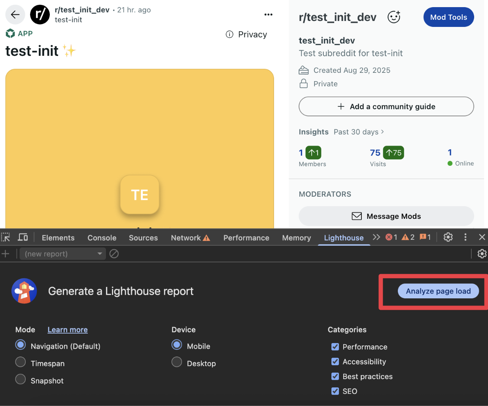

import Tabs from '@theme/Tabs'; import TabItem from '@theme/TabItem';

# First Screen Customization

Control what users see when they first encounter your Devvit app post. Choose between a configuration-based splash screen or an inline web view (experimental) that launches directly into the interactive experience. Splash screens are great for:

- Getting started with your app
- Apps that require a long load time (e.g. Phaser game)
- Faster initial reviews

:::note
First screen customization is built for web view apps on Devvit Web.
:::

| **Feature**                                              | **Web** | **iOS**           | **Android**       |
| -------------------------------------------------------- | ------- | ----------------- | ----------------- |
| Splash Screens                                           | ✅      | ✅                | 🟡Partial Support |
| Inline Web Views (Experimental)                          | ✅      | 🟡Partial Support | 🟡Partial Support |
| requestImmersiveMode for Inline Web Views (Experimental) | ✅      | 🟡Partial Support | 🟡Partial Support |

## Customization Options

### Splash Screens

Splash screens provide a personalized entry point for your app, displaying a customized view before users interact with your post. A well-designed splash screen improves first impressions and drives better user engagement.

The splash screen appears when users first view your post, featuring your app's branding, a description, and a call-to-action button that launches the main experience.

#### Creating Posts with Splash Screens

When creating a post with a splash screen, include the splash parameter to customize the appearance:

```ts title="server/index.ts"
import { reddit } from '@devvit/web/server';

export const createPost = async (context: DevvitContext) => {
  const post = await reddit.submitCustomPost({
    subredditName: context.subredditName!,
    title: 'My Interactive Post',
    splash: {
      appDisplayName: 'My Amazing App', // only required field
      backgroundUri: 'background.png',
      buttonLabel: 'Start Playing',
      description: 'An exciting interactive experience',
      entryUri: 'index.html',
      heading: 'Welcome to the Game!',
    },
    postData: {
      gameState: 'initial',
      score: 0,
    },
    runAs: 'USER',
  });
};
```

#### Splash Screen Properties

The splash object supports the following customization options:

| **Property**   | **Type** | **Description**                                                | **Default**                                                          |
| -------------- | -------- | -------------------------------------------------------------- | -------------------------------------------------------------------- |
| appDisplayName | string   | Your app's display name                                        | Required                                                             |
| backgroundUri  | string   | Background image URL (relative to media directory or data URI. | None, recommended for inline web views as it acts as a loading image |
| buttonLabel    | string   | Text for the launch button                                     | 'Launch App'                                                         |
| description    | string   | Secondary text describing the post experience                  | None                                                                 |
| entryUri       | string   | Web view URI relative to client directory                      | 'index.html'                                                         |
| heading        | string   | Large text naming the post under app name                      | appDisplayName                                                       |
| appIconUri     | string   | Icon URL relative to media directory or data URI               | None                                                                 |

#### Using Images

Images can be referenced in two ways:

1. Local assets: Place images in your app's assets folder and point to the assets folder in your devvit.json

For example, to use an image at assets/splash-background.png:

```tsx
// in devvit.json, make sure you have the media dir set:
// "media": {
//  "dir": "assets"
// },

// in server endpoint
await reddit.submitCustomPost({
  // ...
  splash: {
    appDisplayName: 'Example App',
    backgroundUri: 'splash-background.png',
    appIconUri: 'app-icon.png',
  },
});
```

2. Reddit URLs: Use a reddit hosted URL, which must be on an i.redd.it domain:

```tsx
// in server endpoint
await reddit.submitCustomPost({
  // ...
  splash: {
    appDisplayName: 'Example App',
    backgroundUri: 'https://i.redd.it/your-image.png',
  },
});
```

#### Example: Splash Screen

You can choose the first screen type based on context or user preferences:

```tsx
import { reddit } from '@devvit/web/server';

async function createPost(postType: 'game' | 'leaderboard', context: any) {
  const baseConfig = {
    subredditName: context.subredditName!,
    postData: {
      type: postType,
      initialized: false,
    },
  };

  return await reddit.submitCustomPost({
    ...baseConfig,
    title: 'Epic Adventure Game',
    splash: {
      appDisplayName: 'Quest Master',
      backgroundUri: 'game-splash.png',
      buttonLabel: 'Begin Quest',
      description: 'Embark on an unforgettable journey',
      heading: 'The Adventure Awaits',
    },
  });
}
```

### Inline Web Views (Experimental)

:::warning
Inline web views are currently an experimental feature and may be modified during development. We expect to have this feature fully supported across all platforms in October.
:::

Inline web views allow your app to skip the splash screen entirely and load directly into the interactive experience. This is ideal for apps where immediate interaction or apps that want more dynamic content and developers are comfortable optimizing performance and preventing conflicts with native gestures (scroll, swipe, zoom, pan).

Inline web views can launch into immersive mode on user action with the requestImmersiveMode method in ‘@devvit/web/client’.

#### Example

To enable inline web views you’ll have to add the inline: true property to your entrypoint. We also recommend setting a background image in your splash screen parameter which will act as your loading screen.

```tsx
// in devvit.json, make sure the following is set up:
/*
 "post": {
    "dir": "dist/client",
    "entrypoints": {
      "default": {
        "entry": "index.html",
        "inline": true
      }
    }
  },
*/

// in server files
export const createPost = async () => {
  const { subredditName } = context;
  if (!subredditName) {
    throw new Error('subredditName is required');
  }

  return await reddit.submitCustomPost({
    splash: {
      appDisplayName: 'test-init',
      backgroundUri: 'background.png', // used as loading screen
    },
    subredditName: subredditName,
    title: 'test inline web view post',
  });
};
```

#### Guidelines for Inline Web Views

Apps using inline web views are subject to additional app review to ensure performance and user experience standards. Apps must meet these requirements for approval and featuring:

- **Performance requirements** - Apps must achieve a Lighthouse score >80

- Use [Lighthouse](https://developer.chrome.com/docs/lighthouse/overview) and run your post's performance from a post view before submission.



- Optimize for mobile devices and slower connections

- **Do not interfere with native app gestures while inline** - Apps cannot interfere with native Reddit gestures
- No scroll traps or scroll hijacking
- Apps should not accept zooming or panning
- Users must be able to scroll past your post and swipe back and forth and to other relevant reddit app components naturally
- Touch gestures must work as expected
- If you need additional gestures, use within immersive mode

- **UI that works on all viewports** - Relevant content must be mobile-first and visually appealing across multiple viewport sizes (A vast majority of app engagers are on mobile devices)

- **User-initiated immersive experiences** - Apps cannot auto-launch into immersive or fullscreen modes
- Require explicit user interaction (clearly labeled button or action)
- Default view should respect standard post boundaries

:::note
You must do performance testing before submitting an app with inline web views. Run Lighthouse in Chrome DevTools to ensure your score exceeds 80. Focus on optimizing initial load time, reducing JavaScript bundle size, and minimizing layout shifts.
:::

#### Best Practices

- **Make the whole screen clickable for immersive mode** - Don't rely on small buttons alone; users expect to tap anywhere to proceed
- **Add dynamic content** - Include contextual information like post author, snoovatar, date, # of plays, current participants, or live stats to make each splash screen feel fresh
- **Use subtle animations** - Add pulse effects, gentle floating, or shimmer animations to interactive elements to signal they're clickable
- **Keep it fast** - Performance matters! Aim for splash screens that load in under 1 second. Optimize images.

#### Enabling Immersive Mode from an Inline Web View

:::Note
This is currently only available on Web and will be available on mobile platforms in October.
:::

Apps in immersive mode are able to take full control of native gestures (swipe, pan, zoom) and have better long term engagement for certain types of game experiences. When you are in the inline web view experience you can launch into immersive mode from a direct user interaction (click, touch, etc).. Immersive mode launches your web view app into a full screen context on mobile and a larger modal on web.

##### API Reference

There are functions available in @devvit/web/client

- isImmersiveMode() - Checks if the app is currently in immersive mode.

```typescript
import { isImmersiveMode } from '@devvit/web/client';

// Conditionally render UI based on mode
if (isImmersiveMode()) {
  showFullscreenControls();
} else {
  showCompactView();
}
```

- requestImmersiveMode(event) - Transition from inline to immersive mode presentation. Must be called from a user-initiated event (click, touch, etc.). In react, you must user event.nativeEvent

```tsx
import { requestImmersiveMode } from '@devvit/web/client';

// Vanilla JavaScript
button.addEventListener('click', async (event) => {
  try {
    await requestImmersiveMode(event);
    console.log('Entered immersive mode');
  } catch (error) {
    console.error('Failed to enter immersive mode:', error);
  }
});

// React - use nativeEvent
function GameComponent() {
  const handleStartGame = async (event: React.MouseEvent) => {
    try {
      await requestImmersiveMode(event.nativeEvent);
      // Navigate or update state
    } catch (error) {
      // Handle error gracefully
    }
  };

  return <button onClick={handleStartGame}>Start Game</button>;
}
```

- exitImmersiveMode(nativeEvent) - Transition from immersive back to inline mode presentation. Must be called from a user-initiated event. In react, you must user event.nativeEvent

```typescript
import { exitImmersiveMode } from '@devvit/web/client';

// Add escape key handler
document.addEventListener('keydown', async (event) => {
  if (event.key === 'Escape') {
    await exitImmersiveMode(event);
  }
});
```

- addImmersiveModeChangeEventListener(callback: (mode: 'inline' | 'immersive') => void) and removeImmersiveModeChangeEventListener(callback) - Listen for mode changes to update your UI accordingly.

```typescript
import {
  addImmersiveModeChangeEventListener,
  removeImmersiveModeChangeEventListener,
} from '@devvit/web/client';

// React hook example
function useImmersiveMode() {
  const [isImmersive, setIsImmersive] = useState(false);

  useEffect(() => {
    const handleModeChange = (mode: 'inline' | 'immersive') => {
      setIsImmersive(mode === 'immersive');
      document.body.classList.toggle('immersive', mode === 'immersive');
    };

    addImmersiveModeChangeEventListener(handleModeChange);

    return () => {
      removeImmersiveModeChangeEventListener(handleModeChange);
    };
  }, []);

  return isImmersive;
}
```

##### Complete Example

```tsx
// game.tsx
import React, { useState, useEffect } from 'react';
import {
  isImmersiveMode,
  requestImmersiveMode,
  exitImmersiveMode,
  addImmersiveModeChangeEventListener,
  removeImmersiveModeChangeEventListener,
} from '@devvit/web/client';

export function GameApp() {
  const [mode, setMode] = useState<'inline' | 'immersive'>(
    isImmersiveMode() ? 'immersive' : 'inline'
  );
  const [gameStarted, setGameStarted] = useState(false);

  useEffect(() => {
    const handleModeChange = (newMode: 'inline' | 'immersive') => {
      setMode(newMode);

      // Pause game when exiting immersive mode
      if (newMode === 'inline' && gameStarted) {
        pauseGame();
      }
    };

    addImmersiveModeChangeEventListener(handleModeChange);
    return () => removeImmersiveModeChangeEventListener(handleModeChange);
  }, [gameStarted]);

  const handlePlayClick = async (event: React.MouseEvent) => {
    try {
      await requestImmersiveMode(event.nativeEvent);
      setGameStarted(true);
    } catch (error) {
      console.error('Could not enter immersive mode:', error);
      // Fallback: start game inline
      setGameStarted(true);
    }
  };

  const handleExitClick = async (event: React.MouseEvent) => {
    try {
      await exitImmersiveMode(event.nativeEvent);
    } catch (error) {
      console.error('Could not exit immersive mode:', error);
    }
  };

  if (mode === 'inline') {
    return (
      <div className="inline-view">
        <h2>Epic Adventure</h2>
        <p>Tap to play in fullscreen!</p>
        <button onClick={handlePlayClick} className="play-button">
          Play Now
        </button>
      </div>
    );
  }

  return (
    <div className="immersive-view">
      <button onClick={handleExitClick} className="exit-button">
        ✕ Exit
      </button>
      <GameCanvas />
    </div>
  );
}
```
