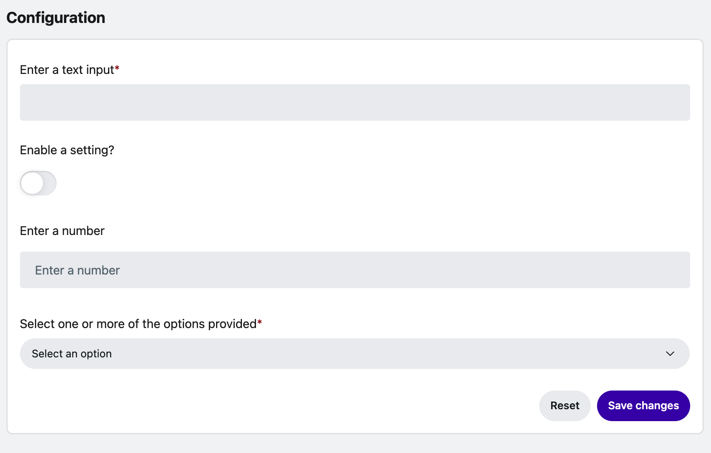
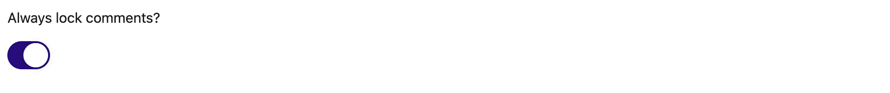
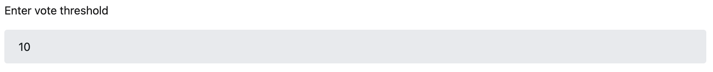

# App configurations

Devvit gives you the flexibility to add configuration settings to your app.

Once the app is installed, the configuration settings are available on the Install Settings page. Moderators add the required input and save the changes to configure the app. Note that these settings are limited to the subreddit where the app is installed, so your app can be uniquely configured to each subreddit’s specific needs.



## Input types

There are currently four supported types of input:

- Text
- Boolean
- Number
- Dropdown selection

## Examples

### Text

Renders an input field that accepts text responses.

#### Discord Webhook URL


### Boolean

Renders a switch to toggle on (true) or off (false).

#### Comment lock



### Number

Renders an input field that accepts text responses.

#### Vote threshold



### Dropdown

Renders a dropdown menu where moderator can select one or more developer-defined options.

#### Define a type of object (ie `Devvit.addAction` context)


## Prerequisites

Before you can start adding settings, make sure you’ve completed the [Devvit Quickstart](quickstart) and have a test app up and running.

## Configuring settings within your app

You can use the following code snippets as a guide to adding configuration settings to your app:

1. First, make sure this import is at the top of your file.

```ts
import { Devvit } from '@devvit/public-api';
```

2. Use `Devvit.addSettings` to define any input fields you want to add to your settings form. Each field needs to be assigned a type, name, and label. You can provide the dropdown options for selection fields, as well as determine if the user can select more than one option within the dropdown. The label is the only text that will be visible on the form, so use this to communicate what the moderator should enter in each input field.

```ts
Devvit.addSettings([
  {
    type: 'string',
    name: 'text-input',
    label: 'Enter your text input:',
    onValidate: async ({ value }) => {
      if (value !== 'bird') {
        return 'Word must be "bird"';
      }
    },
  },
  {
    type: 'boolean',
    name: 'bool-input',
    label: 'Use the switch to determine if some setting should be enabled:',
  },
  {
    type: 'select',
    name: 'select-input',
    label: 'Select one of the options:',
    options: [
      {
        label: 'Option 1',
        value: 'Option 1',
      },
      {
        label: 'Option 2',
        value: 'Option 2',
      },
    ],
    multiSelect: false,
  },
  {
    type: 'select',
    name: 'multiselect-input',
    label: 'Select multiple options:',
    options: [
      {
        label: 'Option 1',
        value: 'Option 1',
      },
      {
        label: 'Option 2',
        value: 'Option 2',
      },
      {
        label: 'Option 3',
        value: 'Option 3',
      },
    ],
    multiSelect: true,
  },
  {
    type: 'number',
    name: 'number-input',
    label: 'Enter your number input:'',
  },
  {
    type: 'paragraph',
    name: 'paragraph-input',
    label: 'Enter your paragraph input:',
  },
  {
    type: 'group',
    label: 'This is a GROUP field',
    fields: [
      {
        type: 'string',
        name: 'group-text-input',
        label: 'Group: Enter your text input:',
      },
      {
        type: 'boolean',
        name: 'group-bool-input',
        label: 'Group: Use the switch to determine if some setting should be enabled:',
      },
    ],
  },
]);
```

### Input validation


Devvit app configurations also support input validation. As the app developer, you can set restrictions on what kind of input must be entered in each field.

For example, setting a maximum number:

```ts
onValidate: (event) => {
  if (event.value! > 10) {
    return 'Number too high!';
  }
};
```

To use validation, add the `onValidate` handler to the settings field object, like this:

```ts
  {
    type: 'number',
    name: 'number-input',
    label: 'Enter your number input:',
    onValidate: (event) => {
      if (event.value! > 10) { return 'Number too high! Must be lower than 10.' }
    }
  },
```

## Retrieving settings within your app

After you've written the settings for your app, you can see the input that has been entered by the moderator by using `getSettings`.

1. Add the following imports to the top of your file:

```ts
import { Devvit, Context, getSetting, getSettings } from '@devvit/public-api';
```

2. Use `Devvit.addAction` to create a menu item that will trigger a toast message containing the form input.

```ts
Devvit.addAction({
  name: 'Test Action',
  description: '',
  context: Context.SUBREDDIT,
  async handler(_event, metadata) {
    // to get all settings
    const settings = await getSettings(metadata);

    // to get an individual setting
    const textFieldInput = await getSetting('text-input', metadata);

    return {
      success: true,
      message: JSON.stringify(textFieldInput),
    };
  },
});
```


