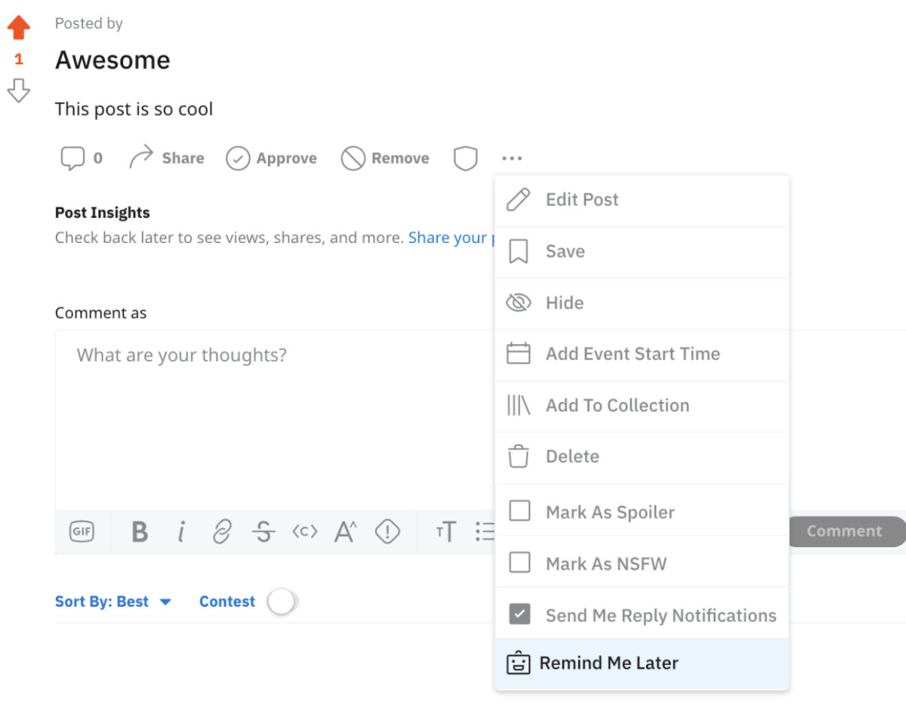

# Menu actions

You can add custom menu actions to posts and comments using the addAction or addActions function. These functions serve as an entry point for apps.addActions.



## Supported Contexts

The context lets you define where the menu action shows up. The options are:

- COMMENT
- POST
- SUBREDDIT

You can also define the userContext (optional) to specify the types of users that can see the menu action. The options are:

- LOGGED_IN
- MEMBER
- MODERATORY

## Limitations

- If there are multiple apps, there is no way to sort order of actions in the menu.
- The context, name, and description fields do not support dynamic logic.

## Example

Here you'll use `Devvit.addActions` to create a post menu action that is visible to members, a comment menu action that is visisble to moderators, and a subreddit menu action that is available to all users.

```ts

import { Context, Devvit, UserContext } from '@devvit/public-api';

// Declare multiple actions to be added to the menu
Devvit.addActions([
  {
    context: Context.POST,// Can be on a post, comment, subreddit, or member
    userContext: UserContext.MEMBER,  // optional, specify type of user context necessary
    name: 'Custom Post Action', // Displayed text in the menu (keep it short!)
    description: 'Do something with this post', // Short blurb describing the action
    handler: async (event) => {
      const message = `Post action! Post ID: ${event.post?.id}`;
      console.log(message);

      // Return success status and a message to show the user as feedback
      return { success: true, message };
    },
  },
  {
    context: Context.COMMENT,
    userContext: UserContext.MODERATOR, // only moderators are able to see
    name: 'Custom Comment Action',
    description: 'Do something with this comment',
    handler: async (event) => {
      const message = `Comment action! Comment ID: ${event.comment?.id}`;
      console.log(message);
      return { success: true, message };
    },
  },
]);


Devvit.addAction({
  context: Context.SUBREDDIT,
  name: 'Custom Subreddit Action', // text to display in the menu (keep it short!)
  description: 'Do something on this Subreddit, // short blurb describing what we're going to do
  handler: async (event) => {
    const message = `Subreddit action! Comment ID: ${event.subreddit?.id}`;
    console.log(message);
    return { success: true, message };
  },
});


```
