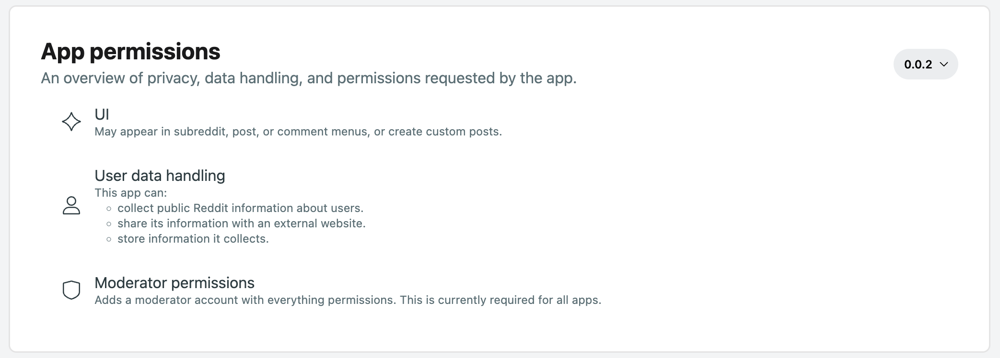

# How apps work

Devvit apps are designed to interact with Reddit communities.

## App accounts

When you upload an app, an app account is automatically created. An app account is a separate user account that your app uses to interact with a subreddit.

Once a mod or admin installs your app, the app account appears as a user in the mod list. When the app is executed, the action comes from the app’s user account. This is helpful for tracking posts and comments.

The app account has the same permissions that are granted to your app.

## App permissions

App permissions help users understand how your app will interact with a subreddit and users.

If your app accesses user data or interacts with the UI, that information is listed in the [Apps](https://developers.reddit.com) directory and in the CLI on installation. Permissions fall into one of three categories.

| **Category**                         | **Description**                                                                                              | **Capabilities involved**                                                                                                                                                             |
| ------------------------------------ | ------------------------------------------------------------------------------------------------------------ | ------------------------------------------------------------------------------------------------------------------------------------------------------------------------------------- |
| **UI**                               | Permissions your app needs for the UI elements it uses.                                                      | Menu actions, custom posts, or asset use all require UI permissions.                                                                                                                  |
| **User data handling**               | Permissions your app needs for the way it manages user data.                                                 | The specific permissions your app requires will depend on the capabilities you’ve used: app settings, key value store, HTTP fetch, media, Redis, Reddit API, scheduler, and triggers. |
| **Moderator permissions** (required) | Permission your app needs to create a mod account with _everything_ permissions on the installing subreddit. | This permission is required for every app.                                                                                                                                            |

Here’s an example of the permissions displayed on the app detail page in the Developer Portal.

## App versions

When you update your app, every subreddit that has installed your app has to be **manually updated** to the new version (don’t worry, this won’t last forever). To update your subreddit app installation:

1. Go to [My Communities](https://developers.reddit.com/my/communities) from the profile dropdown in the Developer Portal.
2. Click the community you want to view.
3. When a new version of an app is available for a given subreddit, you will see a blue **Update** button next to the app tile. Click the button and follow the prompts to upgrade each community.

## Understanding client-side apps

Client-side apps run on the user’s device instead of a remote server. This increases the speed and responsiveness of the app and provides a better user experience. Devvit apps operate like most client-side apps (browser extensions, html5 games, etc). When a user visits an [interactive post](interactive_posts.md) that has a running Devvit app, the bundled source code is transmitted to the user. The app runs in the user’s client for optimal app performance, which exposes app details to clients during runtime.

What is available to the client:

- App source code
- Anything stored in state (e.g. useState)

What is not available to the client:

- Any server side plugins (outside of state), like data from Redis, secrets, and settings
- Fetch calls to external services from within an app

:::note
We are working on mechanisms to split your code into server portions (hidden) and client portions (exposed).
:::

## Development stages

Devvit apps go through three stages during development. This lets you build and iterate on your app until you're ready to share it with the rest of Reddit.

| Stage    | Description                                                                                                                                                                                                                                                                                                      |
| -------- | ---------------------------------------------------------------------------------------------------------------------------------------------------------------------------------------------------------------------------------------------------------------------------------------------------------------- |
| Private  | When you are building and testing your app, it’s only visible to you, and it can only be installed by you in small subreddits with fewer than 200 subscribers.                                                                                                                                                   |
| Unlisted | After you publish your app, it is still only visible to you in the Apps directory, but you can install it on larger subreddits.                                                                                                                                                                                  |
| Public   | Once you submit your [app review form](https://docs.google.com/forms/d/e/1FAIpQLSdEyE5vrqOBlojue_mkrV25RiiHv_sxe-xqtcdzCMBTWmoROA/viewform) and it's been approved by the Developer Platform team, your app is visible to all users in the Apps directory and can be installed by mods and admins across Reddit. |
