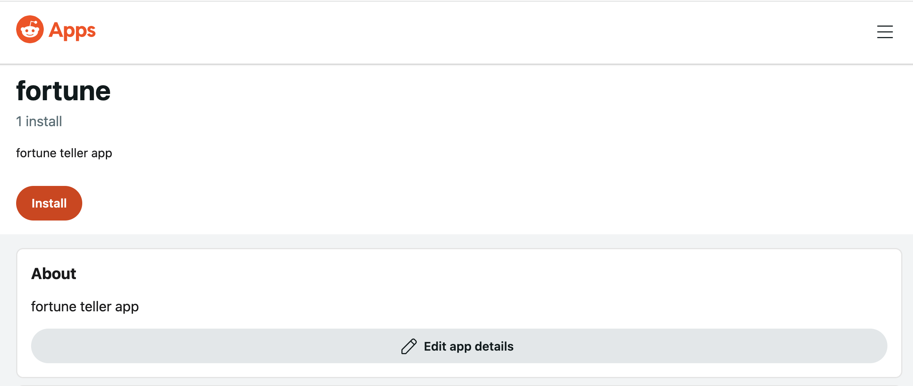

## Add your app to a subreddit

To add an app to your subreddit, find it on developers.reddit.com. Click on the app info card to get to the app details page, and click "Install".

This will give you a list of subreddits that will allow you to add the app. Generally, you can only add an app to subreddits that you moderate.

Select a subreddit to install the app.

