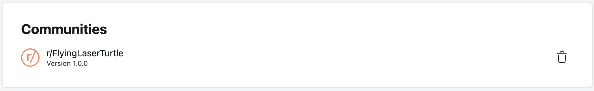
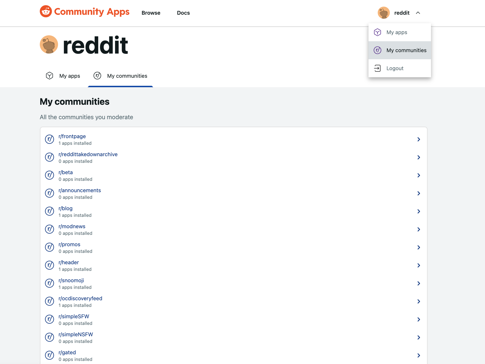

# Manage

## Remove an app from your subreddit

**Uninstall from the Developer Portal**

- Find your app on [developers.reddit.com](https://developers.reddit.com/).
- Click on the app info card to get to the app details page (e.g. `developers.reddit.com/apps/your-app-name`)
- Under the **Communities** section, you will see a list of all subreddits your app is installed on
- If you have permissions to uninstall the app, you can click the trash can icon to the right of a community name to uninstall the app from that community.



**Uninstall using the CLI**  
To find a list of installations, run `$ devvit list installs`.

```
$ devvit list installs
loading...... done

 App Name          Installed Subreddits
 ───────────────── ────────────────────
 test-app-one    r/testsub1 (v0.0.1)

 test-app-two    r/testsub2 (v0.0.3)

$ devvit uninstall test-app-one --subreddit r/testsub1
```

To uninstall an app, run `$ devvit uninstall [app-name] --subreddit [subreddit-name]`.

## Remove your published app from the directory

If your app is published, you can remove it from the Developer Portal. This will not remove the code from the directory, and it will not remove the app from subreddits that have installed previous versions. Once an app is published and installed, that version will continue to exist until a moderator explicitly removes it.

**Hide using the directory UI**  
Go to [developers.reddit.com](https://developers.reddit.com) and find your app. From the "App Details" page, scroll to the "Developer Settings" and toggle the "Available" option off. Note that you will not see this option for apps that have only been uploaded, but not published

## Manage your communities

To view the subreddits you moderate, select “My communities” from the profile dropdown menu. This will list app installations across all communities where you have moderator permissions.



Click the subreddit name to install or remove apps from your community.

_Note: only moderators with app management permissions will be able to modify community app installations. Permissions are [managed in mod settings](https://mods.reddithelp.com/hc/en-us/articles/360009381491-User-Management-moderators-and-permissions)._
