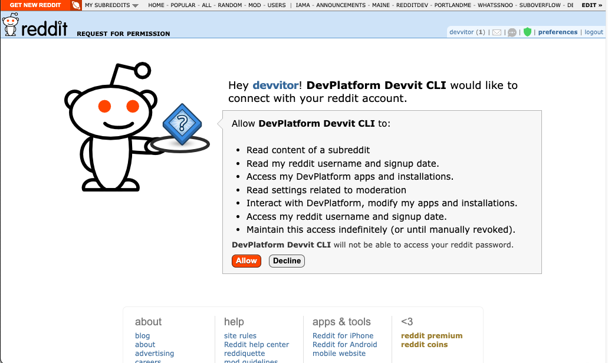

# Authentication

To publish, install, and manage applications, you must be logged in with a Reddit account. Once you log in, your access token is stored locally at `~/.devvit/token`. Whenever you interact with the CLI, the authentication token is loaded and used for interacting with Devvit’s backend. These tokens are automatically refreshed.

Once your app is published, when the app is invoked in the Reddit backend, an access token is automatically issued for the user and is used to interact with the Reddit public API.

## Logging in

1. Open up a terminal to log in via the CLI.
2. Type `devvit login` and press enter.
3. In the browser window, enter your username and password. If you have two-factor authentication (2FA) enabled, you’ll be prompted to enter your 2FA code.
   

4. Press the Allow button on the authorization screen.
   

5. Once you see the success screen, you can close the browser.
   

6. If the login was successful, you'll see `Logged in as <username>` in your terminal window.

7. To confirm your CLI is authenticated, run `devvit whoami` and confirm that your username is returned.

## Logging out

To logout of your Devvit CLI, run `devvit logout`. This logs out your local system and revokes the issued access token.

To remove OAuth access to the devvit CLI entirely, go to your [app
preferences](https://www.reddit.com/prefs/apps) and click **revoke access**.

