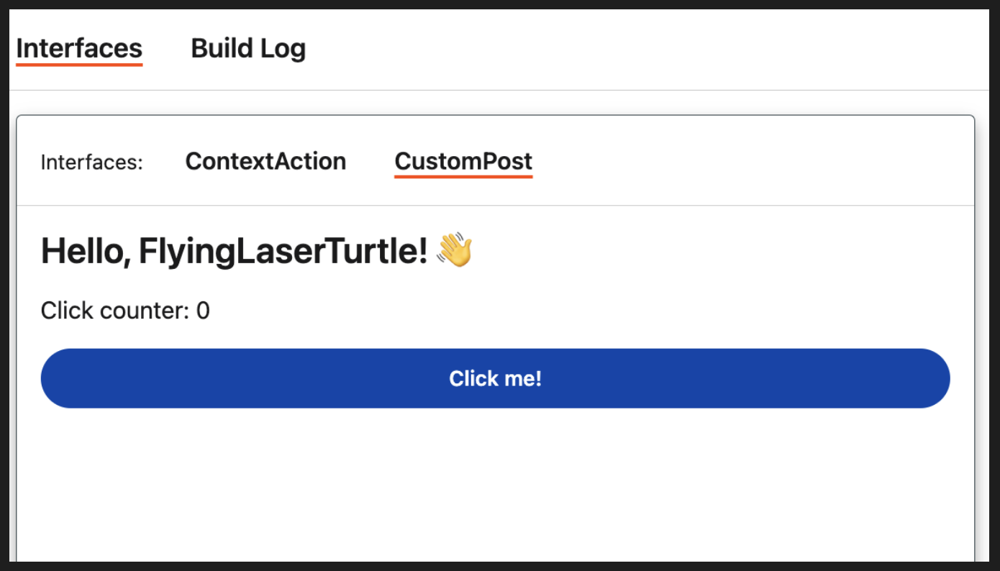

# Create a custom post

## Start a project

To create a custom post app, use the `custom-post` template to start a new project.

1. From the terminal, navigate to a directory where you'll store your project.
2. Enter the following command to create a project folder on your local machine.

```bash
devvit new <replace-with-your-app-name> --template=custom-post
```

### Install dependencies

3. To have your package manager install the dependencies, run the following command in the root of your project:

```bash
npm install
```

-OR-

```bash
yarn install
```

### Check out your post!

4. Open your app in your test subreddit. Run the following command in the root of your project:

```bash
devvit playtest <replace with your test subreddit name>
```

You'll see a "Hello" post that looks like this:



### Next steps

Now that you've created a basic custom post, check out one of our tutorials to learn how to [build a form](custom_post_form.md) in a custom post.
