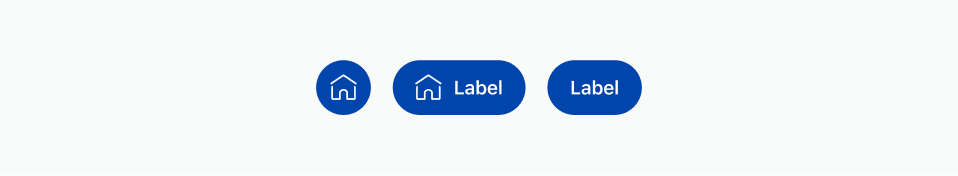
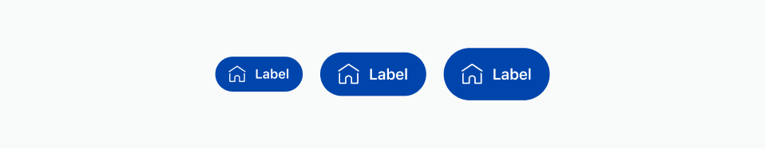
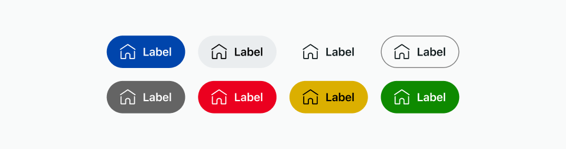
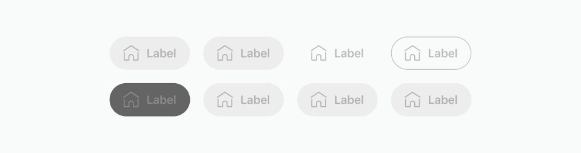

import AttributeMinHeight from './attributes/_minHeight.md';
import AttributeMaxHeight from './attributes/_maxHeight.md';
import AttributeMinWidth from './attributes/_minWidth.md';
import AttributeMaxWidth from './attributes/_maxWidth.md';
import AttributeGrow from './attributes/_grow.md';
import AttributeOnPress from './attributes/_onPress.md';
import AttributeWidth from './attributes/_width.mdx';
import AttributeHeight from './attributes/_height.mdx';

# Button

The `<button>` element creates an interactive button that users can click or tap.

## Attributes

### `icon`

Adds an icon to the button, specified by its string identifier.

Can be used with or without a text label.



#### Examples

An icon button

```tsx
<button icon="home" />
```

A button with a an icon and a label

```tsx
<button icon="home">Label</button>
```

A button with no icon

```tsx
<button>Label</button>
```

### `size`

Determines the button size. Possible values:

- `small`: 32px
- `medium`: 40px. The default if the attribute is not used.
- `large`: 48px



#### Example

A small button

```tsx
<button size="small">Label</button>
```

### `appearance`

Sets the button style. Possible values:

- `primary`
- `secondary`: The default if the attribute is not used.
- `plain`
- `bordered`
- `media`
- `destructive`
- `caution`
- `success`



#### Example

A primary button

```tsx
<button appearance="primary">Label</button>
```

### `disabled`

Disables the button if set to true, preventing interactions.



#### Examples

A disabled button button

```tsx
<button disabled>Label</button>
```

A disabled button button

```tsx
<button disabled={true}>Label</button>
```

### `grow`

<AttributeGrow />

#### Example

A growing button

```tsx
<button grow>Label</button>
```

### `width`

<AttributeWidth />

### `minWidth`

<AttributeMinWidth />

### `maxWidth`

<AttributeMaxWidth />

### `height`

<AttributeHeight />

### `minHeight`

<AttributeMinHeight />

### `maxHeight`

<AttributeMaxHeight />

## Functions

### `onPress`

<AttributeOnPress />

#### Examples

```tsx
<button onPress={() => console.log('world')}>Hello</button>
```

## Notes

## Examples

A button that increments a counter

```tsx
import { Devvit, useState } from '@devvit/public-api';

Devvit.addCustomPostType({
  name: 'Say Hello',
  render: (context) => {
    const [votes, setCounter] = useState(0);
    return (
      <blocks>
        <vstack alignment="center middle" height="100%" width="100%">
          <button icon="upvote-outline" onPress={() => setCounter(votes + 1)}>
            {votes}
          </button>
        </vstack>
      </blocks>
    );
  },
});
```
