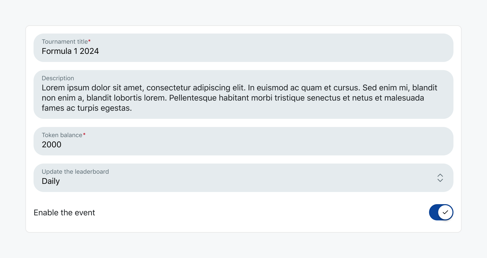
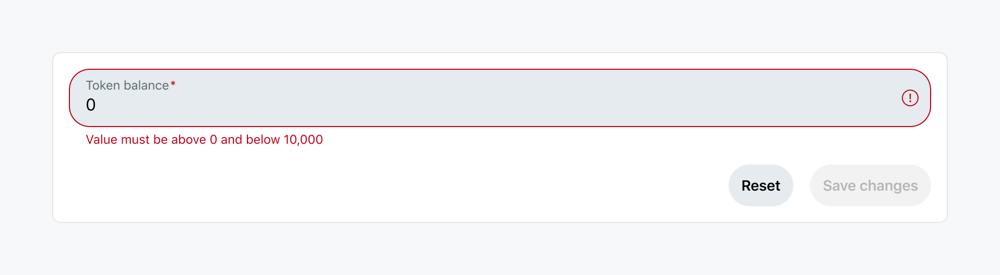
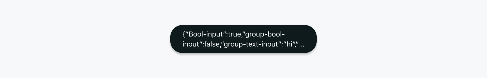

# App configurations

Include configuration settings in your app.



Configuration settings let users change the functionality and behavior of an app. Use the following steps to add settings at the global app-scope.

1. Use `Devvit.addSettings` to define the fields with scope as `SettingsScope.App`

```tsx
import { Devvit, SettingScope } from '@devvit/public-api';

Devvit.addSettings([
  {
    type: 'string',
    name: 'my-feature-flag',
    label: 'Feature Flag to rollout a new change',
    scope: SettingScope.App, // this can be a string literal 'app' as well
  },
]);
```

2. Store the app setting value via CLI. Keep in mind this operation modifies the value across all installations.

```bash
devvit settings set my-feature-flag
```

3. Access the global setting inside your app. Example menu item to show a toast with the setting value:

```tsx
Devvit.addMenuItem({
  label: 'Test App Settings',
  location: 'subreddit',
  onPress: async (_event, { ui, settings }) => {
    // retrieve the global setting
    const featureFlag = await settings.get('my-feature-flag');
    ui.showToast(`Retrieved the setting featureFlag as ${featureFlag}`);
  },
});
```

Once the app is installed, the configuration settings are available on the Install Settings page. Moderators add the required input and save the changes to configure the app. Note that these configurations are limited to the subreddit where the app is installed, so your app can be uniquely configured to each subreddit’s specific needs.

## Input types

There are currently five supported types of input:

- String or `'string'`
- Boolean or `'boolean'`
- Number or `'number'`
- Dropdown selection or `'select'`
- Paragraph or `'paragraph'`

See the [Forms page](./forms.md) for more detail.

## Configuring settings within your app

You can use the following code snippets as a guide to adding configuration settings to your app:

1. First, make sure this import is at the top of your file.

```tsx
import { Devvit } from '@devvit/public-api';
```

2. Use `Devvit.addSettings` to define any input fields you want to add to your settings form. Each field needs to be assigned a type, name, and label. You can provide the dropdown options for selection fields, as well as determine if the user can select more than one option within the dropdown. The label is the only text that will be visible on the form, so use this to communicate what the moderator should enter in each input field.

```tsx
Devvit.addSettings([
  {
    type: 'string',
    name: 'text-input',
    label: 'Enter your text input:',
    onValidate: async ({ value }) => {
      if (value !== 'bird') {
        return 'Word must be "bird"';
      }
    },
  },
  {
    type: 'boolean',
    name: 'bool-input',
    label: 'Use the switch to determine if some setting should be enabled:',
  },
  {
    type: 'select',
    name: 'select-input',
    label: 'Select one of the options:',
    options: [
      {
        label: 'Option 1',
        value: 'Option 1',
      },
      {
        label: 'Option 2',
        value: 'Option 2',
      },
    ],
    multiSelect: false,
  },
  {
    type: 'select',
    name: 'multiselect-input',
    label: 'Select multiple options:',
    options: [
      {
        label: 'Option 1',
        value: 'Option 1',
      },
      {
        label: 'Option 2',
        value: 'Option 2',
      },
      {
        label: 'Option 3',
        value: 'Option 3',
      },
    ],
    multiSelect: true,
  },
  {
    type: 'number',
    name: 'number-input',
    label: 'Enter your number input:',
  },
  {
    type: 'group',
    label: 'This is a GROUP field',
    fields: [
      {
        type: 'string',
        name: 'group-text-input',
        label: 'Group: Enter your text input:',
      },
      {
        type: 'boolean',
        name: 'group-bool-input',
        label: 'Group: Use the switch to determine if some setting should be enabled:',
      },
    ],
  },
]);
```

### Input validation



Devvit app configurations also support input validation. As the app developer, you can set restrictions on what kind of input must be entered in each field.

For example, setting a maximum number:

```tsx
onValidate: (event) => {
  if (event.value! > 10) {
    return 'Number too high!';
  }
};
```

To use validation, add the `onValidate` handler to the settings field object, like this:

```tsx
  {
    type: 'number',
    name: 'number-input',
    label: 'Enter your number input:',
    onValidate: (event) => {
      if (event.value! > 10) { return 'Number too high! Must be lower than 10.' }
    }
  },
```

## Retrieving settings within your app

After you've written the configuration settings for your app, you can see the input that has been entered by the moderator by using `getSettings`.

1. Add the following imports to the top of your file:

```tsx
import { Devvit } from '@devvit/public-api';
```

2. Use `Devvit.addMenuItem` to create a menu item that will trigger a toast message containing the form input.

```tsx
Devvit.addMenuItem({
  label: 'Test Action',
  location: Context.SUBREDDIT,
  onPress: (_, context) {
    // to get all settings
    const settings = await context.settings.getAll();
    // to get an individual setting
    const textFieldInput = await context.settings.get('text-input');

    ui.showToast(JSON.stringify(textFieldInput))
  },
});
```


