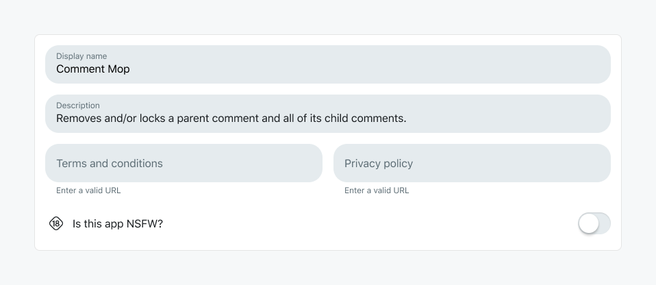

# Overview

Make requests to allow-listed external domains.

Your Devvit app can make network requests to access allow-listed external domains using HTTP Fetch. This enables your app to leverage webhooks, personal servers, and other third-party integrations asynchronously across the network.

## Devvit configure

```ts
import { Devvit } from '@devvit/public-api';

Devvit.configure({
  http: true,
  // other capabilities
});
```

## Requesting a domain to be allow-listed

Apps may request a domain to be added to the allow-list by specifying `domains` in the `http` configuration.
This configuration is optional, and apps can still configure `http: true` as before.

```ts
import { Devvit } from '@devvit/public-api';

Devvit.configure({
  http: {
    domains: ['my-site.com', 'another-domain.net'],
  },
});
```

Requested domains will be submitted for review when you playtest or upload your app. Admins may approve or deny domain requests.

Domain entries must be exact hostnames only, such as nytimes.com or wikipedia.org. These fetch requests are not allowed:

- No using \* example.com when you need api.example.com
- No wildcards: \*.example.com
- No protocols: https://api.example.com
- No paths: api.example.com/webhooks

Domains that are approved for your app will be displayed in the Developer Settings section for your app at https://developers.reddit.com/apps/{your-app-slug}/developer-settings.
These domains are allow-listed for **your app only** and not globally.

Apps must request each individual domain that it intends to fetch, even if the domain is already globally allowed. See the [global fetch allowlist](./http-fetch-allowlist.md) to view the list of globally allowed domains.

## Limitations

- Access is only allowed to https URIs.
- Supported HTTP methods: `GET`, `POST`, `PUT`, `DELETE`, `OPTIONS` and `PATCH`.
- HTTP timeout limit is 30 seconds.

## Example

```ts
import { Devvit } from '@devvit/public-api';

Devvit.configure({ http: true });

Devvit.addMenuItem({
  location: 'comment',
  label: 'Sample HTTP request',
  onPress: async (_, context) => {
    console.log(`Comment ID:  ${context.commentId}`);
    const response = await fetch('https://example.com', {
      method: 'post',
      headers: {
        'Content-Type': 'application/json',
      },
      body: JSON.stringify({ content: context.commentId }),
    });
    context.ui.showToast(
      `Invoked HTTP request on comment: ${context.commentId}. Completed with status: ${response.status}`
    );
  },
});

export default Devvit;
```

## Troubleshooting

If you see the following error, it means HTTP Fetch requests are hitting the internal timeout limits. To resolve this:

- Use a queue or kick off an async request in your back end. You can use [Scheduler](/docs/capabilities/scheduler.md) to monitor the result.
- Optimize the overall HTTP request latency if you have a self-hosted server.

```ts
HTTP request to domain: <domain> timed out with error: context deadline exceeded.
```

### Terms and Conditions

Any app that uses `fetch` must upload Terms and Conditions and a Privacy Policy. Links to each of these documents must be saved in the app details form.


