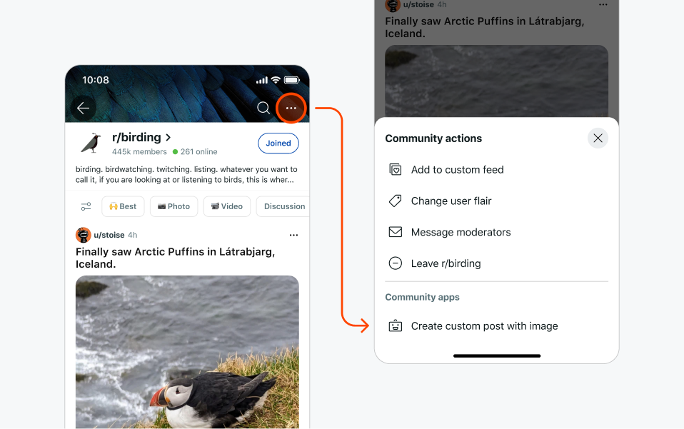

# Menu actions

Add an item to the three dot menu.

You can add custom menu actions to posts and comments using the `Devvit.addMenuItem()` function.

:::note
On new Reddit, comment menu actions in modqueue are only available in card view.
:::



## Supported Contexts

You can decide where the menu action shows up by specifying the context property. For example, setting the location to ‘comment’ will only show the menu action on comments.

| Property               | Values                         | Description                                                                     |
| ---------------------- | ------------------------------ | ------------------------------------------------------------------------------- |
| location (required)    | `comment`, `post`, `subreddit` | Determines where the menu action appears in the custom post.                    |
| postFilter (optional)  | `currentApp`                   | Shows the action created by your app. The default is no filtering.              |
| forUserType (optional) | `moderator`                    | Specifies the user types that can see the menu action. The default is everyone. |

:::note
For moderator permission security, when opening a form from a menu action with `forUserType: moderator`, the user initiating the action must complete all actions within 10 minutes.
:::

## Limitations

- A sort order of actions in the context menu can't be specified.
- The context, name, and description fields do not support dynamic logic.

## Example

This example uses `Devvit.addMenuItem()` to create menu actions for comments, posts and subreddits.

```ts
import { Devvit } from '@devvit/public-api';

// Declare multiple actions to be added to the menu
Devvit.addMenuItem({
  label: 'Say Hello',
  location: 'post', // accepts 'post', 'comment', 'subreddit', or a combination as an array
  forUserType: 'moderator', // restricts this action to moderators, leave blank for any user
  onPress: (event, context) => {
    context.ui.showToast(`Hello from a ${event.location}!`);
  },
});
```
