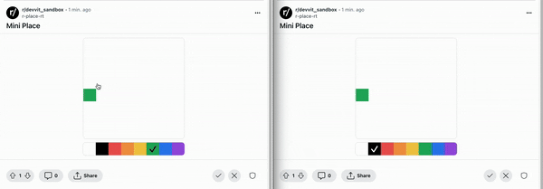
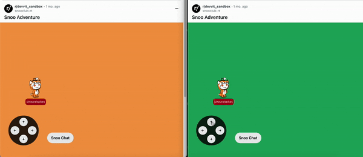
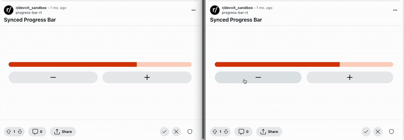
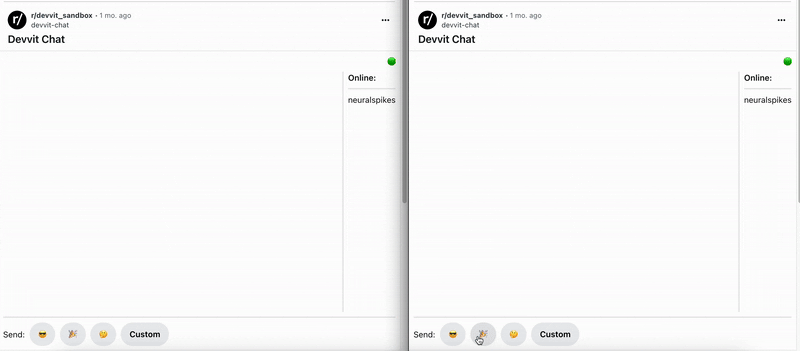
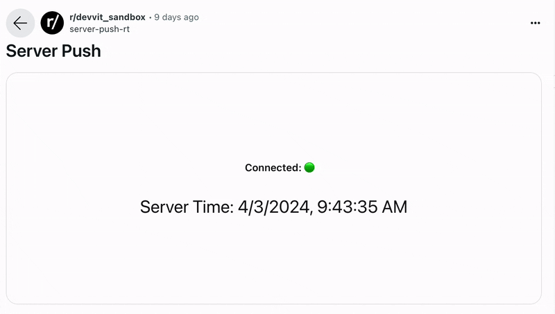

# Realtime

Create live and event-driven interactive posts. Realtime provides a set of primitives that lets you build interactive posts that are:

- **Live**. Users engaging with the same interactive post see each others’ changes without any observable lag.
- **Event-driven**. Posts render automatically in response to server events.
- **Synced**. Using realtime with [Redis](/docs/capabilities/redis.md) lets you build persistent community experiences that are backed by high performance data synchronization.

## Create a live interactive post

#### 1. Configure realtime.

```tsx
Devvit.configure({
  realtime: true,
});
```

#### 2. Create and subscribe to a channel.

`useChannel` hook allows interactive posts to subscribe and send to an event stream.

A new channel can be setup with function handlers containing custom logic to update state:

- `onMessage` - called every time a message is received on a channel
- `onSubscribed` - optional hook to be informed when channel has connected
- `onUnsubscribed` - optional hook to be informed when channel has disconnected

```tsx
import { Devvit, useChannel } from '@devvit/public-api';

// Defined within render function of an interactive post

// Choose a channel name that works for you

// You have the flexibility to define the message data shape to be published
// via channel.send - same shape will be received in the onMessage handler

const channel = useChannel({
  name: 'events',
  onMessage: (data) => {
    // modify local state
  },
  onSubscribed: () => {
    // handle connection setup
  },
  onUnsubscribed: () => {
    // handle network degradation with fallback scenarios
  },
});

// subscribe to the channel to receive messages
channel.subscribe();
```

#### 3. Send messages to a channel.

`channel.send` is recommended for peer-to-peer synchronization across clients. See [Mini Place](#mini-place) and [Snoo Club](#snoo-club)

```tsx
<button
  icon="add-fill"
  width={50}
  onPress={async () => {
    const newProgress = Math.max(progress + 10, 0);
    const message: RealtimeMessage = {
      payload: { progress: newProgress },
      session: UUID,
    };
    setProgress(newProgress); // set local state
    await channel.send(message); // publish message to the channel
  }}
/>
```

`realtime.send` is recommended for re-rendering interactive posts based on server events. This can be invoked on an event trigger, scheduled job, or after a HTTP fetch call. [Server-Push](#server-push) example illustrates how to compose scheduler and realtime together.

```tsx
// During app installation, we create a scheduled job 'publish_to_channel' that runs
// every minute - it uses realtime plugin to publish events to an arbitrary channel

Devvit.addTrigger({
  event: 'AppInstall',
  onEvent: async (_, context) => {
    await context.scheduler.runJob({
      name: 'publish_to_channel',
      cron: '* * * * *',
    });
  },
});

// Interactive posts subscribed to the 'events' channel via useChannel hook will start
// receiving messages which can processed in the onMessage handler to update local state.
Devvit.addSchedulerJob({
  name: 'publish_to_channel',
  onRun: async (_, context) => {
    await context.realtime.send('events', {
      message: payload,
    });
  },
});
```

## Limits and Quotas

- Messages/sec per installation: 100
- Maximum message payload: 1 MB
- Channels per app installation: 5

## Examples

:::note
Try the demos with multiple browser windows and see local changes sync across sessions without any lag.
:::

### Mini Place



**[Demo](https://sh.reddit.com/r/devvit_sandbox/comments/1bumd7e/mini_place/)**,
**[Source Code](https://github.com/reddit/devvit/tree/main/packages/apps/mini-place)**

### Snoo Club



**[Demo](https://sh.reddit.com/r/devvit_sandbox/comments/1bunpzv/interactive_snooclub/)**,
**[Source Code](https://github.com/reddit/devvit/tree/main/packages/apps/snooclub)**

### Synced Progress Bar



**[Demo](https://sh.reddit.com/r/devvit_sandbox/comments/1b3ccp9/synced_progress_bar/),**
**[Source Code](https://github.com/reddit/devvit/tree/main/packages/apps/synced-progress-bar)**

### Devvit Emoji Chat



**[Demo](https://sh.reddit.com/r/devvit_sandbox/comments/1bvf6if/emoji_chat/),**
**[Source Code](https://github.com/reddit/devvit/tree/main/packages/apps/devvit-emoji-chat)**

### Server Push



**[Demo](https://sh.reddit.com/r/devvit_sandbox/comments/1bnnc60/server_push/),**
**[Source Code](https://github.com/reddit/devvit/tree/main/packages/apps/server-push)**
